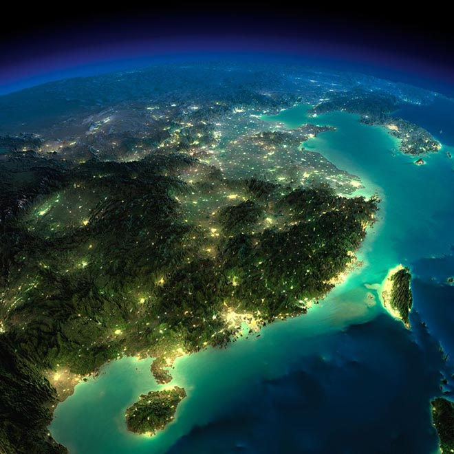

## [澳恪森数智科技服务](https://oxon8.com)

**澳恪森数智科技服务** (Oxford Roadmapping，简称 澳恪森 Oxon8  ) 创新数智平台与绿色金融科技的设计，助组织与个人的双化协同发展及精准脱碳之旅。

-----

### 来自湾区、服务湾区网络

位于湾区现代金融、物流、旅游、酒店、农业等行业的地方脉络，**澳恪森**以提供具全球及地方视野的科技和课题预查新、前瞻与传统产业知识地图、等等的产品及服务。

**澳恪森**为行业、智库、政府等提供基于专利分析、科学计量、知识图谱等等数据情报，合作开展集科技研发、科技服务、成果转化、系统集成、人才培养、等科技创新公共及商业服务，以前瞻情报有效连结在地及全球网络。

-----

2023年，**澳恪森** 成立。⭐⭐⭐⭐⭐

<!--湾区设计协同研究院  ️**Trusted by 250,000+ researchers, educators, and students.** Highly customizable via the integrated **no-code, widget-based Wowchemy page builder**, making every site truly personalized    -->

### 2023年具体年度项目

澳恪森2023年具体项目有：
* ☁️基于E碳信息流的双碳数智平台🚀
* 🌱绿色化数字化双化转型技术路线工具箱🌐
* 🎁绿色化数字化双化转型商业模式工具箱🈺
* 👉基于专利分析丶科学计量丶的中文及英文科技和课题预查新丶前瞻与传统产业知识地图产品及服务 👌

