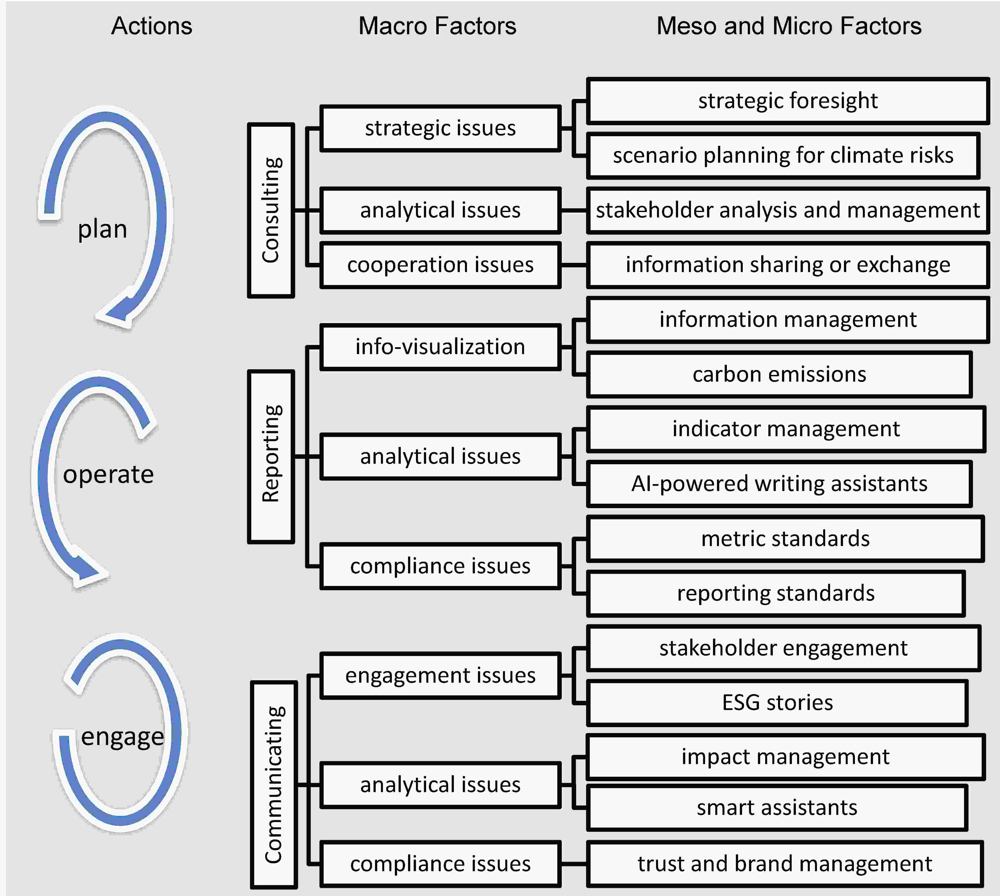

**澳恪森**的論文 [**《在 ESG 咨詢﹑報告和參與教育方面進行合作》** ](https://www.frontiersin.org/articles/10.3389/fenvs.2023.1119011/abstract) 獲錄稿發表。 

此研究以創新設計「我們可以怎樣」(How Might We)思維方法，在 ESG 教育產出合作路線圖。
<!--more-->

### 獲錄稿發表的合作伙伴地圖
論文 [**《在 ESG 咨詢﹑報告和參與教育方面進行合作》( Collaborating on ESG consulting, reporting, and communicating education)** ](https://www.frontiersin.org/articles/10.3389/fenvs.2023.1119011/abstract) 獲國際期刊 《Frontiers in Environmental Science》2023/02/22 正式錄稿於《消費者對向循環經濟轉型的偏好 - 刺激驅動力和克服障礙》(Consumers' Preferences Toward the Transition to Circular Economy-- Stimulating Drivers and Tackling" Barriers) 研究課題下。

此研究發表於環境經濟學及管理欄目，符合國家ESG及雙碳人才建設需求。
此研究面對粵港澳大灣區在國家及國企雙碳目標，以及綠色金融所需的ESG人才需求，文章整合了相關文獻及專家訪談數據，基於創新的利益相關人分析，提出了用數據貫通ESG 咨詢﹑報告和參與教育的合作伙伴地圖，對培養政府及企業部門所需的ESG顧問﹑投資﹑分析﹑管理﹑傳播﹑公關﹑等等人才勾勒出主要利害關系人﹑主要文獻﹑及人才需求的驅動及障礙。

### 解決ESG及雙碳系統創新的迫切人才培養及需求

論文以國際前沿發展結合粵港澳大灣區具體的人才需求及供給，運用循環經濟商業模式畫布的設計科學方法，進行了交叉分析並形成系統需求文件，明確ESG數據價值鏈上的利益相關人，全覆蓋解決ESG及雙碳系統創新的迫切人才培養及需求。

為ESG人才教育產出的合作伙伴地圖有：

#### ESG咨詢教育合作伙伴地圖

#### ESG報告教育合作伙伴地圖

#### ESG傳播教育合作伙伴地圖

### ESG 與碳信息的智能體系

此研究提出了一個概念框架——ESG和碳信息的智能體系，以總結ESG和碳信息的規劃、運營和溝通，以及高層次的組織行動和人才能力體系。此框架明確了企業內ESG操作系統的構建區塊，以吸引各種利益相關者進行價值創造協作。

此研究及設計方法恪遵設計科學舉辦設計工作坊，整合了設計思維﹑文獻分析和跨學科專家訪談。

### 英文摘要  Abstract

Given the rising demand for environmental, social, and governance (ESG) talents, the study aims to provide a multi-disciplinary outlook of specific capability requirements of ESG talents focusing on the use of ESG and carbon information, thereby filling the literature gap in ESG education. Following the design science conventions and running design workshops that integrate design thinking of “how might we” design questions, literature analysis, and expert interviews across disciplines, the study presents findings regarding three main consulting, reporting, and communicating activities. Based on the iterations of design workshops that adopt a circular economy-based partner map design canvas for stakeholder analysis, with procedures including expert interviews and literature reviews, three Partner/Capability Maps were generated to map out the stakeholders and explore the capabilities needed. Digital and data skills using ESG and carbon information emerged as the core capability to complete all three tasks. A conceptual framework, Smart System on ESG and Carbon Information, is proposed to summarize the planning, operating, and engaging with ESG and carbon information, along with high-level organizational actions and talent capabilities. It identifies building blocks that amount to an ESG operating system within an enterprise, with the purpose to engage various stakeholders for value-creation collaboration. Despite the limitations in the lack of comprehensive review and limited geographic and disciplinary representation, the study provides a roadmap for enterprises and universities to explore and define talent requirements and create specific education and training programs.

### 相關消息介紹

*  知研1v1,  （2023-02-24）.　《三個月內三篇SCI(一區及二區）收錄期刊發表，成績斐然》 [03. ESG數據驅動治理及教育](https://mp.weixin.qq.com/s?src=11&timestamp=1679377034&ver=4419&signature=58rspt51riDaR40jvggKb7MvePyHPP3j0uR0cLd2acMEJsEzW2094fT63kp-SKdgx*ORo6w1YEtlkh3eg48VOxVKMBasEFW1A-Xd4OC31j3t2JoChGuMHv-2IOxJnnDQ&new=1)

### 關於澳恪森數智科技
澳恪森數智科技，簡稱Oxon8，全名為澳恪森數智科技服務（廣州）有限公司，創新數智平台與綠色金融科技的設計，助組織與個人的雙化協同發展及精准脫碳之旅。

澳恪森Oxon8為行業﹑智庫﹑政府等提供基於專利分析﹑科學計量﹑知識圖譜等等數據情報，合作開展集科技研發﹑科技服務﹑成果轉化﹑系統集成﹑人才培養﹑等科技創新公共及商業服務，運用前瞻情報連結在地及全球網絡。

