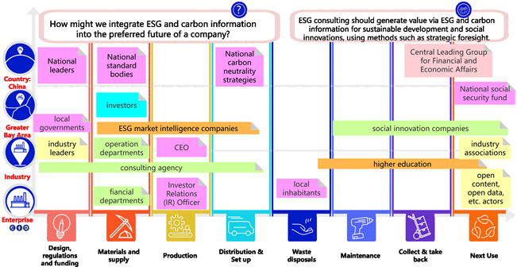
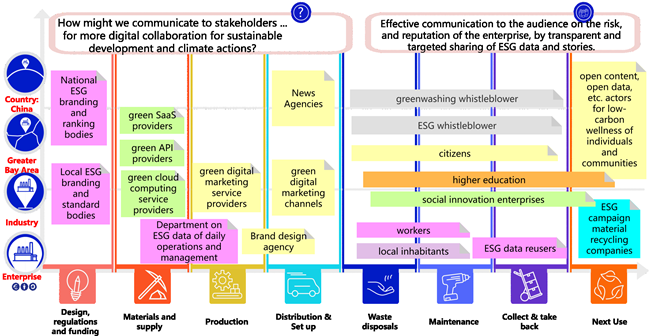

**澳恪森**的论文 [**《在 ESG 咨询﹑报告和参与教育方面进行合作》** ](https://www.frontiersin.org/articles/10.3389/fenvs.2023.1119011/abstract) 获录稿发表。 

此研究以创新设计「我们可以怎样」(How Might We)思维方法，在 ESG 教育产出合作路线图。
<!--more-->

### 获录稿发表的合作伙伴地图
论文 [**《在 ESG 咨询﹑报告和参与教育方面进行合作》( Collaborating on ESG consulting, reporting, and communicating education)** ](https://www.frontiersin.org/articles/10.3389/fenvs.2023.1119011/abstract) 获国际期刊 《Frontiers in Environmental Science》2023/02/22 正式录稿于《消费者对向循环经济转型的偏好 - 刺激驱动力和克服障碍》(Consumers' Preferences Toward the Transition to Circular Economy-- Stimulating Drivers and Tackling" Barriers) 研究课题下。

此研究发表于环境经济学及管理栏目，符合国家ESG及双碳人才建设需求。
此研究面对粤港澳大湾区在国家及国企双碳目标，以及绿色金融所需的ESG人才需求，文章整合了相关文献及专家访谈数据，基于创新的利益相关人分析，提出了用数据贯通ESG 咨询﹑报告和参与教育的合作伙伴地图，对培养政府及企业部门所需的ESG顾问﹑投资﹑分析﹑管理﹑传播﹑公关﹑等等人才勾勒出主要利害关系人﹑主要文献﹑及人才需求的驱动及障碍。

### 解决ESG及双碳系统创新的迫切人才培养及需求

论文以国际前沿发展结合粤港澳大湾区具体的人才需求及供给，运用循环经济商业模式画布的设计科学方法，进行了交叉分析并形成系统需求文件，明确ESG数据价值链上的利益相关人，全覆盖解决ESG及双碳系统创新的迫切人才培养及需求。

为ESG人才教育产出的合作伙伴地图有：

#### ESG咨询教育合作伙伴地图

#### ESG报告教育合作伙伴地图

#### ESG传播教育合作伙伴地图

### ESG 与碳信息的智能体系

此研究提出了一个概念框架——ESG和碳信息的智能体系，以总结ESG和碳信息的规划丶运营和沟通，以及高层次的组织行动和人才能力体系。此框架明确了企业内ESG操作系统的构建区块，以吸引各种利益相关者进行价值创造协作。

此研究及设计方法恪遵设计科学举办设计工作坊，整合了设计思维﹑文献分析和跨学科专家访谈。

### 英文摘要  Abstract

Given the rising demand for environmental, social, and governance (ESG) talents, the study aims to provide a multi-disciplinary outlook of specific capability requirements of ESG talents focusing on the use of ESG and carbon information, thereby filling the literature gap in ESG education. Following the design science conventions and running design workshops that integrate design thinking of “how might we” design questions, literature analysis, and expert interviews across disciplines, the study presents findings regarding three main consulting, reporting, and communicating activities. Based on the iterations of design workshops that adopt a circular economy-based partner map design canvas for stakeholder analysis, with procedures including expert interviews and literature reviews, three Partner/Capability Maps were generated to map out the stakeholders and explore the capabilities needed. Digital and data skills using ESG and carbon information emerged as the core capability to complete all three tasks. A conceptual framework, Smart System on ESG and Carbon Information, is proposed to summarize the planning, operating, and engaging with ESG and carbon information, along with high-level organizational actions and talent capabilities. It identifies building blocks that amount to an ESG operating system within an enterprise, with the purpose to engage various stakeholders for value-creation collaboration. Despite the limitations in the lack of comprehensive review and limited geographic and disciplinary representation, the study provides a roadmap for enterprises and universities to explore and define talent requirements and create specific education and training programs.

### 相关消息介绍

*  知研1v1,  （2023-02-24）.　《三个月内三篇SCI(一区及二区）收录期刊发表，成绩斐然》 [03. ESG数据驱动治理及教育](https://mp.weixin.qq.com/s?src=11&timestamp=1679377034&ver=4419&signature=58rspt51riDaR40jvggKb7MvePyHPP3j0uR0cLd2acMEJsEzW2094fT63kp-SKdgx*ORo6w1YEtlkh3eg48VOxVKMBasEFW1A-Xd4OC31j3t2JoChGuMHv-2IOxJnnDQ&new=1)

---



