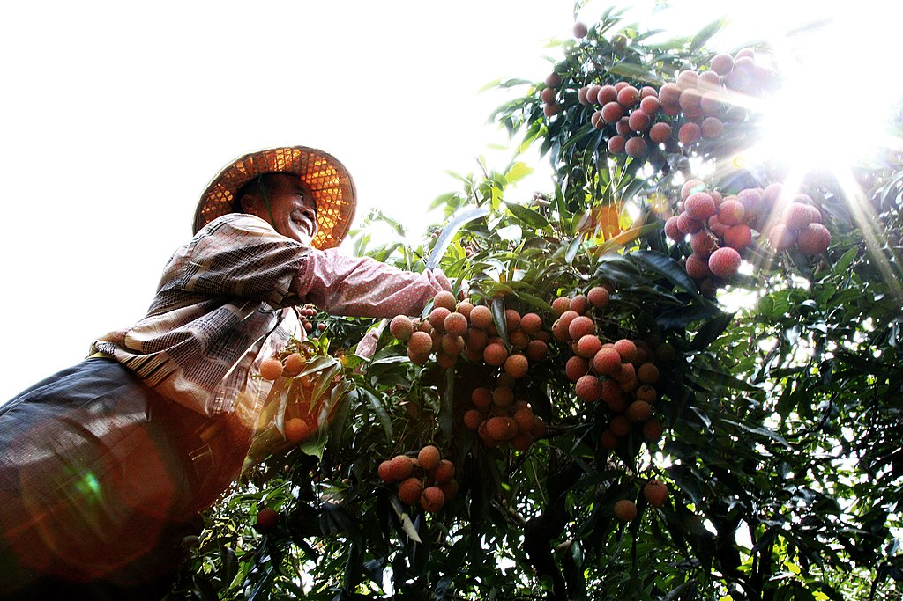

**澳恪森**創辦人與智彗港口物聯網專家合作，於3月26日進行腦力風暴探討如何開發綠色金融科技，支持如『雙碳荔枝』、『碳中和玫瑰』等可核算的低碳、零碳、或負碳成果，打通綠色品牌、技術、地理標志、等估值和 (1) 綠色智能農業、(2)綠色供應鏈與物流、 (3) 綠色可持續營銷、等等的綠色金融科技推迸***高質量發展***。

來自灣區﹑服務灣區，澳恪森期待能和企業、行業及科研單位，推出未來碳中和或雙碳品牌協同創新設計服務及產品，特別在[“3060”雙碳目標](https://www.gd.gov.cn/zwgk/zcjd/bmjd/content/post_3576430.html)、《[中歐地理標志協定](http://www.gov.cn/xinwen/2020-09/24/content_5546599.htm)》、[碳邊境稅碳關稅](https://www.thepaper.cn/newsDetail_forward_22398315)等脈絡下，為[地方外貿高質量發展](https://news.cctv.com/2023/03/26/ARTIs1flmUBcpTZy5TBVBIPc230326.shtml)，提供含有堅實SBTi科學碳目標倡議、E碳足跡 (碳排護照) 等新技術共創賦能。

<!--more-->

**澳恪森**創辦人廖漢騰﹑潘仲亷博士，星期天3月26日接待智彗港口物聯網專家羅聰明副教授，在已[合作](https://mp.weixin.qq.com/s?src=11&timestamp=1679881883&ver=4431&signature=XPyu5bSfQ4ICowJFIDgUPOjbYqBvLcdIUdggmLa27z9C*79506hjip6VpWH42kMJDCP80Y8QuraF78AvoUG1UlaqDHI8mC7K7Z*x-MAWrRyYYvn7s2GCC4hq0b-qlzCD&new=1))發表的論文《[智能港口知識圖譜分析：面對全球價值鏈挑戰的研究](https://www.mdpi.com/2079-8954/11/2/88) 》的基礎上，介紹了澳恪森2023年3月剛發表的《[碳中和管理服務數智平台](https://oxfordroadmap.github.io/oxon8/post/2023-02-20-smart-digital-platforms-carbon-neutral-management-services/)》、《[在 ESG 咨詢﹑報告和傳播教育方面進行合作](https://oxfordroadmap.github.io/oxon8/post/2023-02-22-esg-education-partner-maps/)》，並進行腦力風暴，為能市場化及產品化的科研合作做准備。

### 來自灣區﹑服務灣區的綠色技術路線圖

〝來自灣區﹑服務灣區，從化在大灣區已有如世界生態設計大會WEDC、[從化生態設計小鎮](http://lyj.gd.gov.cn/news/newspaper/content/post_2575583.html)等的國際品牌，更有[冷鏈技術助力](http://dara.gd.gov.cn/snnyxxlb/content/post_3330574.html) “出海”的[從化荔枝](https://new.qq.com/rain/a/20210715A02DYN00)﹑國家認定的[國家現代農業產業園](http://dara.gd.gov.cn/snnyxxlb/content/post_3802004.html)〞，牛津大學博士廖漢騰解釋協同創新的潛力如何能[“3060”雙碳目標下攻關關鍵技術、增強社會民生領域](https://www.gd.gov.cn/zwgk/zcjd/bmjd/content/post_3576430.html)高質量發展，“要如何把好的農產品及民生服務，享有零碳或負碳的品牌估值及金融支持，則為為需要協同設計﹑協同創新的重大議題。”

〝碳核算是攻關 “3060” 雙碳目標的基礎，中國已超出國際前沿發展的供應鏈金融及平台技術，必需要發展[E碳足跡](https://e-liability.institute/about-e-liability/)或碳排護照，支持產品及服務出海〞，台灣科技大學博士潘仲亷博士從市場化及產品化的角度來分析，〝不管是[保加利亞玫瑰](https://baike.baidu.com/item/%E4%BF%9D%E5%8A%A0%E5%88%A9%E4%BA%9A%E7%8E%AB%E7%91%B0%E8%8A%82/11027118)、從化荔枝的農產品、衍生民生美妝保養商品，還是其下游的酒店餐飲的采購，要如何在創投、供應鏈金融等方面，進行科學化能核算的支持呢？〞

> [保加利亞玫瑰節](https://www.rosefestivalkazanlak.com/)

〝國家在[統籌推進 “近零碳港口” 建設賦能行業“雙碳”](https://info.chineseshipping.com.cn/cninfo/News/202208/t20220825_1368795.shtml)方面，已運用技術打造世界一流港口、綠色港口，〞智彗港口物聯網專家羅聰明副教授指出系統創新的發展設計方向，〝出海的、進口的，若有良好的E碳足跡或碳排護照，在選擇進出口的海關及港口時，就可以在數智平台上找到近零碳的路徑及費用。若已是負碳的綠色農產品，再有“近零碳港口”的碳核算證書，就能串連出可信可查的碳中和產品及品牌。〞

<iframe width="560" height="315" src="https://www.youtube.com/embed/XfWSMj3CfSE" title="YouTube video player" frameborder="0" allow="accelerometer; autoplay; clipboard-write; encrypted-media; gyroscope; picture-in-picture; web-share" allowfullscreen></iframe>

> [E碳足跡](https://e-liability.institute/about-e-liability/)或碳排護照：具有打通綠色信息流、金流的潛力

澳恪森創辦人之一廖漢騰博士指出國際市場上零碳水果或碳中和農產品的品牌化作法，〝主要是要SBTi科學碳目標倡議，提供堅實信息及數據服務，能面對碳核算等要求，再進行有效的綠色生產、物流、運營及營銷。若能結合[E碳足跡](https://e-liability.institute/about-e-liability/)或碳排護照，則具有打通綠色信息流、金流的潛力。〞

### 科技創新服務及產品：雙碳荔枝？

〝數字化﹑綠色化的雙化協同發展，需要具全球及地方視野的科技路線圖〞，澳恪森創始人之一廖漢騰點出市場需求，“想想從化若要發展「雙碳荔枝」，各行各業能做什麼？〞

〝荔枝不只是水果，更是有從田野到餐桌的各種農產品，從荔枝干到荔枝酒，需要不只是智能的現代營銷及物流，更需有促進綠色發展及鄉村振興的增長，〞澳恪森創始人之一潘仲亷點出綠色供應鏈金融的機會，〝要如何能給有減排或創新的荔枝綠色供應鏈農戶及商家相對映的綠色信用﹑投融資？要如何推動綠色產業營銷的同時避免漂綠？要如何打造可信可用的荔枝E碳足跡護照？要如何建立「雙碳荔枝」的行業最佳實踐﹑標准﹑及標章？〞

> 來源： [Crops for Carbon Farming](https://www.frontiersin.org/articles/10.3389/fpls.2021.636709/full)

〝荔枝不只是水果，更是生態系的一環，在從化還有荔枝木﹑荔枝菌等等傳統及現代結合的實踐，是實現 [生物減排固碳](http://lyj.gd.gov.cn/news/special/forum/content/post_3629236.html) 發展「雙碳鄉村振興」的高潛力案例。〞澳恪森廖漢騰點出[生物能源與碳捕獲和儲存 (BECCS )](https://www.eco.gov.cn/news_info/51244.html)用於「雙碳鄉村振興」的可能性。〝荔枝木的使用多元，包括燒雞燒鴨等，都可以協同創新改良改進現有實踐來創造負碳排放。此外，菌類的減排潛力已有量化科學研究，因此在荔枝菌的生產與消費應該建構以聯合國SBTi（科學碳目標倡議）標准的計量體系，來合理估算審計荔枝生態循環的綠金潛力。〞

### 地理標志：灣區雙碳荔枝？從化雙碳荔枝？

〝地理標志如[惠來荔枝](https://baike.baidu.com/item/%E6%83%A0%E6%9D%A5%E8%8D%94%E6%9E%9D/5500621)、[雷嶺烏葉荔枝](https://www.sohu.com/a/658622456_121411175)是種商標市場化工具，成功注冊後就能變成資產，〞澳恪森創始人之一潘仲亷點出綠色創新創業的機會，〝**雙碳雙創**，若能成功打入如[《中歐地理標志協定》的標志產品名單](http://www.gicity.org/news/ind/3489.html)，更能預先在[碳邊境稅](https://www.thepaper.cn/newsDetail_forward_22398315)脈絡下取得商機及商譽，是[地方外貿高質量發展](https://news.cctv.com/2023/03/26/ARTIs1flmUBcpTZy5TBVBIPc230326.shtml)新賦能工具。〞

〝地理標志的綠色數字化轉型，在互聯網數字營銷、跨境電商、物流保稅等等，就會有數據驅動的金融科技、監管科技等等新技術服務，〞澳恪森創始人之一廖漢騰點出**雙碳雙創**的從化機會、灣區機會，〝不論叫**灣區雙碳荔枝**，還是**從化雙碳荔枝**，若能成功閉環在從化培養出結合金融、生產、供應、消費、回收的循環經濟設計生態，則能產出可學習可復制的數字農業+數字營銷+金融科技+監管科技+鄉村振興等的工具及標准，以 雙碳信息流 貫穿各技術平台的高質量發展。〞

### 大學科研人員師生能做什麼？使用工具箱參與綠色化數字化創新

面對大學的科研人員、教師、學生，潘仲亷博士以澳恪森2023年具體項目為例，說明各專業的大學生都能使用工具箱參與綠色化數字化創新：

* 🌱 綠色化數字化雙化轉型技術路線工具箱 🌐

* 🎁 綠色化數字化雙化轉型商業模式工具箱 🈺

* 👉基於專利分析﹑科學計量﹑等信息的中文及英文科技和課題預查新﹑前瞻與傳統產業知識地圖產品及服務 👌

潘仲亷博士以此說明，聚焦於輔導大學科學論文思考﹑寫作的**知研1對1**，已和澳恪森合作，擴大大學生參與如雙化轉型技術路線﹑雙化轉型商業模式的工作坊，並以專利及文獻分析來協同跨領域﹑異業合作創新。

〝這也是我認同並選擇在灣區設計開放大學/灣區設計協同研究院成立公司及辦公的主要原因。”澳恪森廖漢騰點「開放協同」及「開放創新」的重要性。〞從大學畢業出社會工作到現在，我一直在開源軟件﹑開放數據﹑開放內容﹑開放知識﹑開放創新﹑數字協作等領域工作，現在這些關於數據及數字的開放知識，也正如同綠色軟件基金會的發展，走向綠色化﹑走向科技向善。〞

### 科研人員開放﹑好奇的初心，是工業5.0的核心

〝大學科研人員保有開放的心﹑好奇的心，按步就班使用工具箱和不同領域的專家學習，就有創新的機會。”澳恪森廖漢騰點出，〝恪這字，不只是傳統謹慎的用心，更是如陳寅恪先生『獨立之精神，自由之思想』 名言，體現的以人為中心的協同創新設計觀，工業5.0的核心。〞

〝歡迎有志對產業前瞻與傳統的知識地圖﹑協作地圖有興趣的大學科研人員來使用工具箱參與綠色化數字化創新。〞潘仲亷博士總結。

-----

## 延伸閱讀

### 生物質能碳捕集與封存 BECCS

#### 國內

*  中國華能 (2022-03-28)，[碳中和目標下電力行業如何加快發展BECCS技術](https://m.thepaper.cn/newsDetail_forward_17338633) 。『實現碳中和需要負碳技術』

              * [農業農村部辦公廳關於做好2022年農作物秸稈綜合利用工作的通知](http://www.gov.cn/zhengce/zhengceku/2022-04/26/content_5687228.htm) 中國政府網 (www.gov.cn) 農辦科〔2022〕12號

                           * 推進秸稈變能源降碳，助力“雙碳”工作。積極有序發展秸稈為原料的成型燃料﹑打捆直燃﹑沼氣工程﹑熱解氣化等生物質能利用，提升農村清潔用能比例。在鄉村社區﹑園區以及公共機構等推廣打捆直燃集中式供熱﹑成型燃料+生物質鍋爐供熱﹑成型燃料+清潔爐具分布式供暖等模式。

              * 中國科協科普部 (2022), [生物質能源化利用 助力“雙碳”目標實現](http://www.news.cn/science/2022-11/10/c_1310675250.htm) -新華網 (news.cn)

#### 國際

* [Venton](https://www.pnas.org/doi/10.1073/pnas.1617583113#con), Danielle (2016), Can bioenergy with carbon capture and storage make an impact?  _PNAS_ **113(47)**, 13260–13262. [https://doi.org/10.1073/pnas.1617583113](https://doi.org/10.1073/pnas.1617583113)

              * 『BECCS的技術挑戰是真實的，...更大的挑戰是金融和政治。我們尚未制定政策，認識到氣候挑戰的緊迫性』

* Council of the EU (2022), [Council adopts conclusions on carbon farming - Consilium](https://www.consilium.europa.eu/en/press/press-releases/2022/04/07/council-adopts-conclusions-on-carbon-farming/)
	* 結論具體說明了理事會對碳去除認證框架的期望，今年年底將提出立法提案，以確保根據科學證明的測量要求，增加**碳去除**和儲存的做法具有經濟價值。
	* 歐盟的碳捕集﹑利用和封存 [Carbon Capture, Utilisation and Storage in the European Union (europa.eu)](https://setis.ec.europa.eu/carbon-capture-utilisation-and-storage-european-union_en)
	* 歐盟碳去除認證框架 [Carbon Removal Certification (europa.eu)](https://climate.ec.europa.eu/eu-action/sustainable-carbon-cycles/carbon-removal-certification_en)
	* IEA (2022), Bioenergy with Carbon Capture and Storage, IEA, Paris https://www.iea.org/reports/bioenergy-with-carbon-capture-and-storage, License: CC BY 4.0
	* 『BECCS路線已有商業化路線，但最關鍵的路線仍處於示範或試點階段』
  

*  Ai, Z., Hanasaki, N., Heck, V. _et al._ (2021), Global bioenergy with carbon capture and storage potential is largely constrained by sustainable irrigation. _Nat Sustain_ **4**, 884–891 . https://doi.org/10.1038/s41893-021-00740-4
* 『BECCS在許多嚴格的氣候情景中至關重要...  我們的研究結果強調了水資源/灌溉限制在全球BECCS潛力中的重要性。』
* [EMILY DREYFUSS](https://www.wired.com/author/emily-dreyfuss) (2019), [The Plan to Grab the World's Carbon With Supercharged Plants](https://www.wired.com/story/the-plan-to-grab-the-worlds-carbon-with-supercharged-plants/)  WIRED

### 荔枝產業園﹑從化產業

* 廣州日報 (2021-08-23),  [一棵荔枝樹 三種致富“經”](http://food.cnr.cn/focus/20210823/t20210823_525575542.shtml) 央廣網 (cnr.cn)
    * 廣州市從化區荔枝產業園...將助推從化區建設全省乃至全國鄉村振興示範區。
	    * ... 李仲輝介紹道，在荔枝樹上種鐵皮石斛既不影響荔枝生長，又能多一項收益。
	    * ... 李仲輝介紹，培植荔枝菌，需要設備﹑技術和人工，每畝地投入4萬到8萬元左右，收成之時收益可以達到每畝地20萬元左右。
	    * ... “以前是靠人，現在靠技術。”李仲輝介紹道，荔博園瑞安裝了攝像頭，氣像﹑溫度﹑水土等資料都通過技術收集起來，溫度不夠？水分不夠？遠程就能遙控打開水閘，工作人員只要坐在辦公室就能照顧荔枝。
	    * ...“通過電商零售我們的利潤能高出30%。”
	    * ...率先實施的農戶以荔枝果樹土地經營權入股，探索出的“土地流轉得租金﹑入園就業得薪金﹑家庭經營得現金﹑股份分紅得股金”的“一地生四金”模式就讓農民獲得多重收入。
	    * 陳厚彬觀察發現，... “比如很少產業園會在生產環節尋求科技支持，省內很多荔枝園依然是低產的，品質提升也是不夠的，精深加工不足，沒有真正從研發﹑生產到加工環節投入科技力量，提升產品的附加值。”

* [456億！涉及高速改擴建﹑產業園！從化2022年重點建設項目出爐！_騰訊新聞 (qq.com)](https://new.qq.com/rain/a/20220323A09G1Z00)
	* 明珠片區選址**明珠工業園核心區低丘緩坡片區東側**，...，**打造生物醫藥﹑醫療美容融合發展的“南方美谷”**；
	* 民樂片區緊鄰京珠高速民樂出入口...，**重點打造新能源汽車零部件生產基地**；
	* 太平片區...，作為中新知識城產業延伸...區域，...，打造**成為集科技創新﹑國際合作﹑生態宜居為特色的產城融合發展示範區**。

-----

### 灣區設計開放大學/灣區設計協同研究院

灣區設計開放大學/灣區設計協同研究院 ...

### 關於知研1對1

知研1對1是廣州市級眾創空間，廣州南方學院商學院南方創新谷的雙創項目，旨在“大眾創業﹑萬眾創新”﹑“專創融合立體化人才培養”﹑“新文科教育實踐基地”等背景下，提供各項科技商業模式創新﹑市場查新﹑科研論文﹑科學計量等﹑1v1輔導﹑創新創業工作坊的公共及商業服務。

### 關於澳恪森數智科技
澳恪森數智科技，簡稱Oxon8，全名為澳恪森數智科技服務（廣州）有限公司，創新數智平台與綠色金融科技的設計，助組織與個人的雙化協同發展及精准脫碳之旅。

澳恪森Oxon8為行業﹑智庫﹑政府等提供基於專利分析﹑科學計量﹑知識圖譜等等數據情報，合作開展集科技研發﹑科技服務﹑成果轉化﹑系統集成﹑人才培養﹑等科技創新公共及商業服務，運用前瞻情報連結在地及全球網絡。
