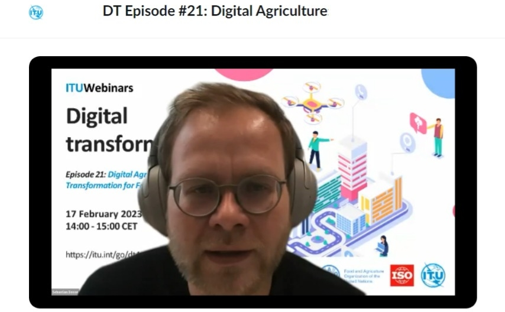
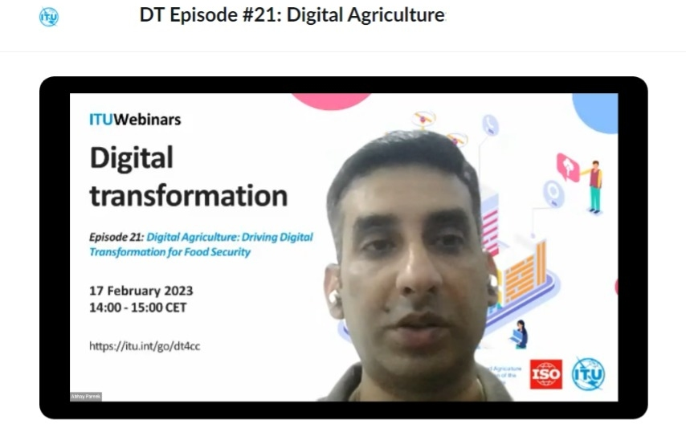
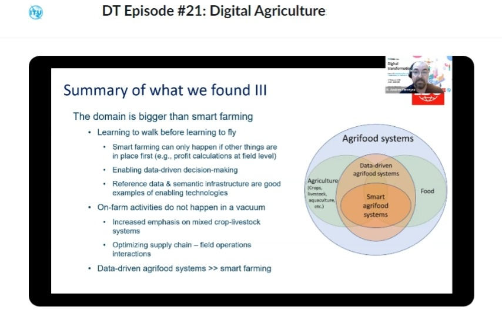

鄉村振興作為糧食安全戰略，「要...積極延伸和拓展**農業產業鏈**，培育發展農村**新產業新業態**，...」

**產業振興**、**農業產業鏈**、**新產業新業態**要如何做？

聯合國**國際電聯**及**糧農組織**，在線研討會系列第 21 集《數字農業：為糧食安全驅動數字轉型》為題，澳恪森兩位創辦人，數據科學家廖漢騰博士與商業模式運營官潘仲亷博士進行了學習及筆記。

<!--more-->

在中國[糧食安全作為國家戰略的高度](https://www.chinanews.com.cn/gn/2023/03-29/9980766.shtml)之下，《習近平關於國家糧食安全論述摘編》中就有「要把**產業振興**作為鄉村振興的重中之重，積極延伸和拓展**農業產業鏈**，培育發展農村**新產業新業態**，不斷拓寬農民增收致富渠道。」的論述。

**產業振興**、**農業產業鏈**、**新產業新業態**要如何做？

聯合國[**國際電信聯盟**](https://www.itu.int/zh/about/Pages/default.aspx) (ITU，簡稱 **國際電聯**，負責**信息通信技術 ICT 事務**的專門機構) ，及[糧食及農業組織](https://www.fao.org/home/zh) (FAO，簡稱 **糧農組織**，負責**消除飢餓**的專門機構 ) ，亦已合作於[2023 年 2 月 17 日在線研討會 ](https://itu.zoom.us/rec/play/zmdnzzW2a2y-1P9XM0GzQTShgHK4k4KtbS6kJX5pMeXGqLVkYMZGZ-opt6AsWii2CzsBM7-kMV7RdL2X.hRjzOJsdYSB2UFY1?startTime=1676638840000&_x_zm_rtaid=yoN60stZT-eP9f9NWA4MNg.1680104621320.50988e2cd7b334379f81d2ea2c62f7e1&_x_zm_rhtaid=287)。以《數字農業：為糧食安全驅動數字轉型》為題，是國際電信聯盟在線研討會系列第 21 集。

澳恪森兩位創辦人，數據科學家廖漢騰博士與商業模式運營官潘仲亷博士進行了學習及筆記。

> FAO糧農組織： 〝CBAC〞方法 -- 碳中和農產品產生的潛在協同效應  碳中和農產品產生的潛在協同效應 

### 數字農業生態設計能催生新產業新業態

〝綠色轉型、數字轉型的雙化融合，在農業領域就需要新產業新業態生態設計，這也是像[_國家工業設計研究院（生態設計領域）_](http://news.zjnu.edu.cn/2022/0324/c8449a390137/page.htm)、[_車載信息服務產業應用聯盟 TIAA_](https://www.tiaa.org.cn/index/temdown/index.html)等組織在人才培養、標准服務等持續進行知識及技術轉化的工作。〞廖漢騰博士指出，〝現在正進行國際標准制定活動的[國際電信聯盟 ITU-T 專門小組](https://www.itu.int/en/ITU-T/focusgroups/Pages/default.aspx "ITU-T Focus Groups")，[FG-AI4A](https://www.itu.int/en/ITU-T/focusgroups/ai4a/Pages/default.aspx#) ，致力於構建**數字農業的人工智能 (AI) 和物聯網 (IoT)** 的 專門詞彙表 _**WG-Gloss**_、用例和解決方案 _**WG-AS**_、數據采集和建模 _**WG-DAM**_、標准活動的路線圖 _**WG-Roadmap**_、倫理法律和監管考慮 _**WG-ELR**_、協作和外聯 **_WG-CO_**、等等工作。〞

潘仲亷博士表示，〝這些打底的知識及技術轉化的工作，不只有全球知名研究單位參與，亦有如華為、[車載信息服務產業應用聯盟 TIAA](https://www.tiaa.org.cn/index/temdown/index.html)等中國的企業及行業的參加，顯見相關的單位，在數字農業領域催生新產業新業態的強烈動機。〞

〝基於從化 [**世界生態設計大會 WEDC**](https://www.wedo2018.com.cn/about/)及澳恪森於[**互聯網生態與向善設計**](https://mp.weixin.qq.com/s/kjS1gD7T22AAO7KeNnndtg)的積累，〞廖漢騰博士點出在學習[國際電信聯盟在線研討會系列--數字農業](https://itu.zoom.us/rec/play/zmdnzzW2a2y-1P9XM0GzQTShgHK4k4KtbS6kJX5pMeXGqLVkYMZGZ-opt6AsWii2CzsBM7-kMV7RdL2X.hRjzOJsdYSB2UFY1?startTime=1676638840000&_x_zm_rtaid=yoN60stZT-eP9f9NWA4MNg.1680104621320.50988e2cd7b334379f81d2ea2c62f7e1&_x_zm_rhtaid=287)的切入角度，〝國際權威前沿討論到的問題及技術方案，有哪些是從化在地需要或能貢獻的？整體的知識及技術轉化的工作，若放在技術路線圖 Technology Roadmap 上，如何能催生新產業新業態？需要什麼樣的數字農業生態設計 ( Eco-design of Digital Agriculture) ？

### 議程及主要利益相關者分析

根據聯合國糧農組織及國際電聯的議程文件 ( 見[FAO 官網](https://www.fao.org/e-agriculture/events/itu-webinars-series-episode-21-digital-agriculture-driving-digital-transformation-food) 及[ITU 官網](https://www.itu.int/cities/standards4dt/ep21/#Lehmann))，澳恪森將 Webinar 議程整理如下：

- **14:00 - 14:10** -- **歡迎致辭**
  - [**大江征三** Seizo Onoe ](https://www.itu.int/en/ITU-T/tsbdir/Pages/Seizo_Onoe/biography.aspx)，**國際電聯** 電信標准化局 主任
  - **[Dejan Jakovljevic](https://www.itu.int/en/ITU-T/webinars/DT4CC/20230217/Pages/bios.aspx#Jakovljevic)**，**聯合國糧農組織** 首席信息官兼數字化和信息學司司長
  - **[Johannes Lehmann](https://www.itu.int/en/ITU-T/webinars/DT4CC/20230217/Pages/bios.aspx#Lehmann)**，**德國標准化研究所** 智能農業業務發展主管，**ISO 國標准組織** 智能農業戰略咨詢小組召集人
- **14：10 - 14：50** -- **分論壇**：**農業數字化轉型**
	- 主持人： **[FG-AI4A](https://www.itu.int/en/ITU-T/focusgroups/ai4a/Pages/default.aspx#)**   聯合主席 [塞巴斯蒂安·博斯 Sebastian Bosse](https://www.itu.int/en/ITU-T/webinars/DT4CC/20230217/Pages/bios.aspx#Bosse)   **德國 Fraunhofer HHI** 互動與認知系統集團 負責人
	- [Abhay Pareek](https://www.itu.int/en/ITU-T/webinars/DT4CC/20230217/Pages/bios.aspx#Pareek)，**世界經濟論壇 (WEF)**  農業工業 4.0 革命 負責人
	- [R. Andres Ferreyra](https://www.itu.int/en/ITU-T/webinars/DT4CC/20230217/Pages/bios.aspx#Ferreyra)，**先正達** (Syngenta) 全球數字農業 數據資產管理經理
	- [Claudia Rossler](https://www.itu.int/en/ITU-T/webinars/DT4CC/20230217/Pages/bios.aspx#Rossler)，**微軟雲** 總監
- **14:50 - 15:00** -- **結束語** 
	- [**Ramy Ahmed Fathy**](https://www.itu.int/en/ITU-T/webinars/DT4CC/20230217/Pages/bios.aspx#Fathy)，**國際電聯** ITU-T 電信標准化局 第 20 研究組 ITU-T SG20 副主席
	- [Bilel Jamoussi](https://www.itu.int/en/ITU-T/webinars/DT4CC/20230217/Pages/bios.aspx#Jamoussi)，**國際電聯** ITU TSB 研究組組長

〝分論壇主體活動是以世界經濟論壇、先正達、及微軟雲為主，〞潘仲亷博士分析，〝突出了**數據作為資產在雲端創新創業促進經濟發展，運用數字技術創新的新業態**，而 FG-AI4A 的聯合主席作為主持人所負責的集團，正是德國主要的電信研究所的應用系統部門，以互動及認知系統的設計切入，顯見信息系統及設計科學交叉發展信息技術的必要，是數字農業新業態。〞

> [FG-AI4A](https://www.itu.int/en/ITU-T/focusgroups/ai4a/Pages/default.aspx#) 聯合主席 [塞巴斯蒂安·博斯 Sebastian Bosse](https://www.itu.int/en/ITU-T/webinars/DT4CC/20230217/Pages/bios.aspx#Bosse) **德國 Fraunhofer HHI** 互動與認知系統集團 負責人

**聯合國糧農組織** 首席信息官   [Dejan Jakovljevic](https://www.itu.int/en/ITU-T/webinars/DT4CC/20230217/Pages/bios.aspx#Jakovljevic) 首先點出全球糧農體系安全及韌性，不只要在現有的耕地上增加可持續生產力，更要在此領域使用數字科技協助創新，在供應鏈上各環節，要提供可負擔的技術准入及數字公共產品，才能釋放潛力。這對鄉村及脆弱群體尤為重要。

[Dejan Jakovljevic](https://www.itu.int/en/ITU-T/webinars/DT4CC/20230217/Pages/bios.aspx#Jakovljevic)從糧食安全的時序、進用、使用、及穩定 的四項關鍵原則出發，主張物理網及人工智能應整體性的對農糧體系的上下游進行跨領域的通力協作，以達經濟規模。

-----

### 啟示 1 ：農業供應鏈的數據驅動轉型 -- 廣東**綠色碳鏈通**農業機運

〝聯合國糧農組織不只強調技術系統創新，〞廖漢騰博士分析，〝更突**數字技術促糧農體系 agri-food systems 的政策顧問及投資的必要性** ，才能將數字農業的投資影響最大化。這也是聯合國糧農組織和國際電聯合力的出發點，並點名『數據是橫跨聯合國糧農組織有體系各介入切點的加速器』(data is cross-cutting accelerators across all FAO's programmatic internventions)。〞

〝像 ITU 及 ISO 標准，作為真正的國際標准化組織，得開發市場能采用且可規模化應用的信息科技，來確保數據驅動平衡的成功，來支持糧食安全的四原則。〞 Dejan Jakovljevic 說。

〝這讓我們更確認了，澳恪森的綠色信息流打通供應鏈各平台及節點的重要性，〞潘仲亷博士補充，〝聯合國糧農組織指出人工智能用於監控森林、農害、人力投入、肥料運用等，亦點出在經濟、社會、及倫理的風控，必需要有符合國際人權原則的人工智能設計 ，這和我們即將發表的供應鏈安全韌性及勞動人權論文結論十分契合，也是鄉村振興在成功精准脫貧後，要精准脫碳的關鍵抓手。〞

> 智能農業的工作定義：於農業價值鏈上，數據驅動的、有原則的決策，能對多種通常互相衝突的目標進行最佳化，以面對全球VUCA的環境。來源：[R. Andres Ferreyra](https://www.itu.int/en/ITU-T/webinars/DT4CC/20230217/Pages/bios.aspx#Ferreyra)，**先正達** (Syngenta) 

〝沒錯，綠色數據、綠色信息流需在農業供應鏈能發揮正面角色，〞廖漢騰博士指出在地的前沿機運，〝廣東已成功依托**企業碳賬戶+供應鏈金融** 推出 **_綠色碳鏈通_** 融資業務，是[**綠色金融**創新用例](http://www.greenfinance.org.cn/displaynews.php?cid=86&id=3537)，十分需要在農業及鄉村振興領域開發相關**綠色供應鏈金融科技** Green Supply Chain FinTech，根據農業供應商不同的測評等級和綠色標識，提供差異化的信貸融資、數字技術支持、甚至是租稅優免或產業補貼，以支持上下游供應商企業進行綠色改造升級和日常運營。〞

〝實現 **“鏈式脫碳”、“鏈式融資”、“鏈式支持”** 是人民銀行廣州分行總結 “**綠色碳鏈通**”融資的創新意義，十分值得推向國際，〞潘仲亷博士說明參與**國際電聯**的制定標准納入在地實踐的中國現代化意義，〝人民銀行及中國金融學會綠色金融專業委員會等的組織，亦對[通過“綠色碳鏈通”模式進行融資並取得良好經濟、社會、環境效益的供應鏈核心企業、上下游企業進行精准支持采正面期待](http://www.greenfinance.org.cn/displaynews.php?cid=86&id=3537)。〞

〝這是綠色數據及信息流促進社會、環境、治理 (ESG) 效益的**精准支持**及數據驅動**精准脫碳**、**精准減排**的最新理論及實踐路徑，〞廖漢騰博士總結，〝在**擴大企業碳賬戶的行業覆蓋面**的工作建議之下，農業有不少[生物能源與碳捕獲和儲存 (BECCS )](https://www.eco.gov.cn/news_info/51244.html)在零碳或負碳的機運，打通綠色品牌、技術、地理標志、等估值的 **高質量發展**，[設計如『雙碳荔枝』、『碳中和玫瑰』品牌之綠色金融科技路線圖](https://oxfordroadmap.github.io/oxon8/post/2023-03-26-high-quality-development-conghua-carbon-neutral-brands/)。

-----

### 啟示 2 ：支持糧食安全的數據驅動轉型 -- 國際原則及用例

在實踐上，智能農業策略顧問組在 2021 年 9 月召集 150 名專家，針對 ISO 標准實現農糧供應鏈的可互操性 (interoperatbility)，而 ITU [FG-AI4A](https://www.itu.int/en/ITU-T/focusgroups/ai4a/Pages/default.aspx#) 則聚焦在物聯網及人工智能。

**世界經濟論壇 (WEF)**  農業工業 4.0 革命 負責人[Abhay Pareek](https://www.itu.int/en/ITU-T/webinars/DT4CC/20230217/Pages/bios.aspx#Pareek)，也以其在印度在地及國際論壇的經驗，同意經濟規模化達成糧食安全四原則的重要，以及用數據驅動為主的取徑。

Abhay Pareek 分享了在 3 大領域的實踐，基於 30 多項用例研究：(1) 增進包容性：讓女性、青年、及老年農民可透過數字手段進用包括信用及保險的金融服務；(2) 增進可持續性：讓農業參與者能有效地運用包括水等資源；(3)  提高供應鏈效率：包括鼓勵農業科技的創新創業。這方面特別需要數據 (包括政府及產業的數據)、技術、及技術驗證的支持及服務 。

政府可以扮演支點或驅動者的角色，將私部門創新者的金融及非金融動機進行支持，Abhay Pareek 表示，讓數據集可以在 PPP 框架下進行交流，所以推出了數據交流及交易中心、最後一哩協作合作、沙盒試驗、以提供安全可控的人工智能運用的解決方案。

〝PPP 框架、沙盒試驗等社會-技術手段，〞廖漢騰博士總結，〝看來是使用數據支持糧食安全的可行路徑。如何能有效采集並試驗在地的數字農業及綠色金融科技將是重要的工作。[廣東省碳普惠交易](http://gdee.gd.gov.cn/attachment/0/487/487047/3905858.pdf) 可算是類似的 **增進包容性** 試驗。〞

-----

### 啟示 3：智能農業在糧農體系核心問題 -- 標准的推廣及教學重要

在推動此議題領域的全球機器學習、數據分析集成平台，**先正達** (Syngenta) 全球數字農業 數據資產管理經理 [R. Andres Ferreyra](https://www.itu.int/en/ITU-T/webinars/DT4CC/20230217/Pages/bios.aspx#Ferreyra)則從國際數據標准的實踐需求，提供了智能農業的定義、標准重要性說明、以及目前國際標准化組織 ISO 在此領域的 SAG 組織的主要工作產出，就是要產出標准化路線圖 (Standardaization Roadmap)。

目前 ISO 的智能農業 SAG 組由糧食生產、動物產品、及 都市農業 三分組構成，又有橫跨各組的數據、社會分析、專業術語、供應鏈、OEM 代工、氣候與環境的六專家小組支持。

R. Andres Ferreyrag 配合圖表進行報告，並指出目前的難點有以下：

- 多伙伴的數據交換/交易所：數據可互操性極難達成
- 大規模的數據驅動決策：數據集成決策也難
- 低質量的數據模型文文件及驗證

這些難點都可以因為有了標准的采用及實踐，獲得關鍵成果。

然而，R. Andres Ferreyrag 點出，由於學校不教、潛在用戶也不知道，這些潛在農業技術的提供商則不斷要重新發明輪子，使標准評估難且貴，需要突破標准的推廣、教學、及采用。

全球合作需要協作路線圖，要納入大學參與，並強調標准之間的可互操性，R. Andres Ferreyrag 建議。

〝**智能農業應放在數據驅動的糧農體系**，是 R. Andres Ferreyrag 的重要結論，〞廖漢騰博士總結，〝糧農體系的**精准減排**工作，也因此需要把智能農業的數據標准可互操性放在第一位，這和中國國家要推動國家及國際的雙碳計量標准相符，值得發展成[世界生態設計大會 WEDC](https://www.wedo2018.com.cn/about/)及[互聯網生態與向善設計](https://mp.weixin.qq.com/s/kjS1gD7T22AAO7KeNnndtg)的主要推廣及教學領域。

**微軟雲** 總監 [Claudia Rossler](https://www.itu.int/en/ITU-T/webinars/DT4CC/20230217/Pages/bios.aspx#Rossler)則分享了精准農業的實踐，也同意數據及技術的可互操性對業界協作的重要性，市場及行業參與者若能從數據及分析標准化過程資源獲益，則能對標准及行業發展有正向的影響。

〝針對數智農業的數據及分析標准，〞廖漢騰博士總結，〝看來需要可互操性高的標准，這方面中國的相關行業及國家標准的建構及發展將是重要的工作。〞

-----

### 合作機運：澳恪森數智征求加入 ITU FG-AI4A 的合作伙伴

聚焦<a href="#腳注">數智平台 ¹</a> 與   <a href="#腳注">綠色金融科技 ²</a>  <a href="#腳注">設計創新 ³</a>的 **澳恪森數智科技服務** ，認同此次聯合國信息通信技術及農糧組織的權威前沿討論結論之一：易用易交換的數據標准及數據分析標准是發展的必要。

在地相關的行業協會如[廣州市綠色金融協會，也已為金融機構圍繞 “雙碳” 目標開展投融資業務提供可操作、可計量、可驗證的依據進行探討](http://www.gzgfa.org.cn/Dongtai-30/632.html)，都對國家及[地方的綠色低碳循環發展經濟體系](http://www.gd.gov.cn/zwgk/wjk/qbwj/yf/content/post_3721142.html) 做出貢獻。

澳恪森數智科技服務征求加入 ITU FG-AI4A 的合作伙伴，參與以下活動，使致力於構建**數字農業的人工智能 (AI) 和物聯網 (IoT)** 的[FG-AI4A](https://www.itu.int/en/ITU-T/focusgroups/ai4a/Pages/default.aspx#) 國際標准的討論流程，能有效采集並試驗在地的數字農業及綠色金融科技：

- 專門詞彙表 _**WG-Gloss**_、
- 用例和解決方案 _**WG-AS**_、
- 標准活動的路線圖 _**WG-Roadmap**_

〝供應鏈金融低碳體系建設方面，農業及農糧體系在國家[糧食安全戰略高度](https://www.chinanews.com.cn/gn/2023/03-29/9980766.shtml)下可不能少。〞澳恪森創辦人與商業模式運營官潘仲亷博士總結。〝支持智能農業及鄉村振興的綠色供應鏈金融，對從化的農業、旅游業、酒店業、美妝業等等，都是關鍵需要高質量發展的商業模式創新，這也是我們最近發表的《[在 ESG 咨詢﹑報告和傳播教育方面進行合作](https://oxfordroadmap.github.io/oxon8/post/2023-02-22-esg-education-partner-maps/)》、《[碳中和管理服務數智平台](https://oxfordroadmap.github.io/oxon8/post/2023-02-20-smart-digital-platforms-carbon-neutral-management-services/)》兩篇論文及系列設計畫布的發展相符。〞 ( 參見[《 設計科學+信息科學：不論任何學科都能用上的知識及方法》](https://oxfordroadmap.github.io/oxon8/post/2023-03-27-design-science-plus-information-science/) )

〝供應鏈金融低碳體系建設方面，農糧體系和金融體系的數據交換及交流標准則是重中之重。〞澳恪森創辦人與數據科學家廖漢騰騰博士總結。〝支持智能農業及鄉村振興的綠色技術及標准需要多方合作，望有志之士一同為此領域創建公共產品及平台，推動數智農業的產業 5.0 數據空間技術路線圖 ，催生新產業新業態，發展數字農業生態設計 ( Eco-design of Digital Agriculture) 。〞

### 腳注

¹ 數智平台 指利用人工智能﹑區塊鏈﹑雲計算﹑數據科學等 ABCD 數字科技實現[數字化轉型](http://www.sasac.gov.cn/n4470048/n13461446/n15927611/n16058233/c16135120/content.html)[平台商業模式](https://www2.deloitte.com/cn/zh/pages/soe/articles/soe-digital-transformation-2.html)，如阿裡雲[數據智能平台](https://datapaas.aliyun.com)、京東雲[數智平台“優加”](http://www.21jingji.com/article/20230323/herald/fe6ebc956c6d6e11f7887c21cbe0a86e.html) ，有廣義的 SaaS/PaaS/IaaS/DaaS，也有狹義的 Data as a Service (DaaS) 

² [綠色金融科技](https://link.springer.com/chapter/10.1007/978-3-319-76014-8_11) 指 [可持續金融](https://www.unep.org/regions/asia-and-pacific/regional-initiatives/supporting-resource-efficiency/green-financing) (特別包括[聯合國可持續發展目標下](https://www.un.org/en/digital-financing-taskforce) ) 及 [金融科技](https://www.sciencedirect.com/topics/economics-econometrics-and-finance/fintech) (或 數字金融) 兩者交叉的新興領域及實踐。 

³ [設計創新](https://www.sciencedirect.com/topics/social-sciences/design-innovation)  為 設計學 及 創新學 交叉的領域，在聯合國系統下如[使用創新標准結合數字化轉型達成可持續發展](https://www.unido.org/news/unido-promotes-innovation-standards-and-digital-transformation-achieve-sdgs)﹑[使用數字化轉型促進社會包容型發展](https://www.un.org/development/desa/dspd/2021/02/digital-technologies-for-social-inclusion/)﹑[使用數字創新生態系統促進數字化轉型](https://www.itu.int/itu-d/sites/innovation/)﹑等等。

---

### 關於澳恪森數智科技

澳恪森數智科技，簡稱 Oxon8，全名為澳恪森數智科技服務（廣州）有限公司，創新數智平台與綠色金融科技的設計，助組織與個人的雙化協同發展及精准脫碳之旅。

澳恪森 Oxon8 為行業﹑智庫﹑政府等提供基於專利分析﹑科學計量﹑知識圖譜等等數據情報，合作開展集科技研發﹑科技服務﹑成果轉化﹑系統集成﹑人才培養﹑等科技創新公共及商業服務，運用前瞻情報連結在地及全球網絡。
