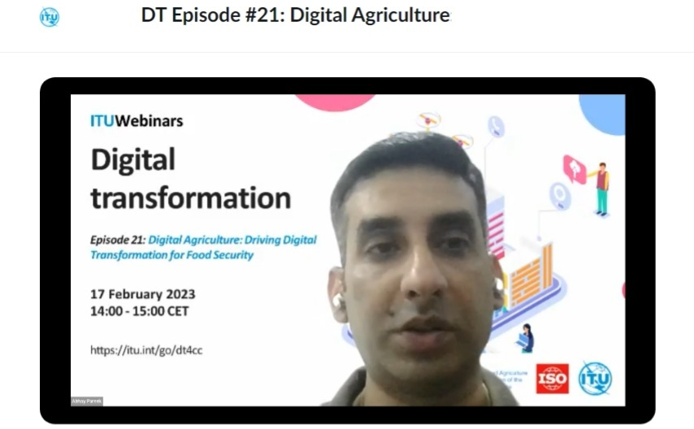
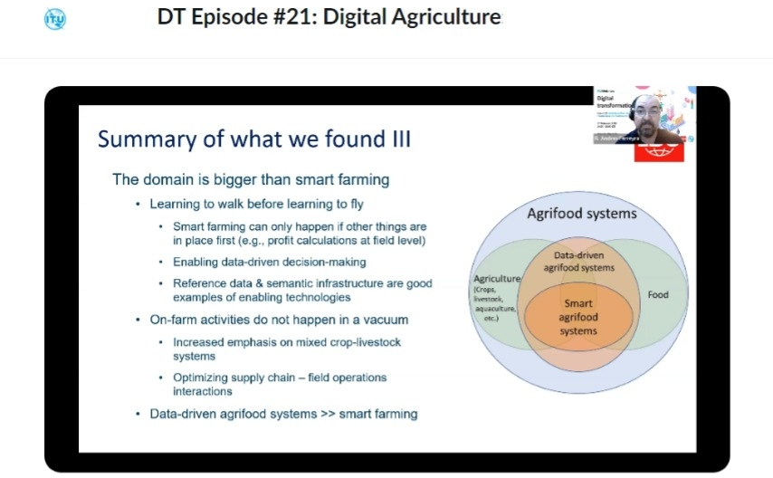

乡村振兴作为粮食安全战略，「要...积极延伸和拓展**农业产业链**，培育发展农村**新产业新业态**，...」

**产业振兴**、**农业产业链**、**新产业新业态**要如何做？

联合国**国际电联**及**粮农组织**，在线研讨会系列第 21 集《数字农业：为粮食安全驱动数字转型》为题，澳恪森两位创办人，数据科学家廖汉腾博士与商业模式运营官潘仲亷博士进行了学习及笔记。

<!--more-->

在中国[粮食安全作为国家战略的高度](https://www.chinanews.com.cn/gn/2023/03-29/9980766.shtml)之下，《习近平关于国家粮食安全论述摘编》中就有「要把**产业振兴**作为乡村振兴的重中之重，积极延伸和拓展**农业产业链**，培育发展农村**新产业新业态**，不断拓宽农民增收致富渠道。」的论述。

**产业振兴**、**农业产业链**、**新产业新业态**要如何做？

联合国[**国际电信联盟**](https://www.itu.int/zh/about/Pages/default.aspx) (ITU，简称 **国际电联**，负责**信息通信技术 ICT 事务**的专门机构) ，及[粮食及农业组织](https://www.fao.org/home/zh) (FAO，简称 **粮农组织**，负责**消除饥饿**的专门机构 ) ，亦已合作于[2023 年 2 月 17 日在线研讨会 ](https://itu.zoom.us/rec/play/zmdnzzW2a2y-1P9XM0GzQTShgHK4k4KtbS6kJX5pMeXGqLVkYMZGZ-opt6AsWii2CzsBM7-kMV7RdL2X.hRjzOJsdYSB2UFY1?startTime=1676638840000&_x_zm_rtaid=yoN60stZT-eP9f9NWA4MNg.1680104621320.50988e2cd7b334379f81d2ea2c62f7e1&_x_zm_rhtaid=287)。以《数字农业：为粮食安全驱动数字转型》为题，是国际电信联盟在线研讨会系列第 21 集。

澳恪森两位创办人，数据科学家廖汉腾博士与商业模式运营官潘仲亷博士进行了学习及笔记。

### 数字农业生态设计能催生新产业新业态

〝绿色转型、数字转型的双化融合，在农业领域就需要新产业新业态生态设计，这也是像[_国家工业设计研究院（生态设计领域）_](http://news.zjnu.edu.cn/2022/0324/c8449a390137/page.htm)、[_车载信息服务产业应用联盟 TIAA_](https://www.tiaa.org.cn/index/temdown/index.html)等组织在人才培养、标准服务等持续进行知识及技术转化的工作。〞廖汉腾博士指出，〝现在正进行国际标准制定活动的[国际电信联盟 ITU-T 专门小组](https://www.itu.int/en/ITU-T/focusgroups/Pages/default.aspx "ITU-T Focus Groups")，[FG-AI4A](https://www.itu.int/en/ITU-T/focusgroups/ai4a/Pages/default.aspx#) ，致力于构建**数字农业的人工智能 (AI) 和物联网 (IoT)** 的 专门词汇表 _**WG-Gloss**_、用例和解决方案 _**WG-AS**_、数据采集和建模 _**WG-DAM**_、标准活动的路线图 _**WG-Roadmap**_、伦理法律和监管考虑 _**WG-ELR**_、协作和外联 **_WG-CO_**、等等工作。〞

潘仲亷博士表示，〝这些打底的知识及技术转化的工作，不只有全球知名研究单位参与，亦有如华为、[车载信息服务产业应用联盟 TIAA](https://www.tiaa.org.cn/index/temdown/index.html)等中国的企业及行业的参加，显见相关的单位，在数字农业领域催生新产业新业态的强烈动机。〞

〝基于从化 [**世界生态设计大会 WEDC**](https://www.wedo2018.com.cn/about/)及澳恪森于[**互联网生态与向善设计**](https://mp.weixin.qq.com/s/kjS1gD7T22AAO7KeNnndtg)的积累，〞廖汉腾博士点出在学习[国际电信联盟在线研讨会系列--数字农业](https://itu.zoom.us/rec/play/zmdnzzW2a2y-1P9XM0GzQTShgHK4k4KtbS6kJX5pMeXGqLVkYMZGZ-opt6AsWii2CzsBM7-kMV7RdL2X.hRjzOJsdYSB2UFY1?startTime=1676638840000&_x_zm_rtaid=yoN60stZT-eP9f9NWA4MNg.1680104621320.50988e2cd7b334379f81d2ea2c62f7e1&_x_zm_rhtaid=287)的切入角度，〝国际权威前沿讨论到的问题及技术方案，有哪些是从化在地需要或能贡献的？整体的知识及技术转化的工作，若放在技术路线图 Technology Roadmap 上，如何能催生新产业新业态？需要什么样的数字农业生态设计 ( Eco-design of Digital Agriculture) ？

### 议程及主要利益相关者分析

根据联合国粮农组织及国际电联的议程文件 ( 见[FAO 官网](https://www.fao.org/e-agriculture/events/itu-webinars-series-episode-21-digital-agriculture-driving-digital-transformation-food) 及[ITU 官网](https://www.itu.int/cities/standards4dt/ep21/#Lehmann))，澳恪森将 Webinar 议程整理如下：

- **14:00 - 14:10** -- **欢迎致辞**
  - [**大江征三** Seizo Onoe ](https://www.itu.int/en/ITU-T/tsbdir/Pages/Seizo_Onoe/biography.aspx)，**国际电联** 电信标准化局 主任
  - **[Dejan Jakovljevic](https://www.itu.int/en/ITU-T/webinars/DT4CC/20230217/Pages/bios.aspx#Jakovljevic)**，**联合国粮农组织** 首席信息官兼数字化和信息学司司长
  - **[Johannes Lehmann](https://www.itu.int/en/ITU-T/webinars/DT4CC/20230217/Pages/bios.aspx#Lehmann)**，**德国标准化研究所** 智能农业业务发展主管，**ISO 国标准组织** 智能农业战略咨询小组召集人
- **14：10 - 14：50** -- **分论坛**：**农业数字化转型**
	- 主持人： **[FG-AI4A](https://www.itu.int/en/ITU-T/focusgroups/ai4a/Pages/default.aspx#)**   联合主席 [塞巴斯蒂安·博斯 Sebastian Bosse](https://www.itu.int/en/ITU-T/webinars/DT4CC/20230217/Pages/bios.aspx#Bosse)   **德国 Fraunhofer HHI** 互动与认知系统集团 负责人
	- [Abhay Pareek](https://www.itu.int/en/ITU-T/webinars/DT4CC/20230217/Pages/bios.aspx#Pareek)，**世界经济论坛 (WEF)**  农业工业 4.0 革命 负责人
	- [R. Andres Ferreyra](https://www.itu.int/en/ITU-T/webinars/DT4CC/20230217/Pages/bios.aspx#Ferreyra)，**先正达** (Syngenta) 全球数字农业 数据资产管理经理
	- [Claudia Rossler](https://www.itu.int/en/ITU-T/webinars/DT4CC/20230217/Pages/bios.aspx#Rossler)，**微软云** 总监
- **14:50 - 15:00** -- **结束语** 
	- [**Ramy Ahmed Fathy**](https://www.itu.int/en/ITU-T/webinars/DT4CC/20230217/Pages/bios.aspx#Fathy)，**国际电联** ITU-T 电信标准化局 第 20 研究组 ITU-T SG20 副主席
	- [Bilel Jamoussi](https://www.itu.int/en/ITU-T/webinars/DT4CC/20230217/Pages/bios.aspx#Jamoussi)，**国际电联** ITU TSB 研究组组长

〝分论坛主体活动是以世界经济论坛、先正达、及微软云为主，〞潘仲亷博士分析，〝突出了**数据作为资产在云端创新创业促进经济发展，运用数字技术创新的新业态**，而 FG-AI4A 的联合主席作为主持人所负责的集团，正是德国主要的电信研究所的应用系统部门，以互动及认知系统的设计切入，显见信息系统及设计科学交叉发展信息技术的必要，是数字农业新业态。〞

> [FG-AI4A](https://www.itu.int/en/ITU-T/focusgroups/ai4a/Pages/default.aspx#) 联合主席 [塞巴斯蒂安·博斯 Sebastian Bosse](https://www.itu.int/en/ITU-T/webinars/DT4CC/20230217/Pages/bios.aspx#Bosse) **德国 Fraunhofer HHI** 互动与认知系统集团 负责人

**联合国粮农组织** 首席信息官   [Dejan Jakovljevic](https://www.itu.int/en/ITU-T/webinars/DT4CC/20230217/Pages/bios.aspx#Jakovljevic) 首先点出全球粮农体系安全及韧性，不只要在现有的耕地上增加可持续生产力，更要在此领域使用数字科技协助创新，在供应链上各环节，要提供可负担的技术准入及数字公共产品，才能释放潜力。这对乡村及脆弱群体尤为重要。

[Dejan Jakovljevic](https://www.itu.int/en/ITU-T/webinars/DT4CC/20230217/Pages/bios.aspx#Jakovljevic)从粮食安全的时序、进用、使用、及稳定 的四项关键原则出发，主张物理网及人工智能应整体性的对农粮体系的上下游进行跨领域的通力协作，以达经济规模。

-----

### 启示 1 ：农业供应链的数据驱动转型 -- 广东**绿色碳链通**农业机运

〝联合国粮农组织不只强调技术系统创新，〞廖汉腾博士分析，〝更突**数字技术促粮农体系 agri-food systems 的政策顾问及投资的必要性** ，才能将数字农业的投资影响最大化。这也是联合国粮农组织和国际电联合力的出发点，并点名『数据是横跨联合国粮农组织有体系各介入切点的加速器』(data is cross-cutting accelerators across all FAO's programmatic internventions)。〞

〝像 ITU 及 ISO 标准，作为真正的国际标准化组织，得开发市场能采用且可规模化应用的信息科技，来确保数据驱动平衡的成功，来支持粮食安全的四原则。〞 Dejan Jakovljevic 说。

〝这让我们更确认了，澳恪森的绿色信息流打通供应链各平台及节点的重要性，〞潘仲亷博士补充，〝联合国粮农组织指出人工智能用于监控森林、农害、人力投入、肥料运用等，亦点出在经济、社会、及伦理的风控，必需要有符合国际人权原则的人工智能设计 ，这和我们即将发表的供应链安全韧性及劳动人权论文结论十分契合，也是乡村振兴在成功精准脱贫后，要精准脱碳的关键抓手。〞

> 智能农业的工作定义：于农业价值链上，数据驱动的丶有原则的决策，能对多种通常互相冲突的目标进行最佳化，以面对全球VUCA的环境。來源：[R. Andres Ferreyra](https://www.itu.int/en/ITU-T/webinars/DT4CC/20230217/Pages/bios.aspx#Ferreyra)，**先正达** (Syngenta) 

〝没错，绿色数据、绿色信息流需在农业供应链能发挥正面角色，〞廖汉腾博士指出在地的前沿机运，〝广东已成功依托**企业碳账户+供应链金融** 推出 **_绿色碳链通_** 融资业务，是[**绿色金融**创新用例](http://www.greenfinance.org.cn/displaynews.php?cid=86&id=3537)，十分需要在农业及乡村振兴领域开发相关**绿色供应链金融科技** Green Supply Chain FinTech，根据农业供应商不同的测评等级和绿色标识，提供差异化的信贷融资、数字技术支持、甚至是租税优免或产业补贴，以支持上下游供应商企业进行绿色改造升级和日常运营。〞

〝实现 **“链式脱碳”、“链式融资”、“链式支持”** 是人民银行广州分行总结 “**绿色碳链通**”融资的创新意义，十分值得推向国际，〞潘仲亷博士说明参与**国际电联**的制定标准纳入在地实践的中国现代化意义，〝人民银行及中国金融学会绿色金融专业委员会等的组织，亦对[通过“绿色碳链通”模式进行融资并取得良好经济、社会、环境效益的供应链核心企业、上下游企业进行精准支持采正面期待](http://www.greenfinance.org.cn/displaynews.php?cid=86&id=3537)。〞

〝这是绿色数据及信息流促进社会、环境、治理 (ESG) 效益的**精准支持**及数据驱动**精准脱碳**、**精准减排**的最新理论及实践路径，〞廖汉腾博士总结，〝在**扩大企业碳账户的行业覆盖面**的工作建议之下，农业有不少[生物能源与碳捕获和储存 (BECCS )](https://www.eco.gov.cn/news_info/51244.html)在零碳或负碳的机运，打通绿色品牌、技术、地理标志、等估值的 **高质量发展**，[设计如『双碳荔枝』、『碳中和玫瑰』品牌之绿色金融科技路线图](https://oxfordroadmap.github.io/oxon8/post/2023-03-26-high-quality-development-conghua-carbon-neutral-brands/)。

-----

### 启示 2 ：支持粮食安全的数据驱动转型 -- 国际原则及用例

在实践上，智能农业策略顾问组在 2021 年 9 月召集 150 名专家，针对 ISO 标准实现农粮供应链的可互操性 (interoperatbility)，而 ITU [FG-AI4A](https://www.itu.int/en/ITU-T/focusgroups/ai4a/Pages/default.aspx#) 则聚焦在物联网及人工智能。

**世界经济论坛 (WEF)**  农业工业 4.0 革命 负责人[Abhay Pareek](https://www.itu.int/en/ITU-T/webinars/DT4CC/20230217/Pages/bios.aspx#Pareek)，也以其在印度在地及国际论坛的经验，同意经济规模化达成粮食安全四原则的重要，以及用数据驱动为主的取径。

Abhay Pareek 分享了在 3 大领域的实践，基于 30 多项用例研究：(1) 增进包容性：让女性、青年、及老年农民可透过数字手段进用包括信用及保险的金融服务；(2) 增进可持续性：让农业参与者能有效地运用包括水等资源；(3)  提高供应链效率：包括鼓励农业科技的创新创业。这方面特别需要数据 (包括政府及产业的数据)、技术、及技术验证的支持及服务 。

政府可以扮演支点或驱动者的角色，将私部门创新者的金融及非金融动机进行支持，Abhay Pareek 表示，让数据集可以在 PPP 框架下进行交流，所以推出了数据交流及交易中心、最后一哩协作合作、沙盒试验、以提供安全可控的人工智能运用的解决方案。

〝PPP 框架、沙盒试验等社会-技术手段，〞廖汉腾博士总结，〝看来是使用数据支持粮食安全的可行路径。如何能有效采集并试验在地的数字农业及绿色金融科技将是重要的工作。[广东省碳普惠交易](http://gdee.gd.gov.cn/attachment/0/487/487047/3905858.pdf) 可算是类似的 **增进包容性** 试验。〞

-----

### 启示 3：智能农业在粮农体系核心问题 -- 标准的推广及教学重要

在推动此议题领域的全球机器学习、数据分析集成平台，**先正达** (Syngenta) 全球数字农业 数据资产管理经理 [R. Andres Ferreyra](https://www.itu.int/en/ITU-T/webinars/DT4CC/20230217/Pages/bios.aspx#Ferreyra)则从国际数据标准的实践需求，提供了智能农业的定义、标准重要性说明、以及目前国际标准化组织 ISO 在此领域的 SAG 组织的主要工作产出，就是要产出标准化路线图 (Standardaization Roadmap)。

目前 ISO 的智能农业 SAG 组由粮食生产、动物产品、及 都市农业 三分组构成，又有横跨各组的数据、社会分析、专业术语、供应链、OEM 代工、气候与环境的六专家小组支持。

R. Andres Ferreyrag 配合图表进行报告，并指出目前的难点有以下：

- 多伙伴的数据交换/交易所：数据可互操性极难达成
- 大规模的数据驱动决策：数据集成决策也难
- 低质量的数据模型文文件及验证

这些难点都可以因为有了标准的采用及实践，获得关键成果。

然而，R. Andres Ferreyrag 点出，由于学校不教、潜在用户也不知道，这些潜在农业技术的提供商则不断要重新发明轮子，使标准评估难且贵，需要突破标准的推广、教学、及采用。

全球合作需要协作路线图，要纳入大学参与，并强调标准之间的可互操性，R. Andres Ferreyrag 建议。

〝**智能农业应放在数据驱动的粮农体系**，是 R. Andres Ferreyrag 的重要结论，〞廖汉腾博士总结，〝粮农体系的**精准减排**工作，也因此需要把智能农业的数据标准可互操性放在第一位，这和中国国家要推动国家及国际的双碳计量标准相符，值得发展成[世界生态设计大会 WEDC](https://www.wedo2018.com.cn/about/)及[互联网生态与向善设计](https://mp.weixin.qq.com/s/kjS1gD7T22AAO7KeNnndtg)的主要推广及教学领域。

**微软云** 总监 [Claudia Rossler](https://www.itu.int/en/ITU-T/webinars/DT4CC/20230217/Pages/bios.aspx#Rossler)则分享了精准农业的实践，也同意数据及技术的可互操性对业界协作的重要性，市场及行业参与者若能从数据及分析标准化过程资源获益，则能对标准及行业发展有正向的影响。

〝针对数智农业的数据及分析标准，〞廖汉腾博士总结，〝看来需要可互操性高的标准，这方面中国的相关行业及国家标准的建构及发展将是重要的工作。〞

-----

### 合作机运：澳恪森数智征求加入 ITU FG-AI4A 的合作伙伴

聚焦<a href="#脚注">数智平台 ¹</a> 与   <a href="#脚注">绿色金融科技 ²</a>  <a href="#脚注">设计创新 ³</a>的 **澳恪森数智科技服务** ，认同此次联合国信息通信技术及农粮组织的权威前沿讨论结论之一：易用易交换的数据标准及数据分析标准是发展的必要。

在地相关的行业协会如[广州市绿色金融协会，也已为金融机构围绕 “双碳” 目标开展投融资业务提供可操作、可计量、可验证的依据进行探讨](http://www.gzgfa.org.cn/Dongtai-30/632.html)，都对国家及[地方的绿色低碳循环发展经济体系](http://www.gd.gov.cn/zwgk/wjk/qbwj/yf/content/post_3721142.html) 做出贡献。

澳恪森数智科技服务征求加入 ITU FG-AI4A 的合作伙伴，参与以下活动，使致力于构建**数字农业的人工智能 (AI) 和物联网 (IoT)** 的[FG-AI4A](https://www.itu.int/en/ITU-T/focusgroups/ai4a/Pages/default.aspx#) 国际标准的讨论流程，能有效采集并试验在地的数字农业及绿色金融科技：

- 专门词汇表 _**WG-Gloss**_、
- 用例和解决方案 _**WG-AS**_、
- 标准活动的路线图 _**WG-Roadmap**_

〝供应链金融低碳体系建设方面，农业及农粮体系在国家[粮食安全战略高度](https://www.chinanews.com.cn/gn/2023/03-29/9980766.shtml)下可不能少。〞澳恪森创办人与商业模式运营官潘仲亷博士总结。〝支持智能农业及乡村振兴的绿色供应链金融，对从化的农业、旅游业、酒店业、美妆业等等，都是关键需要高质量发展的商业模式创新，这也是我们最近发表的《[在 ESG 咨询﹑报告和传播教育方面进行合作](https://oxfordroadmap.github.io/oxon8/post/2023-02-22-esg-education-partner-maps/)》、《[碳中和管理服务数智平台](https://oxfordroadmap.github.io/oxon8/post/2023-02-20-smart-digital-platforms-carbon-neutral-management-services/)》两篇论文及系列设计画布的发展相符。〞 ( 参见[《 设计科学+信息科学：不论任何学科都能用上的知识及方法》](https://oxfordroadmap.github.io/oxon8/post/2023-03-27-design-science-plus-information-science/) )

〝供应链金融低碳体系建设方面，农粮体系和金融体系的数据交换及交流标准则是重中之重。〞澳恪森创办人与数据科学家廖汉腾腾博士总结。〝支持智能农业及乡村振兴的绿色技术及标准需要多方合作，望有志之士一同为此领域创建公共产品及平台，推动数智农业的产业 5.0 数据空间技术路线图 ，催生新产业新业态，发展数字农业生态设计 ( Eco-design of Digital Agriculture) 。〞

### 脚注

¹ 数智平台 指利用人工智能﹑区块链﹑云计算﹑数据科学等 ABCD 数字科技实现[数字化转型](http://www.sasac.gov.cn/n4470048/n13461446/n15927611/n16058233/c16135120/content.html)[平台商业模式](https://www2.deloitte.com/cn/zh/pages/soe/articles/soe-digital-transformation-2.html)，如阿里云[数据智能平台](https://datapaas.aliyun.com)、京东云[数智平台“优加”](http://www.21jingji.com/article/20230323/herald/fe6ebc956c6d6e11f7887c21cbe0a86e.html) ，有广义的 SaaS/PaaS/IaaS/DaaS，也有狭义的 Data as a Service (DaaS) 

² [绿色金融科技](https://link.springer.com/chapter/10.1007/978-3-319-76014-8_11) 指 [可持续金融](https://www.unep.org/regions/asia-and-pacific/regional-initiatives/supporting-resource-efficiency/green-financing) (特别包括[联合国可持续发展目标下](https://www.un.org/en/digital-financing-taskforce) ) 及 [金融科技](https://www.sciencedirect.com/topics/economics-econometrics-and-finance/fintech) (或 数字金融) 两者交叉的新兴领域及实践。 

³ [设计创新](https://www.sciencedirect.com/topics/social-sciences/design-innovation)  为 设计学 及 创新学 交叉的领域，在联合国系统下如[使用创新标准结合数字化转型达成可持续发展](https://www.unido.org/news/unido-promotes-innovation-standards-and-digital-transformation-achieve-sdgs)﹑[使用数字化转型促进社会包容型发展](https://www.un.org/development/desa/dspd/2021/02/digital-technologies-for-social-inclusion/)﹑[使用数字创新生态系统促进数字化转型](https://www.itu.int/itu-d/sites/innovation/)﹑等等。

---

### 关于澳恪森数智科技

澳恪森数智科技，简称 Oxon8，全名为澳恪森数智科技服务（广州）有限公司，创新数智平台与绿色金融科技的设计，助组织与个人的双化协同发展及精准脱碳之旅。

澳恪森 Oxon8 为行业﹑智库﹑政府等提供基于专利分析﹑科学计量﹑知识图谱等等数据情报，合作开展集科技研发﹑科技服务﹑成果转化﹑系统集成﹑人才培养﹑等科技创新公共及商业服务，运用前瞻情报连结在地及全球网络。
