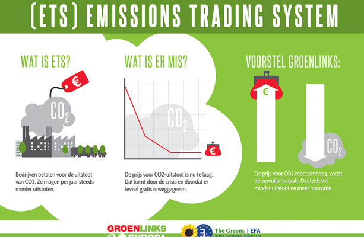

真实落地双碳目标，需要在科学基础上对实际项目管理。澳恪森为企业及个人摘要了 减排**项目管理** 如何采用 **碳普惠方法**，以最终参与省及国家的碳排放核查及碳排放权交易，提供了简要易懂的图文说明，碳普惠方法产出MRV数据，以绿色信息流转型的工作流，发展绿色中介服务机构，按[广东省发展绿色金融支持碳达峰行动的实施方案](https://www.gd.gov.cn/zwgk/wjk/qbwj/ybh/content/post_3972447.html)做出贡献。

<!--more-->

**碳排放权交易**要如何做？由于诸多落地难点，因此有了**碳普惠方法**的打底，指在为了各行业的企业及个人能有方法可依，产出并提供相关活动的温室气体排放数据。

| 中文      | 英文 |
| ----------- | ----------- |
| 中国国家自主贡献 |  China's NDC ( Nationally Determined Contribution ) |
| 国家核证自愿减排量 | CCER ( Chinese Certified Emission Reduction ) |
| 碳排放权交易      | Carbon ETS ( Emission Trading Scheme ) |
| 碳普惠方法   | Carbon Inclusive methodologies|


> 來源：广州碳排放权交易所，[一图读懂--广州碳排放权交易中心2022年度市场报告](https://www.cnemission.com/article/news/jysdt/202301/20230100002836.shtml)

## 温室气体排放数据难点

有温室气体排放数据，**碳排放权交易**才能有可信、可操作的管理办法。

2020年12月公布的《[碳排放权交易管理办法（试行）](http://www.gov.cn/zhengce/zhengceku/2021-01/06/content_5577360.htm)》，就有相关的报告及核查的基本要求。对于任何减排项目管理来说，就有工作流程基本要求如下图所示。


位于图正中央的 **温室气体排放**数据，要如何产出呢？

## 如何产出数据？碳普惠方法

如何基于可监测、可报告、可核查（Monitoring, Reporting and Verification ）标准，量化相关的 温室气体排放、固碳量等等是个难题。

这需要方法。

2023年3月30日，生态环境部发布了[关于公开征集温室气体自愿减排项目方法学建议的函](https://www.mee.gov.cn/xxgk2018/xxgk/xxgk06/202303/t20230330_1024693.html)，指出：

> 方法学是指导温室气体自愿减排项目开发、实施、审定和减排量核查的主要依据，对减排项目的基准线识别、额外性论证、减排量核算和监测计划制定等具有重要的规范作用。碳达峰碳中和目标对温室气体自愿减排交易市场建设提出了新的更高要求，原有方法学体系难以满足当前工作需求，多数方法学需要更新基准线和额外性论证要求，部分方法学缺乏推广使用价值和应用场景，个别方法学不符合产业政策导向，近年涌现的创新减排技术也急需相应方法学支持。

## 中国核证自愿减排量(China Certified Emission Reduction, CCER)

什么是CCER？方法学又是？

中国核证自愿减排量 (China Certified Emission Reduction, CCER) 指特定项目减排效果的量化核证，并在国家温室气体自愿减排交易注册登记，可用于控排企业清缴履约。

作为温室气体自愿减排交易主管部门， 自然资源部及国家发改委，自2013年以来，先后公布国家温室气体自愿减排方法学备案清单，为各类型项目开发CCER提供了算法指引。

中科碳中和投研、ESG数字研究院团队整理了已发布的方法学共计203项，包括电力、交通、化工、建筑等30多个领域。（详见中国发展网，[十二批203个CCER方法学汇总-附件](http://shuangtan.chinadevelopment.com.cn/tkptgy/2022/1130/1811530.shtml)）。

的确，这些方法学必需要通过专家评审验证，如中国林业科学研究院的[《湿地碳汇方法学》](http://www.caf.ac.cn/info/1041/19669.htm)、海南省首个碳普惠方法学[《海南红树林造林/再造林碳汇项目方法学》](https://new.qq.com/rain/a/20230327A0508600)、以及广东省生态环境厅关于印发《[广东省林业碳汇碳普惠方法学（2022年修订版）](http://gdee.gd.gov.cn/shbtwj/content/post_3993031.html)》等5个方法学：

1. [广东省林业碳汇碳普惠方法学（2022年修订版）.pdf](http://gdee.gd.gov.cn/attachment/0/496/496642/3993031.pdf)
2. [广东省安装分布式光伏发电系统碳普惠方法学（2022年修订版）.pdf](http://gdee.gd.gov.cn/attachment/0/496/496631/3993031.pdf) 
3. [广东省使用高效节能空调碳普惠方法学（2022年修订版）.pdf](http://gdee.gd.gov.cn/attachment/0/496/496638/3993031.pdf)
4. [广东省使用家用空气源热泵热水器碳普惠方法学（2022年修订版）.pdf](http://gdee.gd.gov.cn/attachment/0/496/496633/3993031.pdf)
5. [广东省废弃衣物再利用碳普惠方法学（2022年修订版）.pdf](http://gdee.gd.gov.cn/attachment/0/496/496634/3993031.pdf)

澳恪森两位创办人，数据科学家廖汉腾博士与商业模式运营官COO/CFO潘仲亷博士表示，根据《广东省碳普惠交易管理办法》规定，的确在行业推广及应用方面，能促进更具包容性的参与，而各行各业各项产品及服务的相关碳普惠方法则是发展重点。

## 碳普惠方法的基本要求及需求

〝可以说有了碳普惠方法，才有机会产出绿色信息流，有了推动金流、物流、人流等的产业实践，这些绿色信息流才能系统性地改变行业及市场，〞数据科学家廖汉腾博士点出碳普惠方法产出关键数据的重要性。

〝若真有可核算的温室气体排放数据，才能给金融及消费市场有信心的投资、采买、及品牌估值，〞商业模式运营官COO/CFO潘仲亷博士补充说明，〝碳普惠方法的基本要求就需要金融、财务、会计、审计等传统知识能在各行各业下沈去补捉可科学核查的绿色信息。〞

澳恪森两位创办人将此工作流程，扩充摘要如下图：


```mermaid
    graph TB
    subgraph PM[减排项目管理]
        项目 --> |采用| 碳普惠方法学 
        项目 --> |管护和经营| 温室气体排放相关活动
        温室气体排放相关活动 --> |运用科学核算流程和方法| 温室气体排放
	    subgraph Method[碳普惠方法]
	        碳普惠方法学 ===>|可监测M| 温室气体排放 %% 注释[澳恪森数智科技服务](https://oxon8.com/)
	        碳普惠方法学 ===>|可报告R| 温室气体排放 %% 注释[澳恪森数智科技服务](https://oxon8.com/)
	        碳普惠方法学 ===>|可核查V| 温室气体排放 %% 注释[澳恪森数智科技服务](https://oxon8.com/)
	    end
    end
    subgraph C[碳排放权交易]
        温室气体排放 -.->|成功报告与核查| 省级生态环境主管部门 
        省级生态环境主管部门 -.->|量化核证后全国碳排放权注册登记| 国家核证自愿减排量 
    end
```


碳普惠方法的基本要求是：要能产出合规、可信的温室气体排放数据，是能真实反应温室气体排放的相关活动。如上图的上方的减排项目管理，到下方的碳排放权交易的大框架所述。

碳普惠方法的基本需求是：要能产出MRV可监测、可报告、可核查的科学方法及技术指标。

这需要创新设计，对原有的业务以最终能对接国家量化核证为实践。




>  欧盟ETS的众多提案之一：由欧盟绿党的提案

〝国家核证自愿减排量，CCER，是有价值有权威的，〞商业模式运营官COO/CFO潘仲亷博士补充说明，〝碳普惠方法的绿色信息构建的就是这价值及权威，这也是供应链金融科技未来必需要发展纳入的方向。国家[有要求在CCER提升信息化水平，提升配额管理的智能化水平](http://www.gov.cn/zhengce/zhengceku/2023-03/16/content_5747106.htm)。〞


## 小结

〝设计减排项目，〞数据科学家廖汉腾博士说明，〝必需掌握碳普惠方法学与碳排放权交易的关系，就是在能产出MRV数据，以绿色信息流打通产销融消投等循环经济各环节。〞

>要设计减排项目，必需掌握碳普惠方法学与碳排放权交易的关系。
{.h3 .table-success}

〝[广东省发展绿色金融支持碳达峰行动的实施方案](https://www.gd.gov.cn/zwgk/wjk/qbwj/ybh/content/post_3972447.html)中，〞商业模式运营官COO/CFO潘仲亷博士表示，〝鼓励绿色金融研究机构、专业智库创新发展。正同廖汉腾博士，發展在「鼓励碳核算与核查、绿色认证、环境咨询、绿色资产评估、数据服务」等绿色中介服务机构发展商业模式。〞


-----

### 合作机运：澳恪森数智征求开发碳普惠方法的合作伙伴

聚焦<span class="highlight-container highlight-yellow"><span class="highlight"><a href="#脚注">数智平台 ¹</a></span></span> 与   <span class="highlight-container highlight-green"><span class="highlight"><a href="#脚注">绿色金融科技 ²</a></span></span>  <span class="highlight-container highlight-fushia"><span class="highlight"><a href="#脚注">设计创新 ³</a></span></span>的 **澳恪森数智科技服务** ，认同碳普惠方法在各行各业参与碳排放权交易的重要性。

澳恪森数智科技服务征求开发碳普惠方法的合作伙伴，参与相关的公开征集方法学活动，以及广州[市工信局组织“四化”平台服务](https://gz.gov.cn/xw/zwlb/bmdt/content/post_8809369.html)的碳普惠应用。

〝举例来说，[全国首个省级碳普惠应用“浙江碳普惠”，就是以ToC为出发点的**双碳数智平台**](https://www.eco.gov.cn/news_info/53945.html)。＂数据科学家廖汉腾表示，＂广州则以先进制造业强市战略，以ToB的工业4.0甚至是工业5.0实践为主，[开展“四化”平台赋能专项行动](https://gz.gov.cn/ysgz/xwdt/ysdt/content/mpost_8787864.html)。〞

> 〝四化〞即推动制造业数字化转型、网络化协同、智能化改造、绿色化提升，是实现新型工业化、制造业转型升级的目标举措。
>  -- 广州市工信系统


### 脚注

¹ 数智平台 指利用人工智能、区块链、云计算、数据科学等 ABCD 数字科技实现[数字化转型](http://www.sasac.gov.cn/n4470048/n13461446/n15927611/n16058233/c16135120/content.html)[平台商业模式](https://www2.deloitte.com/cn/zh/pages/soe/articles/soe-digital-transformation-2.html)，如阿里云[数据智能平台](https://datapaas.aliyun.com)、京东云[数智平台“优加”](http://www.21jingji.com/article/20230323/herald/fe6ebc956c6d6e11f7887c21cbe0a86e.html) ，有广义的 SaaS/PaaS/IaaS/DaaS，也有狭义的 Data as a Service (DaaS)<br/>

² [绿色金融科技](https://link.springer.com/chapter/10.1007/978-3-319-76014-8_11) 指 [可持续金融](https://www.unep.org/regions/asia-and-pacific/regional-initiatives/supporting-resource-efficiency/green-financing) (特别包括[联合国可持续发展目标下](https://www.un.org/en/digital-financing-taskforce) ) 及 [金融科技](https://www.sciencedirect.com/topics/economics-econometrics-and-finance/fintech) (或 数字金融) 两者交叉的新兴领域及实践。<br/>

³ [设计创新](https://www.sciencedirect.com/topics/social-sciences/design-innovation)  为 设计学 及 创新学 交叉的领域，在联合国系统下如[使用创新标准结合数字化转型达成可持续发展](https://www.unido.org/news/unido-promotes-innovation-standards-and-digital-transformation-achieve-sdgs)、[使用数字化转型促进社会包容型发展](https://www.un.org/development/desa/dspd/2021/02/digital-technologies-for-social-inclusion/)、[使用数字创新生态系统促进数字化转型](https://www.itu.int/itu-d/sites/innovation/)、等等。


-----
### 更多阅读
* 中科碳中和ESG数字研究院投研团队，2022-12-08，[碳汇概念大全](http://shuangtan.chinadevelopment.com.cn/tkptgy/2022/1213/1813600.shtml)，中国发展网 chinadevelopment.com.cn
* 中科碳中和ESG数字研究院投研团队，2022-12-08，[79项碳足迹相关政策汇编及摘要](http://shuangtan.chinadevelopment.com.cn/tkptgy/2022/1208/1812878.shtml)，中国发展网 chinadevelopment.com.cn
* 广东省人民政府，2022，**关于印发《[广东省发展绿色金融支持碳达峰行动的实施方案](https://www.gd.gov.cn/zwgk/wjk/qbwj/ybh/content/post_3972447.html)》的通知**, 粤办函〔2022〕219号
* ICAP 秘书处，International Carbon Action Partnership   [2023 年进展报告](https://icapcarbonaction.com/en/news/out-now-new-icap-status-report-2023-presents-latest-developments-emissions-trading-systems)
* 广州碳排放权交易所，[碳排放管理员-职业能力水平评价培训](https://www.cnemission.com/article/course/kcsz/202302/20230200002858.shtml)
* 广州市人民政府，[市工业和信息化局领导主持召开推进广州服装产业“四化”转型座谈会 ](https://www.gz.gov.cn/xw/zwlb/bmdt/sgyhxxhj/content/post_8889961.html)
* [Tim Frick](https://www.mightybytes.com/blog/author/timfrick/ "Posts by Tim Frick") ，[Sustainable Web Design](https://www.mightybytes.com/blog/tag/sustainablewebdesign/)
* [Tim Frick](https://www.mightybytes.com/blog/author/timfrick/ "Posts by Tim Frick") ，[Corporate Digital Responsibility](https://www.mightybytes.com/blog/what-is-corporate-digital-responsibility/) (CDR) strategy


* 广州市人民政府，[“广聚群链 湾区启航”广州人工智能、软件和信创产业链高质量发展暨产业对接大会成功举行](https://www.gz.gov.cn/xw/zwlb/bmdt/sgyhxxhj/content/post_8835925.html)：着力构建以数字经济为引领的工业和信息化现代产业体系，建立实施以市领导为“链长”、龙头企业为“链主”的双链式“链长制”，制定人工智能、软件和信创产业链等21条重点产业链高质量发展三年行动计划，着力打造软件和信创等8个万亿级、人工智能等13个千亿级和一大批百亿级产业链群。
* [超九成企业盼转型，广州首批45个“四化”赋能重点平台出炉](https://www.sohu.com/a/644542689_161795)


---

### 关于澳恪森数智科技

澳恪森数智科技，简称 Oxon8，全名为澳恪森数智科技服务（广州）有限公司，创新数智平台与绿色金融科技的设计，助组织与个人的双化协同发展及精准脱碳之旅。


澳恪森 Oxon8 为行业、智库、政府等提供基于专利分析、科学计量、知识图谱等等数据情报，合作开展集科技研发、科技服务、成果转化、系统集成、人才培养、等科技创新公共及商业服务，运用前瞻情报连结在地及全球网络。
