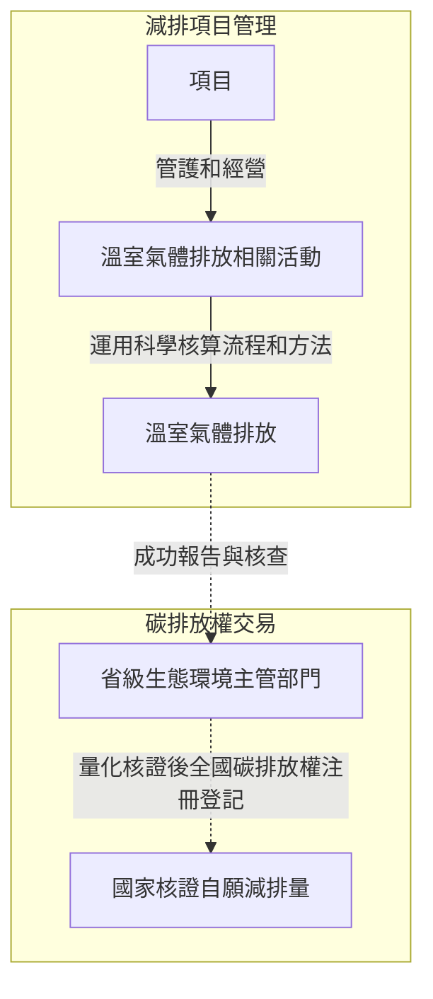
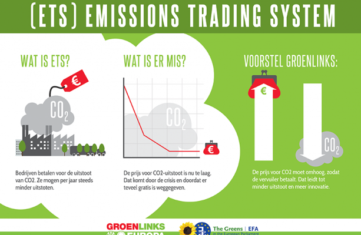

真實落地雙碳目標，需要在科學基礎上對實際項目管理。澳恪森為企業及個人摘要了 減排**項目管理** 如何采用 **碳普惠方法**，以最終參與省及國家的碳排放核查及碳排放權交易，提供了簡要易懂的圖文說明，碳普惠方法產出MRV數據，以綠色信息流轉型的工作流，發展綠色中介服務機構，按[廣東省發展綠色金融支持碳達峰行動的實施方案](https://www.gd.gov.cn/zwgk/wjk/qbwj/ybh/content/post_3972447.html)做出貢獻。

<!--more-->

**碳排放權交易**要如何做？由於諸多落地難點，因此有了**碳普惠方法**的打底，指在為了各行業的企業及個人能有方法可依，產出並提供相關活動的溫室氣體排放數據。

| 中文      | 英文 |
| ----------- | ----------- |
| 中國國家自主貢獻 |  China's NDC ( Nationally Determined Contribution ) |
| 國家核證自願減排量 | CCER ( Chinese Certified Emission Reduction ) |
| 碳排放權交易      | Carbon ETS ( Emission Trading Scheme ) |
| 碳普惠方法   | Carbon Inclusive methodologies|


> 來源：廣州碳排放權交易所，[一圖讀懂--廣州碳排放權交易中心2022年度市場報告](https://www.cnemission.com/article/news/jysdt/202301/20230100002836.shtml)

## 溫室氣體排放數據難點

有溫室氣體排放數據，**碳排放權交易**才能有可信、可操作的管理辦法。

2020年12月公布的《[碳排放權交易管理辦法（試行）](http://www.gov.cn/zhengce/zhengceku/2021-01/06/content_5577360.htm)》，就有相關的報告及核查的基本要求。對於任何減排項目管理來說，就有工作流程基本要求如下圖所示。




位於圖正中央的 **溫室氣體排放**數據，要如何產出呢？

## 如何產出數據？碳普惠方法

如何基於可監測、可報告、可核查（Monitoring, Reporting and Verification ）標准，量化相關的 溫室氣體排放、固碳量等等是個難題。

這需要方法。

2023年3月30日，生態環境部發布了[關於公開征集溫室氣體自願減排項目方法學建議的函](https://www.mee.gov.cn/xxgk2018/xxgk/xxgk06/202303/t20230330_1024693.html)，指出：

> 方法學是指導溫室氣體自願減排項目開發、實施、審定和減排量核查的主要依據，對減排項目的基准線識別、額外性論證、減排量核算和監測計劃制定等具有重要的規範作用。碳達峰碳中和目標對溫室氣體自願減排交易市場建設提出了新的更高要求，原有方法學體系難以滿足當前工作需求，多數方法學需要更新基准線和額外性論證要求，部分方法學缺乏推廣使用價值和應用場景，個別方法學不符合產業政策導向，近年湧現的創新減排技術也急需相應方法學支持。

## 中國核證自願減排量(China Certified Emission Reduction, CCER)

什麼是CCER？方法學又是？

中國核證自願減排量 (China Certified Emission Reduction, CCER) 指特定項目減排效果的量化核證，並在國家溫室氣體自願減排交易注冊登記，可用於控排企業清繳履約。

作為溫室氣體自願減排交易主管部門， 自然資源部及國家發改委，自2013年以來，先後公布國家溫室氣體自願減排方法學備案清單，為各類型項目開發CCER提供了算法指引。

中科碳中和投研、ESG數字研究院團隊整理了已發布的方法學共計203項，包括電力、交通、化工、建築等30多個領域。（詳見中國發展網，[十二批203個CCER方法學彙總-附件](http://shuangtan.chinadevelopment.com.cn/tkptgy/2022/1130/1811530.shtml)）。

的確，這些方法學必需要通過專家評審驗證，如中國林業科學研究院的[《濕地碳彙方法學》](http://www.caf.ac.cn/info/1041/19669.htm)、海南省首個碳普惠方法學[《海南紅樹林造林/再造林碳彙項目方法學》](https://new.qq.com/rain/a/20230327A0508600)、以及廣東省生態環境廳關於印發《[廣東省林業碳彙碳普惠方法學（2022年修訂版）](http://gdee.gd.gov.cn/shbtwj/content/post_3993031.html)》等5個方法學：

1. [廣東省林業碳彙碳普惠方法學（2022年修訂版）.pdf](http://gdee.gd.gov.cn/attachment/0/496/496642/3993031.pdf)
2. [廣東省安裝分布式光伏發電系統碳普惠方法學（2022年修訂版）.pdf](http://gdee.gd.gov.cn/attachment/0/496/496631/3993031.pdf) 
3. [廣東省使用高效節能空調碳普惠方法學（2022年修訂版）.pdf](http://gdee.gd.gov.cn/attachment/0/496/496638/3993031.pdf)
4. [廣東省使用家用空氣源熱泵熱水器碳普惠方法學（2022年修訂版）.pdf](http://gdee.gd.gov.cn/attachment/0/496/496633/3993031.pdf)
5. [廣東省廢棄衣物再利用碳普惠方法學（2022年修訂版）.pdf](http://gdee.gd.gov.cn/attachment/0/496/496634/3993031.pdf)

澳恪森兩位創辦人，數據科學家廖漢騰博士與商業模式運營官COO/CFO潘仲亷博士表示，根據《廣東省碳普惠交易管理辦法》規定，的確在行業推廣及應用方面，能促進更具包容性的參與，而各行各業各項產品及服務的相關碳普惠方法則是發展重點。

## 碳普惠方法的基本要求及需求

〝可以說有了碳普惠方法，才有機會產出綠色信息流，有了推動金流、物流、人流等的產業實踐，這些綠色信息流才能系統性地改變行業及市場，〞數據科學家廖漢騰博士點出碳普惠方法產出關鍵數據的重要性。

〝若真有可核算的溫室氣體排放數據，才能給金融及消費市場有信心的投資、采買、及品牌估值，〞商業模式運營官COO/CFO潘仲亷博士補充說明，〝碳普惠方法的基本要求就需要金融、財務、會計、審計等傳統知識能在各行各業下沈去補捉可科學核查的綠色信息。〞

澳恪森兩位創辦人將此工作流程，擴充摘要如下圖：


```mermaid
    graph TB
    subgraph PM[減排項目管理]
        項目 --> |采用| 碳普惠方法學 
        項目 --> |管護和經營| 溫室氣體排放相關活動
        溫室氣體排放相關活動 --> |運用科學核算流程和方法| 溫室氣體排放
	    subgraph Method[碳普惠方法]
	        碳普惠方法學 ===>|可監測M| 溫室氣體排放 %% 注釋[澳恪森數智科技服務](https://oxon8.com/)
	        碳普惠方法學 ===>|可報告R| 溫室氣體排放 %% 注釋[澳恪森數智科技服務](https://oxon8.com/)
	        碳普惠方法學 ===>|可核查V| 溫室氣體排放 %% 注釋[澳恪森數智科技服務](https://oxon8.com/)
	    end
    end
    subgraph C[碳排放權交易]
        溫室氣體排放 -.->|成功報告與核查| 省級生態環境主管部門 
        省級生態環境主管部門 -.->|量化核證後全國碳排放權注冊登記| 國家核證自願減排量 
    end
```


碳普惠方法的基本要求是：要能產出合規、可信的溫室氣體排放數據，是能真實反應溫室氣體排放的相關活動。如上圖的上方的減排項目管理，到下方的碳排放權交易的大框架所述。

碳普惠方法的基本需求是：要能產出MRV可監測、可報告、可核查的科學方法及技術指標。

這需要創新設計，對原有的業務以最終能對接國家量化核證為實踐。




>  歐盟ETS的眾多提案之一：由歐盟綠黨的提案

〝國家核證自願減排量，CCER，是有價值有權威的，〞商業模式運營官COO/CFO潘仲亷博士補充說明，〝碳普惠方法的綠色信息構建的就是這價值及權威，這也是供應鏈金融科技未來必需要發展納入的方向。國家[有要求在CCER提升信息化水平，提升配額管理的智能化水平](http://www.gov.cn/zhengce/zhengceku/2023-03/16/content_5747106.htm)。〞


## 小結

〝設計減排項目，〞數據科學家廖漢騰博士說明，〝必需掌握碳普惠方法學與碳排放權交易的關系，就是在能產出MRV數據，以綠色信息流打通產銷融消投等循環經濟各環節。〞

>要設計減排項目，必需掌握碳普惠方法學與碳排放權交易的關系。
{.h3 .table-success}

〝[廣東省發展綠色金融支持碳達峰行動的實施方案](https://www.gd.gov.cn/zwgk/wjk/qbwj/ybh/content/post_3972447.html)中，〞商業模式運營官COO/CFO潘仲亷博士表示，〝鼓勵綠色金融研究機構、專業智庫創新發展。正同廖漢騰博士，發展在「鼓勵碳核算與核查、綠色認證、環境咨詢、綠色資產評估、數據服務」等綠色中介服務機構發展商業模式。〞


-----

### 合作機運：澳恪森數智征求開發碳普惠方法的合作伙伴

聚焦<span class="highlight-container highlight-yellow"><span class="highlight"><a href="#腳注">數智平台 ¹</a></span></span> 與   <span class="highlight-container highlight-green"><span class="highlight"><a href="#腳注">綠色金融科技 ²</a></span></span>  <span class="highlight-container highlight-fushia"><span class="highlight"><a href="#腳注">設計創新 ³</a></span></span>的 **澳恪森數智科技服務** ，認同碳普惠方法在各行各業參與碳排放權交易的重要性。

澳恪森數智科技服務征求開發碳普惠方法的合作伙伴，參與相關的公開征集方法學活動，以及廣州[市工信局組織“四化”平台服務](https://gz.gov.cn/xw/zwlb/bmdt/content/post_8809369.html)的碳普惠應用。

〝舉例來說，[全國首個省級碳普惠應用“浙江碳普惠”，就是以ToC為出發點的**雙碳數智平台**](https://www.eco.gov.cn/news_info/53945.html)。”數據科學家廖漢騰表示，”廣州則以先進制造業強市戰略，以ToB的工業4.0甚至是工業5.0實踐為主，[開展“四化”平台賦能專項行動](https://gz.gov.cn/ysgz/xwdt/ysdt/content/mpost_8787864.html)。〞

> 〝四化〞即推動制造業數字化轉型、網絡化協同、智能化改造、綠色化提升，是實現新型工業化、制造業轉型升級的目標舉措。
>  -- 廣州市工信系統


### 腳注

¹ 數智平台 指利用人工智能、區塊鏈、雲計算、數據科學等 ABCD 數字科技實現[數字化轉型](http://www.sasac.gov.cn/n4470048/n13461446/n15927611/n16058233/c16135120/content.html)[平台商業模式](https://www2.deloitte.com/cn/zh/pages/soe/articles/soe-digital-transformation-2.html)，如阿裡雲[數據智能平台](https://datapaas.aliyun.com)、京東雲[數智平台“優加”](http://www.21jingji.com/article/20230323/herald/fe6ebc956c6d6e11f7887c21cbe0a86e.html) ，有廣義的 SaaS/PaaS/IaaS/DaaS，也有狹義的 Data as a Service (DaaS)<br/>

² [綠色金融科技](https://link.springer.com/chapter/10.1007/978-3-319-76014-8_11) 指 [可持續金融](https://www.unep.org/regions/asia-and-pacific/regional-initiatives/supporting-resource-efficiency/green-financing) (特別包括[聯合國可持續發展目標下](https://www.un.org/en/digital-financing-taskforce) ) 及 [金融科技](https://www.sciencedirect.com/topics/economics-econometrics-and-finance/fintech) (或 數字金融) 兩者交叉的新興領域及實踐。<br/>

³ [設計創新](https://www.sciencedirect.com/topics/social-sciences/design-innovation)  為 設計學 及 創新學 交叉的領域，在聯合國系統下如[使用創新標准結合數字化轉型達成可持續發展](https://www.unido.org/news/unido-promotes-innovation-standards-and-digital-transformation-achieve-sdgs)、[使用數字化轉型促進社會包容型發展](https://www.un.org/development/desa/dspd/2021/02/digital-technologies-for-social-inclusion/)、[使用數字創新生態系統促進數字化轉型](https://www.itu.int/itu-d/sites/innovation/)、等等。


-----
### 更多閱讀
* 中科碳中和ESG數字研究院投研團隊，2022-12-08，[碳彙概念大全](http://shuangtan.chinadevelopment.com.cn/tkptgy/2022/1213/1813600.shtml)，中國發展網 chinadevelopment.com.cn
* 中科碳中和ESG數字研究院投研團隊，2022-12-08，[79項碳足跡相關政策彙編及摘要](http://shuangtan.chinadevelopment.com.cn/tkptgy/2022/1208/1812878.shtml)，中國發展網 chinadevelopment.com.cn
* 廣東省人民政府，2022，**關於印發《[廣東省發展綠色金融支持碳達峰行動的實施方案](https://www.gd.gov.cn/zwgk/wjk/qbwj/ybh/content/post_3972447.html)》的通知**, 粵辦函〔2022〕219號
* ICAP 秘書處，International Carbon Action Partnership   [2023 年進展報告](https://icapcarbonaction.com/en/news/out-now-new-icap-status-report-2023-presents-latest-developments-emissions-trading-systems)
* 廣州碳排放權交易所，[碳排放管理員-職業能力水平評價培訓](https://www.cnemission.com/article/course/kcsz/202302/20230200002858.shtml)
* 廣州市人民政府，[市工業和信息化局領導主持召開推進廣州服裝產業“四化”轉型座談會 ](https://www.gz.gov.cn/xw/zwlb/bmdt/sgyhxxhj/content/post_8889961.html)
* [Tim Frick](https://www.mightybytes.com/blog/author/timfrick/ "Posts by Tim Frick") ，[Sustainable Web Design](https://www.mightybytes.com/blog/tag/sustainablewebdesign/)
* [Tim Frick](https://www.mightybytes.com/blog/author/timfrick/ "Posts by Tim Frick") ，[Corporate Digital Responsibility](https://www.mightybytes.com/blog/what-is-corporate-digital-responsibility/) (CDR) strategy


* 廣州市人民政府，[“廣聚群鏈 灣區啟航”廣州人工智能、軟件和信創產業鏈高質量發展暨產業對接大會成功舉行](https://www.gz.gov.cn/xw/zwlb/bmdt/sgyhxxhj/content/post_8835925.html)：著力構建以數字經濟為引領的工業和信息化現代產業體系，建立實施以市領導為“鏈長”、龍頭企業為“鏈主”的雙鏈式“鏈長制”，制定人工智能、軟件和信創產業鏈等21條重點產業鏈高質量發展三年行動計劃，著力打造軟件和信創等8個萬億級、人工智能等13個千億級和一大批百億級產業鏈群。
* [超九成企業盼轉型，廣州首批45個“四化”賦能重點平台出爐](https://www.sohu.com/a/644542689_161795)


---

### 關於澳恪森數智科技

澳恪森數智科技，簡稱 Oxon8，全名為澳恪森數智科技服務（廣州）有限公司，創新數智平台與綠色金融科技的設計，助組織與個人的雙化協同發展及精准脫碳之旅。


澳恪森 Oxon8 為行業、智庫、政府等提供基於專利分析、科學計量、知識圖譜等等數據情報，合作開展集科技研發、科技服務、成果轉化、系統集成、人才培養、等科技創新公共及商業服務，運用前瞻情報連結在地及全球網絡。
