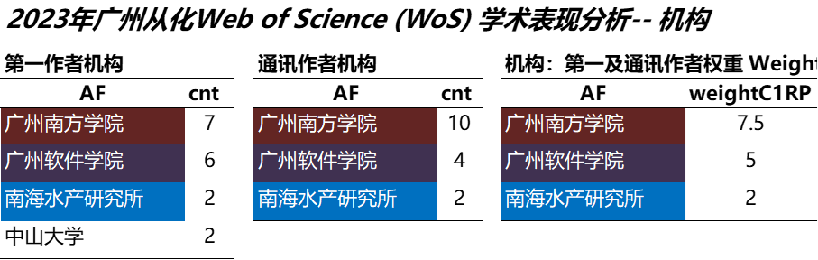
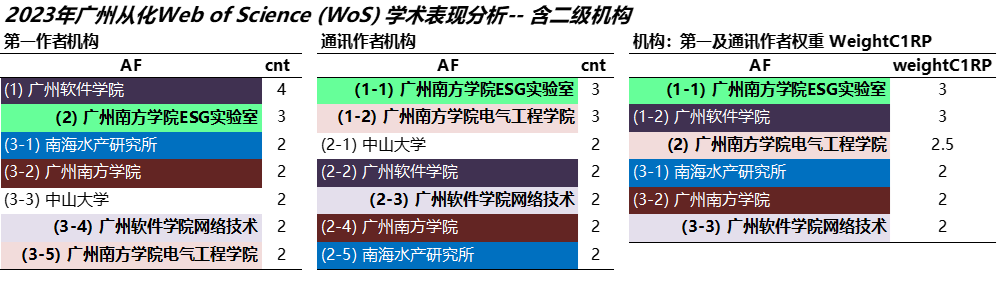
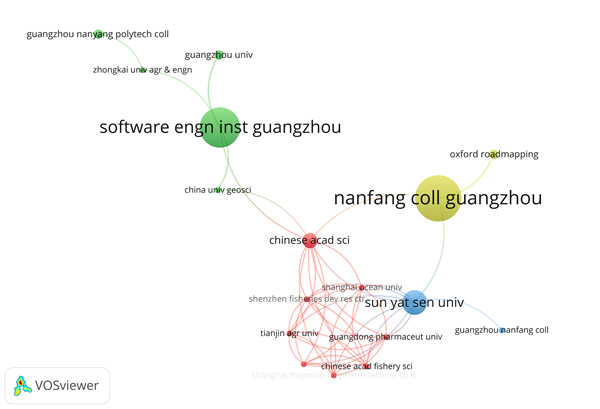
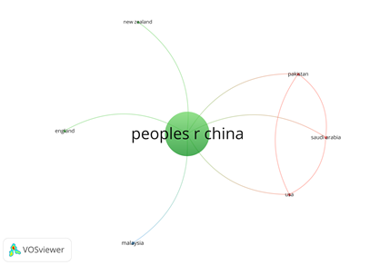
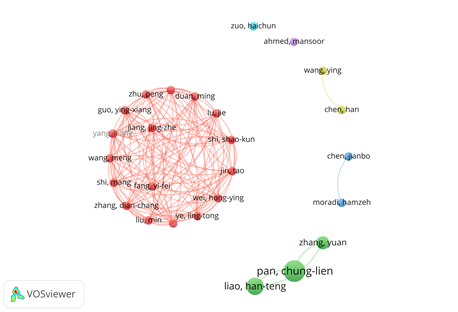
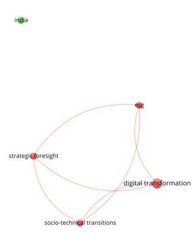

2023年至今，从化科研表现最好的机构为**广州南方学院**、**广州软件学院**、**南海水产研究所**，其中二级机构表现最好的为广州南方学院***ESG实验室***、广州南方学院***电气工程学院***、及广州软件学院***网络技术系***。热点科研议题则涉及数字化转型、ESG、社会-技术转型、战略前瞻等。**澳恪森**在机构合作、议题设定方面已有初步成效。

<!--more-->

今年从化科研表现如何呢？

## 科研表现--科研评估和前沿追踪依据 

从化科研表现数据可以从核心期刊数据库取得，此次澳恪森于2023年9月底从Web of Science (WoS)取得的书目数据共40笔，其中有35篇期刊文章、一共有167名作者，平均每篇有5.08共同作者，详见下表。

澳恪森表示，科学计量学可就科研、专利等数据进行分析作为科研评估和前沿追踪依据。

## 科研表现--机构                                  

科研表现最好的机构为广州南方学院、广州软件学院、南海水产研究所。其中前两机构为位于从化区的高校，而南海水产研究所为主要的大湾区的合作机构，详见下表。

由于文章有不少是跨机构的合作成果，所以上表分别就第一作者机构、通讯作者机构、及两者共同平均权重的简化分析。此分析是基于下表，有至少2笔含以上的一级及二级机构的分析。

二级机构表现最好的为广州南方学院***ESG实验室***、广州南方学院***电气工程学院***、及广州软件学院***网络技术系***。

澳恪森表示，二级机构还有包括广州南方学院***商学院***、***公管学院***等等，这印证了此方法及数据可以用于一级及二级机构的可行性，并也点出论文发表时列明***二级机构***的必要性。

## 跨机构合作网络

科研合作表现可以在共同作者跨机构合作网络反映，共同作者网络图点出了2023年从化区内一级机构间合作缺失，均是间接透过如中国科学院、仲恺农业工程学院，详见下图。

澳恪森(见上图右上的Oxford Roadmapping)表示，同样作为从化的机构，将和如湾区设计开放大学合作，在机构及国家地区层次扩展合作网络。

## 跨国合作网络

跨国家地区合作网络显示以中国为主，少量有美国、英国、新西兰、马来西亚、巴基斯坦的合作者，构成合作网络，详见下图。

## 科研表现—作者

科研表现亦可从作者个人层次分析，简易计量可以算每个作者参与的文章量、简易权重则假定每位共同作者的贡献均摊，亦可只计第一及通讯作者的权重，详见下表。

**澳恪森**表示，除了澳恪森合作成員[Pan, Chung-Lien](author/%E6%BD%98%E4%BB%B2%E4%BA%B7/)、[Liao, Han-Teng](https://oxon8.netlify.app/author/%E5%BB%96%E6%B1%89%E8%85%BE/)之外，表現突出的還有广州南方学院***电气工程学院***[左海春 (Zuo, Haichun)](https://sece.nfu.edu.cn/szll/szll1/177aa8480fa04fbdb03eb863e2fb8a14.htm) ，及南海水产研究所的[姜敬哲 (Jiang, Jing-Zhe)](https://southchinafish.ac.cn/info/1137/6613.htm)。

作者合作网络显示以中科院为主，少量有广州南方学院***ESG实验室***的[Pan, Chung-Lien](author/%E6%BD%98%E4%BB%B2%E4%BA%B7/)、[Liao, Han-Teng](https://oxon8.netlify.app/author/%E5%BB%96%E6%B1%89%E8%85%BE/) 及 Zhang, Yuan，**广州南方学院** Moradi, Hamzeh和**中山大学**的Chen, Jianbo合作、以及**广州软件学院**Wang, Ying的合作团队，详见下图。

## 热点科研议题

热点科研议题可以在共同作者关键词网络及词云反映，详见下图。其中印度一词主要以**广州软件学院**Ahmed, Mansoor参与的气候变迁对印度食物生产的影响、以及相关的碳排建模研究。

其它热点科研议题则涉及数字化转型、ESG、社会-技术转型、战略前瞻等，均以**澳恪森**与广州南方学院***ESG实验室***为主要贡献者。

## 展望未来：机构合作、议题设定

**澳恪森**表示，在机构合作、议题设定方面已有初步成效。由于科学计量学可就科研、专利等数据进行分析作为科研评估和前沿追踪依据。

**澳恪森**已就[中国社科基金](http://fz.people.com.cn/skygb/sk/index.php/Index/index)历年以来立项的(1)[碳排管理治理](http://fz.people.com.cn/skygb/sk/index.php/index/seach?pznum=&xmtype=0&xktype=0&xmname=%E7%A2%B3&lxtime=0&xmleader=&zyzw=0&gzdw=&dwtype=0&szdq=0&ssxt=0&cgname=&cgxs=0&cglevel=0&jxdata=0&jxnum=&cbs=&cbdate=0&zz=&hj=)、(2)[数字化转型](http://fz.people.com.cn/skygb/sk/index.php/index/seach?pznum=&xmtype=0&xktype=0&xmname=%E6%95%B0%E5%AD%97%E5%8C%96%E8%BD%AC%E5%9E%8B&lxtime=0&xmleader=&zyzw=0&gzdw=&dwtype=0&szdq=0&ssxt=0&cgname=&cgxs=0&cglevel=0&jxdata=0&jxnum=&cbs=&cbdate=0&zz=&hj=)、(3)[绿色转型](http://fz.people.com.cn/skygb/sk/index.php/index/seach?pznum=&xmtype=0&xktype=0&xmname=%E7%BB%BF%E8%89%B2%E8%BD%AC%E5%9E%8B&lxtime=0&xmleader=&zyzw=0&gzdw=&dwtype=0&szdq=0&ssxt=0&cgname=&cgxs=0&cglevel=0&jxdata=0&jxnum=&cbs=&cbdate=0&zz=&hj=)共计864项项目，收集在WoS的科研数据，产出表现及影响力分析、议题及概念结构分析，欢迎来信询问 h.liao@ieee.org 各式合作机会。

**澳恪森**在2023年后半将以《联合国气候变化框架公约》第二十八届缔约方大会（COP 28）的外围相关会议如[IEEE 绿色科技、可持续发展和净零政策与实践研讨会(IEEE GTSNZ 2023)](https://gtsnz.org/)，持续对数字化绿色化协同（简称“双化协同”）发展及绿色数字化转型(Green Digital Transformation) 进行科研创新。

