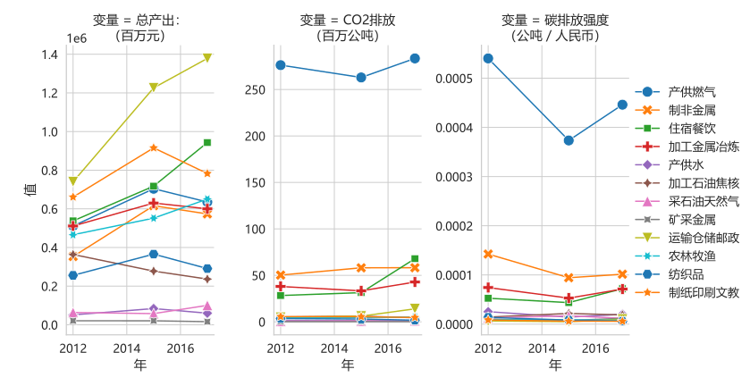
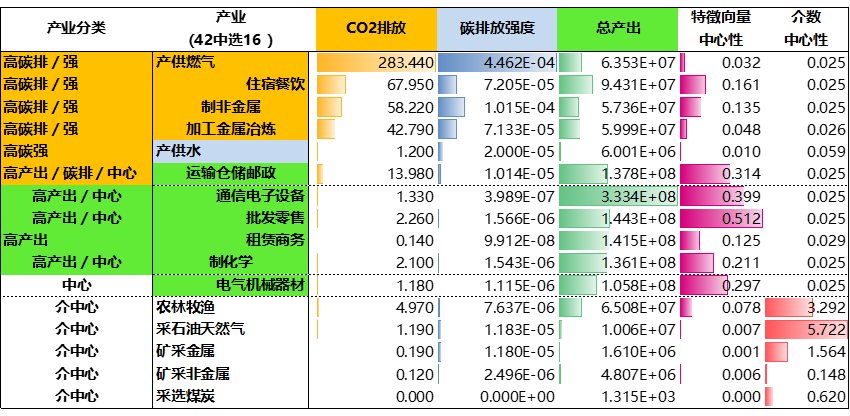
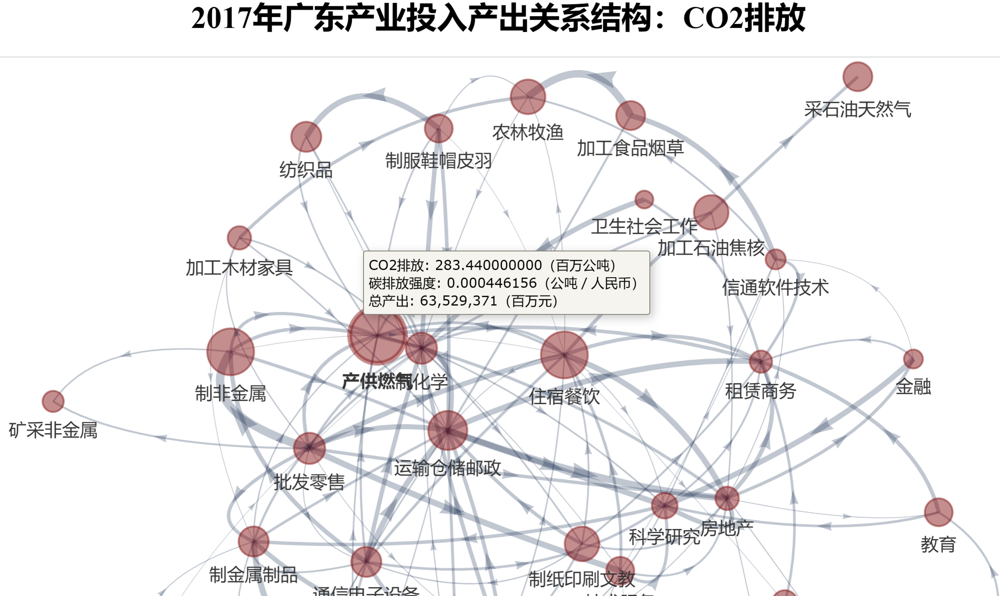
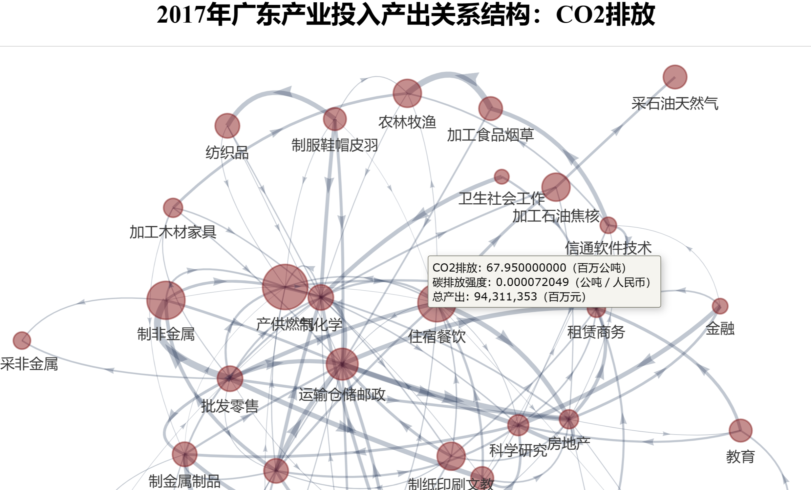
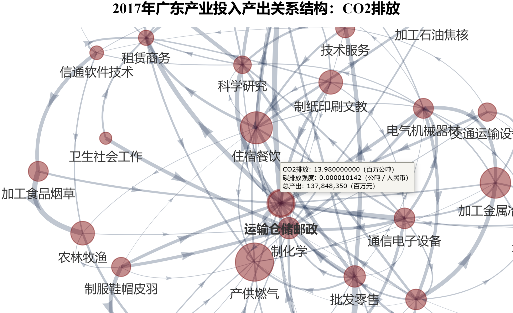
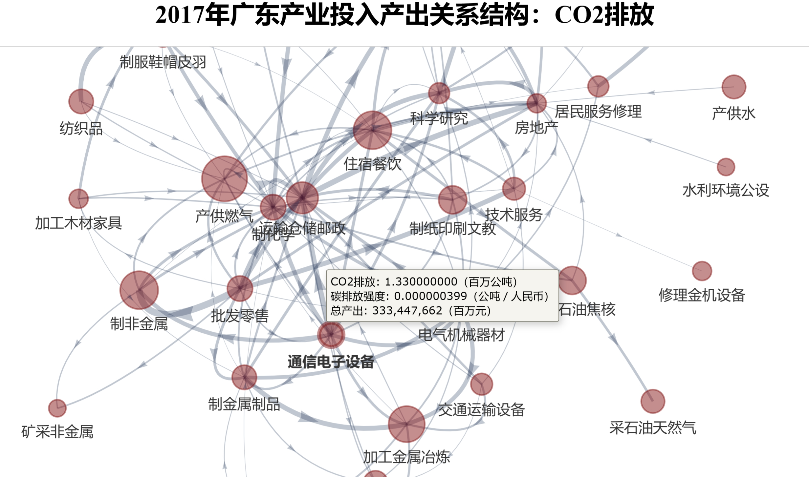
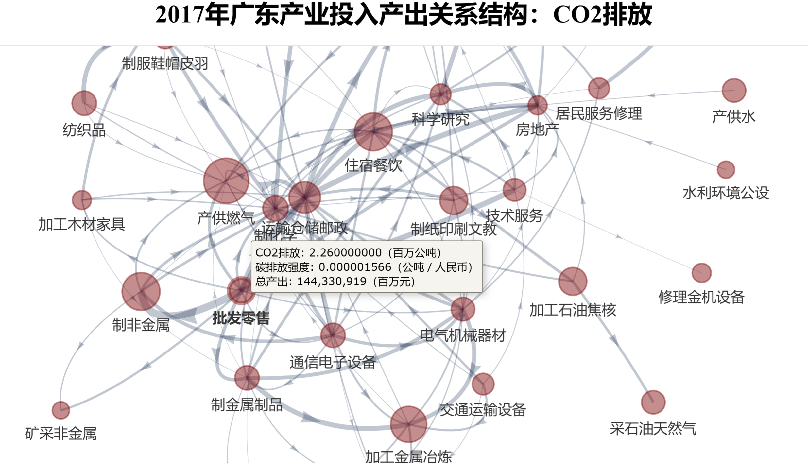
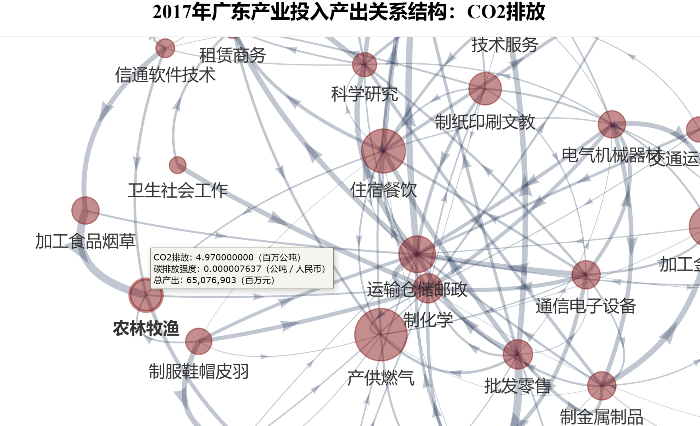
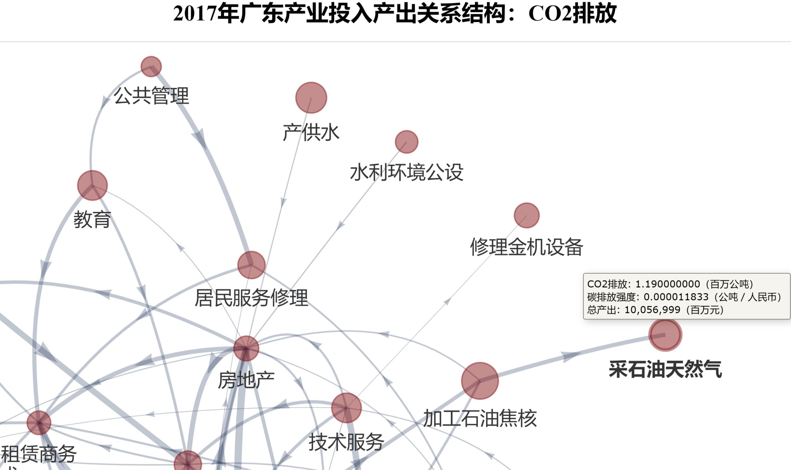

广东产业要如何低碳发展？如何“双化协同”或“数字化绿色化协同发展”？

想一目瞭然广东各产业的投入产出关系，并查看其碳排量？

以下广东2012-2017投入产出网络图的可视化，有交互功能（试试拖拉及鼠标悬停效果）。

<!--more-->

### 广东2012-2017投入产出结构图结合各碳排放量之系列可视化

<figure>

  

   此图有🪄交互功能（试试拖拉、多手指平移、缩放页面及🖱️鼠标悬停效果）
  

<iframe src="./NetGraph_单一省市_广东-2017-CO2排放.html" height="720px" width="100%" style="border:none;"></iframe>

  

   此图有🪄交互功能（试试拖拉、多手指平移、缩放页面及🖱️鼠标悬停效果）
  

<iframe src="./NetGraph_单一省市_广东-2015-CO2排放.html" height="720px" width="100%" style="border:none;"></iframe>

  

   此图有🪄交互功能（试试拖拉、多手指平移、缩放页面及🖱️鼠标悬停效果）
  

<iframe src="./NetGraph_单一省市_广东-2012-CO2排放.html" height="720px" width="100%" style="border:none;"></iframe>

<figcaption markdown="1" >

##### 广东2012-2017投入产出结构图结合各碳排放量之系列可视化

<cite>廖汉腾. (2022). 广东2012-2017投入产出结构之系列可视化. Oxford Roadmapping 澳恪森数智科技服务(广州)有限公司. </cite>

> 注：此图将正式发表，在发表前请勿引用。

</figcaption>
</figure>

###  广东2012-2017投入产出结构图结合各碳排放量之系列可视化

展示出这几年广东的变及不变：

*   持续不变的核心产业：产供燃气、住宿餐饮、运输仓储邮政、通信电子设备、电气机械器材、制化学、批发零售、房地产等
*   新兴的核心产业：科学研究、技术服务等走向中心

### 广东2015、2012、2017年各排名靠前产业走势图－总产出与碳排

CEADs多区域投入产出表数据具有碳排数据，且含的3年数据均为实际非预估，可以提供趋势洞见如下图。

-----

### 广东2017年产业碳排、结构网络计量交叉可视化分析

应用数据科学分析方法，澳恪森数智科技服务并一步提炼出以下广东产业碳排、结构网络计量交叉可视化，分析出高碳排/强度产业（如产供燃气及住宿餐饮）、高产出产业（如通信电子设备、批发零售、租赁商务等）、以及高介中心产业（如农林牧渔及采石油天然气）共16项重点产业。 

#### 高碳排/强度产业

##### 产供燃气

##### 住宿餐饮

##### 运输仓储邮政

-----

#### 高产出产业

##### 通信电子设备

##### 批发零售

-----

#### 高介中心产业

##### 农林牧渔

##### 采石油天然气

-----

##### 数据来源：[中国碳核算数据库（CEADs）](https://www.ceads.net.cn/) 中国大陆地区2017年31省区市区域间投入产出表(42部门) v.3.5

###### 1\. 投入产出表数据引用

Zheng, H., Bai, Y., Wei, W. et al. (2021). Chinese provincial multi-regional input-output database for 2012, 2015, and 2017. Sci Data 8, 244.

###### 2\. CO2碳排清单数据引用

Shan, Y., Huang, Q., Guan, D. et al. (2020). China CO2 emission accounts 2016–2017. Sci Data 7, 54

##### 本图文来源：Oxford Roadmapping 澳恪森数智科技服务(广州)有限公司

<cite>廖汉腾. (2022). 广东2012-2017投入产出结构之系列可视化. Oxford Roadmapping 澳恪森数智科技服务(广州)有限公司. </cite>

> 注：此图文将正式发表，在发表前请勿引用。

## 展望未来：机构合作、议题设定

**澳恪森**表示，在投入产出分析（Input-Output Analysis） 结合 网络图可视化 （Network Mapping）及分析方面，有具大应用于 碳排管理（Carbon management）双化协同（Green Digital Transformation）的空间，欢迎来信 h.liao@ieee.org 问询各式合作机会。

