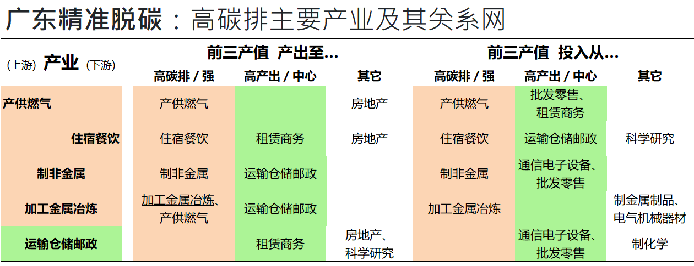
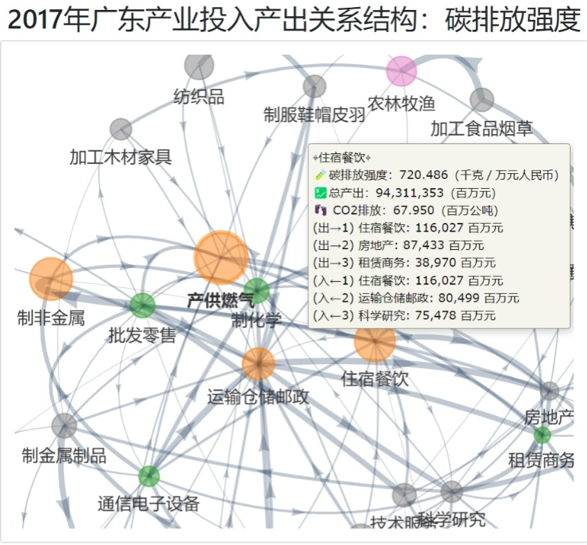
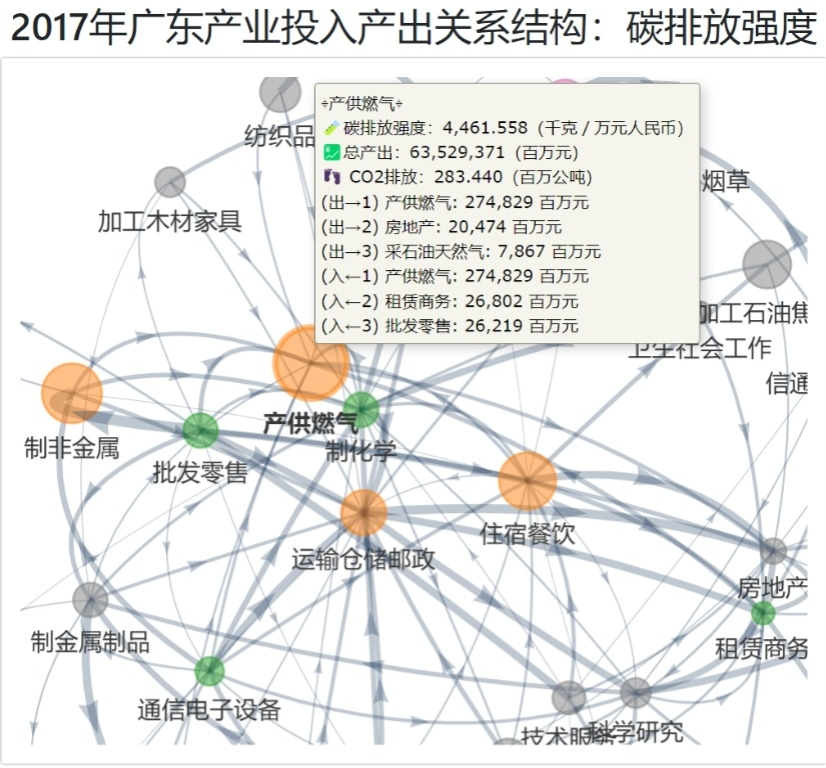

脱碳广东要从何做起？可从高碳排量起抓大放小。

本交互图文优化先前投人产出表数据可视化成果，针对五大高排放产业：产供燃气、住宿餐饮、制非金属、加工金属冶炼、及运输仓储邮政开始，往其下游及上游产的前三值投入及产出关系，发现高度相关的高产出/中心行业如通信电子设备、批发零售、租赁商务、及运输仓储邮政，以及其它行业如科学研究、房地产、等等。

这五大中有四 (产供燃气、住宿餐饮、制非金属、及加工金属冶炼) 需要从自身做起之外，其上下游的核心高产值产业如通信电子设备、批发零售、租赁商务、及运输仓储邮政等，需要有低碳采购、低碳供应链金融、低碳补贴等等去提高脱碳诱因。

五大中的运输仓储邮政，同时也是前五大的高产值产业，则成为重点双化协同数字化绿色化的标竿链主产业，需要以数字经济及平台经济的数据驱动特性，发挥其在广东产业关系网的核心角色，助力其它高碳排量产业。而科学研究及房地产两大产业，虽不是高碳排或高产出中心产业，仍因为与这五大产业的高产值关系，也需要加大低碳采购、低碳供应链的消费及投资角色。

<!--more-->

### 广东精准脱碳：高碳排主要产业及其关系网

本交互图文优化先前投人产出表数据可视化成果，针对五大高排放产业：产供燃气、住宿餐饮、制非金属、加工金属冶炼、及运输仓储邮政开始，往其下游及上游产的前三值投入及产出关系。

针对最新广东2017年投入产出表数据，本研究制表如下：

可见这五大产业中：

* 位于上游的是能源大类的产供燃气，其投入及产出亦是以自身为主。
* 位于下游的是消费大类的住宿餐饮，其投入及产出亦是以自身为主。
* 位于中游的主要是制造业大类的制非金属及加工金属冶炼，其投入及产出亦是以自身为主。
* 位于中游的还有现代基建业大类的运输仓储邮政，其投入及产出则和其它高产出/高中心的行业为主。

### 高碳排的产业关系图

这五大产业的关键，可从以下的交互可视化图探究其高碳排量及关系：

<figure>

  

   此图有🪄交互功能（试试拖拉、多手指平移、缩放页面及🖱️鼠标悬停效果）
  

<iframe src="./NetGraph_单一省市_广东-2017-CO2排放.html" height="800px" width="100%" style="border:none;"></iframe>
<figcaption markdown="1" >
<cite>廖汉腾. (2022). 广东精准脱碳：高碳排主要产业及其关系网. Oxford Roadmapping 澳恪森数智科技服务(广州)有限公司. </cite>

> 注：此图将正式发表，在发表前请勿引用。

</figcaption>
</figure>

#### 以住宿餐饮为例

以住宿餐饮为例，作为广东主要领头的现代消费服务业，其自身的投入及自身的产量大，又有高碳排高中心的运输仓储邮政的主要投入，以及产出至高产出高中心的租赁商务，这意谓着除了自身需要有脱碳的诱因外，也需要如"运输仓储邮政"的绿色投资及布局，更需要租赁商务的绿色采购及消费。

此外，房地产对住宿餐饮业亦可提高其绿色投资，科学研究亦需要有绿色采购及消费最佳实践、标准、政策等等，以使住宿餐饮业有主要的市场及产业关系助其转型。

### 高碳强度的产业关系图

这五大产业的关键，可从以下的交互可视化图探究其高碳强度及关系：

<figure>

  

   此图有🪄交互功能（试试拖拉、多手指平移、缩放页面及🖱️鼠标悬停效果）
  

<iframe src="./NetGraph_单一省市_广东-2017-碳排放强度.html" height="800px" width="100%" style="border:none;"></iframe>
<figcaption markdown="1" >
<cite>廖汉腾. (2022). 广东精准脱碳：高碳排主要产业及其关系网. Oxford Roadmapping 澳恪森数智科技服务(广州)有限公司. </cite>

> 注：此图将正式发表，在发表前请勿引用。
</figcaption>
</figure>

#### 以产供燃气为例

以产供燃气为例，作为广东主要领头的能源业，其自身的投入及自身的产量大，又有高产出至高产出高中心的批发零售、租赁商务，这意谓着除了自身需要有脱碳的诱因外，需要批发零售、租赁商务的绿色采购及消费。

此外，房地产对产供燃气业亦可提高其绿色投资，科学研究亦需要有绿色采购及消费最佳实践、标准、政策等等，以使住宿餐饮业有主要的市场及产业关系助其转型。

### 高产值／中心的产业关系图

这五大产业的关键，亦可从以下的交互可视化图探究其高产值（总产出）及关系：

<figure>

  

   此图有🪄交互功能（试试拖拉、多手指平移、缩放页面及🖱️鼠标悬停效果）
  

<iframe src="./NetGraph_单一省市_广东-2017-总产出.html" height="800px" width="100%" style="border:none;"></iframe>
<figcaption markdown="1" >
<cite>廖汉腾. (2022). 广东精准脱碳：高碳排主要产业及其关系网. Oxford Roadmapping 澳恪森数智科技服务(广州)有限公司. </cite>

> 注：此图将正式发表，在发表前请勿引用。
</figcaption>
</figure>

#### 三大高总产值相关产业："通信电子设备"、"批发零售"、"租赁商务"
 
若采高产值产业倒逼策略，那么总产值最高的"通信电子设备"、"批发零售"、"租赁商务"三大产业一起，就能全覆盖此五大高碳排行业。

专业来说，这里的范围三的碳排报告则对总产值最高的"通信电子设备"、"批发零售"、"租赁商务"三大产业特别重要，需要使这产值高的三大产业也意识到并能掌握其高碳排产业关系的现状。

#### 一大三高（高产出／高碳排／高中心）产业："运输仓储邮政"

"运输仓储邮政"同时是三高（高产出／高碳排／高中心）产业，在广东此三项类指标都位居前五。此产业又对其它三大高碳排行业关系密切："住宿餐饮"、"制非金属"、"加工金属冶炼"。

此系统方法可应用至其它地域，

### 小结：

脱碳广东要从何做起？可从高碳排量起抓大放小。

如本图文所示，有以下重大现实：

* 五大高排放产业："产供燃气"、"住宿餐饮"、"制非金属"、"加工金属冶炼"、及"运输仓储邮政"
* 三大高总产值相关产业："通信电子设备"、"批发零售"、及"租赁商务"
* 一大三高（高产出／高碳排／高中心）产业："运输仓储邮政"
* 两其它相关产业："科学研究"及房地产""

这五大中有四 (产供燃气、住宿餐饮、制非金属、及加工金属冶炼) 需要从自身做起之外，其上下游的核心高产值产业如通信电子设备、批发零售、租赁商务、及运输仓储邮政等，需要有低碳采购、低碳供应链金融、低碳补贴等等去提高脱碳诱因。

五大中的运输仓储邮政，同时也是前五大的高产值产业，则成为重点双化协同数字化绿色化的标竿链主产业，需要以数字经济及平台经济的数据驱动特性，发挥其在广东产业关系网的核心角色，助力其它高碳排量产业。
最后，科学研究及房地产两大产业，虽不是高碳排或高产出中心产业，仍因为与这五大产业的高产值关系，也需要加大低碳采购、低碳供应链的消费及投资角色。

此系统方法可应用至其它地域。

### 列表：广东前20大碳排产业

以下列表为广东前20大碳排产业，亦可查找碳排放强度（千克／万元人民币），其中碳排放第二高的住宿餐饮的碳排放强度已达720.486（千克／万元人民币），比广东省第三高的加工金属冶炼还要高。

<table id="T_c3f63">
  <thead>
    <tr>
      <th class="blank level0">&nbsp;</th>
      <th id="T_c3f63_level0_col0" class="col_heading level0 col0">⇘产业内（百万元）</th>
      <th id="T_c3f63_level0_col1" class="col_heading level0 col1">⇉产出和（百万元）</th>
      <th id="T_c3f63_level0_col2" class="col_heading level0 col2">⇊投入和（百万元）</th>
      <th id="T_c3f63_level0_col3" class="col_heading level0 col3">💹总产出（百万元）</th>
      <th id="T_c3f63_level0_col4" class="col_heading level0 col4">👣CO2排放（百万公吨）</th>
      <th id="T_c3f63_level0_col5" class="col_heading level0 col5">🧪碳排放强度（千克／万元人民币）</th>
    </tr>
    <tr>
      <th class="index_name level0">Node</th>
      <th class="blank col0">&nbsp;</th>
      <th class="blank col1">&nbsp;</th>
      <th class="blank col2">&nbsp;</th>
      <th class="blank col3">&nbsp;</th>
      <th class="blank col4">&nbsp;</th>
      <th class="blank col5">&nbsp;</th>
    </tr>
  </thead>
  <tbody>
    <tr>
      <th id="T_c3f63_level0_row0" class="row_heading level0 row0">产供燃气</th>
      <td id="T_c3f63_row0_col0" class="data row0 col0">274,829</td>
      <td id="T_c3f63_row0_col1" class="data row0 col1">251,688</td>
      <td id="T_c3f63_row0_col2" class="data row0 col2">51,867</td>
      <td id="T_c3f63_row0_col3" class="data row0 col3">635,294</td>
      <td id="T_c3f63_row0_col4" class="data row0 col4">283.440</td>
      <td id="T_c3f63_row0_col5" class="data row0 col5">4,461.558</td>
    </tr>
    <tr>
      <th id="T_c3f63_level0_row1" class="row_heading level0 row1">住宿餐饮</th>
      <td id="T_c3f63_row1_col0" class="data row1 col0">116,027</td>
      <td id="T_c3f63_row1_col1" class="data row1 col1">453,773</td>
      <td id="T_c3f63_row1_col2" class="data row1 col2">275,276</td>
      <td id="T_c3f63_row1_col3" class="data row1 col3">943,114</td>
      <td id="T_c3f63_row1_col4" class="data row1 col4">67.950</td>
      <td id="T_c3f63_row1_col5" class="data row1 col5">720.486</td>
    </tr>
    <tr>
      <th id="T_c3f63_level0_row2" class="row_heading level0 row2">制非金属</th>
      <td id="T_c3f63_row2_col0" class="data row2 col0">69,331</td>
      <td id="T_c3f63_row2_col1" class="data row2 col1">326,275</td>
      <td id="T_c3f63_row2_col2" class="data row2 col2">182,924</td>
      <td id="T_c3f63_row2_col3" class="data row2 col3">573,600</td>
      <td id="T_c3f63_row2_col4" class="data row2 col4">58.220</td>
      <td id="T_c3f63_row2_col5" class="data row2 col5">1,014.993</td>
    </tr>
    <tr>
      <th id="T_c3f63_level0_row3" class="row_heading level0 row3">加工金属冶炼</th>
      <td id="T_c3f63_row3_col0" class="data row3 col0">130,456</td>
      <td id="T_c3f63_row3_col1" class="data row3 col1">313,128</td>
      <td id="T_c3f63_row3_col2" class="data row3 col2">68,715</td>
      <td id="T_c3f63_row3_col3" class="data row3 col3">599,869</td>
      <td id="T_c3f63_row3_col4" class="data row3 col4">42.790</td>
      <td id="T_c3f63_row3_col5" class="data row3 col5">713.323</td>
    </tr>
    <tr>
      <th id="T_c3f63_level0_row4" class="row_heading level0 row4">运输仓储邮政</th>
      <td id="T_c3f63_row4_col0" class="data row4 col0">39,738</td>
      <td id="T_c3f63_row4_col1" class="data row4 col1">563,430</td>
      <td id="T_c3f63_row4_col2" class="data row4 col2">439,789</td>
      <td id="T_c3f63_row4_col3" class="data row4 col3">1,378,484</td>
      <td id="T_c3f63_row4_col4" class="data row4 col4">13.980</td>
      <td id="T_c3f63_row4_col5" class="data row4 col5">101.416</td>
    </tr>
    <tr>
      <th id="T_c3f63_level0_row5" class="row_heading level0 row5">农林牧渔</th>
      <td id="T_c3f63_row5_col0" class="data row5 col0">40,482</td>
      <td id="T_c3f63_row5_col1" class="data row5 col1">310,205</td>
      <td id="T_c3f63_row5_col2" class="data row5 col2">113,653</td>
      <td id="T_c3f63_row5_col3" class="data row5 col3">650,769</td>
      <td id="T_c3f63_row5_col4" class="data row5 col4">4.970</td>
      <td id="T_c3f63_row5_col5" class="data row5 col5">76.371</td>
    </tr>
    <tr>
      <th id="T_c3f63_level0_row6" class="row_heading level0 row6">制纸印刷文教</th>
      <td id="T_c3f63_row6_col0" class="data row6 col0">151,313</td>
      <td id="T_c3f63_row6_col1" class="data row6 col1">154,125</td>
      <td id="T_c3f63_row6_col2" class="data row6 col2">236,445</td>
      <td id="T_c3f63_row6_col3" class="data row6 col3">782,718</td>
      <td id="T_c3f63_row6_col4" class="data row6 col4">4.620</td>
      <td id="T_c3f63_row6_col5" class="data row6 col5">59.025</td>
    </tr>
    <tr>
      <th id="T_c3f63_level0_row7" class="row_heading level0 row7">加工石油焦核</th>
      <td id="T_c3f63_row7_col0" class="data row7 col0">27,490</td>
      <td id="T_c3f63_row7_col1" class="data row7 col1">106,327</td>
      <td id="T_c3f63_row7_col2" class="data row7 col2">64,317</td>
      <td id="T_c3f63_row7_col3" class="data row7 col3">236,441</td>
      <td id="T_c3f63_row7_col4" class="data row7 col4">4.410</td>
      <td id="T_c3f63_row7_col5" class="data row7 col5">186.516</td>
    </tr>
    <tr>
      <th id="T_c3f63_level0_row8" class="row_heading level0 row8">批发零售</th>
      <td id="T_c3f63_row8_col0" class="data row8 col0">17,580</td>
      <td id="T_c3f63_row8_col1" class="data row8 col1">28,295</td>
      <td id="T_c3f63_row8_col2" class="data row8 col2">723,698</td>
      <td id="T_c3f63_row8_col3" class="data row8 col3">1,443,309</td>
      <td id="T_c3f63_row8_col4" class="data row8 col4">2.260</td>
      <td id="T_c3f63_row8_col5" class="data row8 col5">15.658</td>
    </tr>
    <tr>
      <th id="T_c3f63_level0_row9" class="row_heading level0 row9">制化学</th>
      <td id="T_c3f63_row9_col0" class="data row9 col0">363,706</td>
      <td id="T_c3f63_row9_col1" class="data row9 col1">483,463</td>
      <td id="T_c3f63_row9_col2" class="data row9 col2">277,561</td>
      <td id="T_c3f63_row9_col3" class="data row9 col3">1,360,792</td>
      <td id="T_c3f63_row9_col4" class="data row9 col4">2.100</td>
      <td id="T_c3f63_row9_col5" class="data row9 col5">15.432</td>
    </tr>
    <tr>
      <th id="T_c3f63_level0_row10" class="row_heading level0 row10">纺织品</th>
      <td id="T_c3f63_row10_col0" class="data row10 col0">59,521</td>
      <td id="T_c3f63_row10_col1" class="data row10 col1">108,057</td>
      <td id="T_c3f63_row10_col2" class="data row10 col2">72,512</td>
      <td id="T_c3f63_row10_col3" class="data row10 col3">290,879</td>
      <td id="T_c3f63_row10_col4" class="data row10 col4">1.730</td>
      <td id="T_c3f63_row10_col5" class="data row10 col5">59.475</td>
    </tr>
    <tr>
      <th id="T_c3f63_level0_row11" class="row_heading level0 row11">通用设备</th>
      <td id="T_c3f63_row11_col0" class="data row11 col0">51,436</td>
      <td id="T_c3f63_row11_col1" class="data row11 col1">79,782</td>
      <td id="T_c3f63_row11_col2" class="data row11 col2">140,589</td>
      <td id="T_c3f63_row11_col3" class="data row11 col3">441,749</td>
      <td id="T_c3f63_row11_col4" class="data row11 col4">1.610</td>
      <td id="T_c3f63_row11_col5" class="data row11 col5">36.446</td>
    </tr>
    <tr>
      <th id="T_c3f63_level0_row12" class="row_heading level0 row12">通信电子设备</th>
      <td id="T_c3f63_row12_col0" class="data row12 col0">825,773</td>
      <td id="T_c3f63_row12_col1" class="data row12 col1">112,189</td>
      <td id="T_c3f63_row12_col2" class="data row12 col2">442,769</td>
      <td id="T_c3f63_row12_col3" class="data row12 col3">3,334,477</td>
      <td id="T_c3f63_row12_col4" class="data row12 col4">1.330</td>
      <td id="T_c3f63_row12_col5" class="data row12 col5">3.989</td>
    </tr>
    <tr>
      <th id="T_c3f63_level0_row13" class="row_heading level0 row13">制金属制品</th>
      <td id="T_c3f63_row13_col0" class="data row13 col0">92,715</td>
      <td id="T_c3f63_row13_col1" class="data row13 col1">260,441</td>
      <td id="T_c3f63_row13_col2" class="data row13 col2">228,353</td>
      <td id="T_c3f63_row13_col3" class="data row13 col3">742,664</td>
      <td id="T_c3f63_row13_col4" class="data row13 col4">1.320</td>
      <td id="T_c3f63_row13_col5" class="data row13 col5">17.774</td>
    </tr>
    <tr>
      <th id="T_c3f63_level0_row14" class="row_heading level0 row14">产供水</th>
      <td id="T_c3f63_row14_col0" class="data row14 col0">22,610</td>
      <td id="T_c3f63_row14_col1" class="data row14 col1">9,296</td>
      <td id="T_c3f63_row14_col2" class="data row14 col2">14,822</td>
      <td id="T_c3f63_row14_col3" class="data row14 col3">60,006</td>
      <td id="T_c3f63_row14_col4" class="data row14 col4">1.200</td>
      <td id="T_c3f63_row14_col5" class="data row14 col5">199.980</td>
    </tr>
    <tr>
      <th id="T_c3f63_level0_row15" class="row_heading level0 row15">采石油天然气</th>
      <td id="T_c3f63_row15_col0" class="data row15 col0">10,998</td>
      <td id="T_c3f63_row15_col1" class="data row15 col1">52,582</td>
      <td id="T_c3f63_row15_col2" class="data row15 col2">9,535</td>
      <td id="T_c3f63_row15_col3" class="data row15 col3">100,570</td>
      <td id="T_c3f63_row15_col4" class="data row15 col4">1.190</td>
      <td id="T_c3f63_row15_col5" class="data row15 col5">118.326</td>
    </tr>
    <tr>
      <th id="T_c3f63_level0_row16" class="row_heading level0 row16">电气机械器材</th>
      <td id="T_c3f63_row16_col0" class="data row16 col0">116,657</td>
      <td id="T_c3f63_row16_col1" class="data row16 col1">125,208</td>
      <td id="T_c3f63_row16_col2" class="data row16 col2">367,619</td>
      <td id="T_c3f63_row16_col3" class="data row16 col3">1,057,891</td>
      <td id="T_c3f63_row16_col4" class="data row16 col4">1.180</td>
      <td id="T_c3f63_row16_col5" class="data row16 col5">11.154</td>
    </tr>
    <tr>
      <th id="T_c3f63_level0_row17" class="row_heading level0 row17">加工食品烟草</th>
      <td id="T_c3f63_row17_col0" class="data row17 col0">140,869</td>
      <td id="T_c3f63_row17_col1" class="data row17 col1">186,690</td>
      <td id="T_c3f63_row17_col2" class="data row17 col2">244,711</td>
      <td id="T_c3f63_row17_col3" class="data row17 col3">791,941</td>
      <td id="T_c3f63_row17_col4" class="data row17 col4">1.020</td>
      <td id="T_c3f63_row17_col5" class="data row17 col5">12.880</td>
    </tr>
    <tr>
      <th id="T_c3f63_level0_row18" class="row_heading level0 row18">技术服务</th>
      <td id="T_c3f63_row18_col0" class="data row18 col0">823</td>
      <td id="T_c3f63_row18_col1" class="data row18 col1">144,499</td>
      <td id="T_c3f63_row18_col2" class="data row18 col2">146,942</td>
      <td id="T_c3f63_row18_col3" class="data row18 col3">578,484</td>
      <td id="T_c3f63_row18_col4" class="data row18 col4">0.771</td>
      <td id="T_c3f63_row18_col5" class="data row18 col5">13.323</td>
    </tr>
    <tr>
      <th id="T_c3f63_level0_row19" class="row_heading level0 row19">教育</th>
      <td id="T_c3f63_row19_col0" class="data row19 col0">984</td>
      <td id="T_c3f63_row19_col1" class="data row19 col1">76,428</td>
      <td id="T_c3f63_row19_col2" class="data row19 col2">102,832</td>
      <td id="T_c3f63_row19_col3" class="data row19 col3">448,692</td>
      <td id="T_c3f63_row19_col4" class="data row19 col4">0.748</td>
      <td id="T_c3f63_row19_col5" class="data row19 col5">16.666</td>
    </tr>

  </tbody>
</table>

-----

##### 数据来源：[中国碳核算数据库（CEADs）](https://www.ceads.net.cn/) 中国大陆地区2017年31省区市区域间投入产出表(42部门) v.3.5

###### 1\. 投入产出表数据引用

Zheng, H., Bai, Y., Wei, W. et al. (2021). Chinese provincial multi-regional input-output database for 2012, 2015, and 2017. Sci Data 8, 244.

###### 2\. CO2碳排清单数据引用

Shan, Y., Huang, Q., Guan, D. et al. (2020). China CO2 emission accounts 2016–2017. Sci Data 7, 54

##### 本图文来源：Oxford Roadmapping 澳恪森数智科技服务(广州)有限公司

<cite>廖汉腾. (2023). 广东2012-2017投入产出结构之系列可视化. Oxford Roadmapping 澳恪森数智科技服务(广州)有限公司. </cite>

> 注：此图文将正式发表，在发表前请勿引用。

---

---

---





