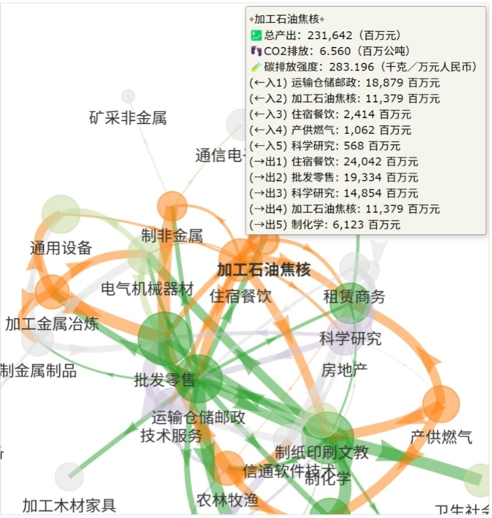

脱碳示范省浙江？产业网络结构可视化点出高质量发展如何持续与高碳排量脱勾。

浙江作为“脱碳示范省”主要是在[其碳排放强度降幅](https://www.greenpeace.org.cn/wp-content/uploads/2022/01/subnational-carbon-emission-briefing.pdf) 和作为“两山理论”的发源地发展各项生态省的努力。

另外，由于浙江将于2025年建成以数字产业和科技创新为重点的“三区三中心”（全国数字产业化发展引领区、全国产业数字化转型示范区、全国数字经济体制机制创新先导区和具有全球影响力的数字科技创新中心、具有全球影响力的新兴金融中心、全球数字贸易中心），自然成为数字化绿色化“双化协同”的重要观察区域。

浙江在其双碳工作方面提出要以数字化改革撬动经济社会发展全面绿色转型，从顶层擘画出减污降碳全景图。

澳恪森结合[中国碳核算数据库（CEADs）](https://www.ceads.net.cn/)与自行研发的投入产出网络图可视化 来检视“减污降碳全景图”之浙江版本。

<!--more-->

### 交互可视化图--总产出大小与产业金流关系

以下交互可视化图，突出浙江高产出值（绿色）与高碳排（橘色）产业节点的“出入”关系，而节点大小表达总产出大小：

<figure>

  

   此图有🪄交互功能（试试拖拉、多手指平移、缩放页面及🖱️鼠标悬停效果）
  

<iframe src="./浙江-产业网络结构可视化-2017-总产出--5.html" height="800px" width="100%" style="border:none;"></iframe>
<figcaption markdown="1" >
<cite>廖汉腾. (2023). 浙江精准脱碳：高碳排主要产业及其关系网. Oxford Roadmapping 澳恪森数智科技服务(广州)有限公司. </cite>

> 注：此图将正式发表，在发表前请勿引用。

</figcaption>
</figure>

“出入”关系指投入产出关系，产业间资金的流动。

本交互图文优化先前投人产出表数据可视化方法，发现前六大高排放产业：产供燃气、制非金属、住宿餐饮、加工金属冶炼、农林牧渔及加工石油焦核。其中住宿餐饮亦是高产值产业。

### （一）浙江高碳排主要产业及其关系网

针对此六大开始，往其下游及上游产的前五值投入及产出关系，发现高度相关的高产出/中心行业如下表：

单就高碳排至高碳排的关系来说，产供燃气→产供燃气是最大量，也可以说是最需要改进的产业关系。

单就高碳排至高产出的关系来说，住宿餐饮→产供燃气、产供燃气→制化学、纺织品、科学研究是最大量，也可以说是最需要改进的产业关系。

就高碳排至高产出的关系总体来看，运输仓储邮政有其六跨五的网络中心性，这暗示着运输仓储邮政有具大的平台化、数字化潜力去影响相关的高碳排产业。

### （二）浙江高产值主要产业及其关系网

浙江高产出/中心行业中，如批发零售、制化学、运输仓储邮政、住宿餐饮、纺织品及科学研究，和高碳排产业关系密切。

传统认知上在纺织品、批发零售等小商品的浙江图景虽有出现在此表里，然而在此科学研究的高产出点明了浙江往高新创转型的成功，比[广东还明显](https://oxon8.netlify.app/post/2023-10-26-guandong-high-carbon-intensity-industry-mapping/)。

值得注意的是，这些高产值产业产出的主要方向，除了住宿餐饮之外，是没有明显高碳排的行业。这意谓着浙江已取得高产值→高碳排结构优化的先机。

至于在高碳排→高产值结构改进方面，这些高产值产需要有低碳采购、低碳供应链金融、低碳补贴等等去提高脱碳诱因，来倒逼高碳排业的结构性变革。

特别值得注意的是科学研究、运输仓储邮政、住宿餐饮的新型现代服务的主要循环。

由于这些主循环产业还与其它技术服务、信通软件技术、金融、房地产等等起关链作用，是最有机运取得数字化、数据化、平台化的成功。

双化协同数字化绿色化的标竿链主应从这些产业找起，以数字经济及平台经济的数据驱动特性，发挥其在浙江产业关系网的核心角色，助力其它高碳排量产业，加大低碳采购、低碳供应链的消费及投资角色。

### 交互可视化图--碳排量大小与产业金流关系

本交互图节点大小表达碳排大小：

<figure>

  

   此图有🪄交互功能（试试拖拉、多手指平移、缩放页面及🖱️鼠标悬停效果）
  

<iframe src="./浙江-产业网络结构可视化-2017-CO2排放--5.html" height="800px" width="100%" style="border:none;"></iframe>
<figcaption markdown="1" >
<cite>廖汉腾. (2022). 广东精准脱碳：高碳排主要产业及其关系网. Oxford Roadmapping 澳恪森数智科技服务(广州)有限公司. </cite>

> 注：此图将正式发表，在发表前请勿引用。

</figcaption>
</figure>

除了产供燃气外，值得注意的是加工石油焦核→住宿餐饮的关系：

### 交互可视化图--高碳强度大小与产业金流关系

本交互图节点大小表达碳排强度：

<figure>

  

   此图有🪄交互功能（试试拖拉、多手指平移、缩放页面及🖱️鼠标悬停效果）
  

<iframe src="./浙江-产业网络结构可视化-2017-碳排放强度--5.html" height="800px" width="100%" style="border:none;"></iframe>
<figcaption markdown="1" >
<cite>廖汉腾. (2023). 浙江精准脱碳：高碳排主要产业及其关系网. Oxford Roadmapping 澳恪森数智科技服务(广州)有限公司. </cite>

> 注：此图将正式发表，在发表前请勿引用。
</figcaption>
</figure>

此系统方法可应用至其它地域，

### 小结：

浙江精准脱碳已有明显结构变革成果，特别在高产值→高碳排方面，除了需要对住宿餐饮改进外，更需要在高碳排→高产值结构找出改进路径。

这些高产值产业需要有低碳采购、低碳供应链金融、低碳补贴等等去提高脱碳诱因，来倒逼高碳排业的结构性变革。特别是科学研究、运输仓储邮政、住宿餐饮的新型现代服务的主要循环，是最有机运取得数字化、数据化、平台化的成功。

浙江双化协同的主力，科学研究、运输仓储邮政、住宿餐饮的主要链主则有相应的责任，不只要其本身减碳，更要负起及在供应链及转投资的影响力，寻求高资量脱碳发展，成为脱碳示范平台、示范链主。

-----

##### 数据来源：[中国碳核算数据库（CEADs）](https://www.ceads.net.cn/) 中国大陆地区2017年31省区市区域间投入产出表(42部门) v.3.5

###### 1\. 投入产出表数据引用

Zheng, H., Bai, Y., Wei, W. et al. (2021). Chinese provincial multi-regional input-output database for 2012, 2015, and 2017. Sci Data 8, 244.

###### 2\. CO2碳排清单数据引用

Shan, Y., Huang, Q., Guan, D. et al. (2020). China CO2 emission accounts 2016–2017. Sci Data 7, 54

##### 本图文来源：Oxford Roadmapping 澳恪森数智科技服务(广州)有限公司

<cite>廖汉腾. (2022). 广东2012-2017投入产出结构之系列可视化. Oxford Roadmapping 澳恪森数智科技服务(广州)有限公司. </cite>

> 注：此图文将正式发表，在发表前请勿引用。

## 展望未来：机构合作、议题设定

**澳恪森**表示，在投入产出分析（Input-Output Analysis） 结合 网络图可视化 （Network Mapping）及分析方面，有具大应用于 碳排管理（Carbon management）双化协同（Green Digital Transformation）的空间，欢迎来信 h.liao@ieee.org 问询各式合作机会。

