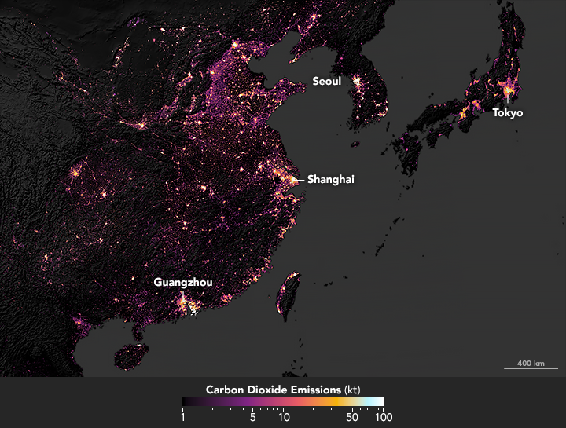

全球足跡網絡之產業分析簡介

“全球足跡網絡”的核心是於1990年代早期成立的科學研究公司“生態足跡”，由Mathis Wackernagel 及 William Rees 創立，基於Wackernagel於UBC的博士研究。其2003年的“國家足跡與生態承截力核算”資源核算工具取得不少包括聯合國單位的認可與引用，包括15個國家政府將其計量方式應用在各自的政策方案裡。該組織亦在瑞士日內瓦與意大利成立了社會組織。該單位亦參與了[中國生態足跡 
報告2010](https://www.footprintnetwork.org/content/images/uploads/LPR_China_2010_Chinese.pdf) 的工作，研究中國大陸31省份對土地和水資源需求的變化，為經濟發展和生態足跡脫釣指明機遇

 <!--more-->
 

該公司於2017年發起“生態足跡探索器”的[開放數據平台](https://data.footprintnetwork.org/#/) ，釋出200多個國家地區的相關足跡與生態承截力數據，並和歐盟高校合作產出[EUSTEPs線上學習平台](https://www.eusteps.eu/)

### 產業分析

“生態足跡”公司的科學研究及服務之一是[產業分析](https://www.footprintnetwork.org/our-work/sector-analysis/) ，可以在地方、區域或國家層面評估行業的生態足跡。

該公司的產業分析取徑分成兩種：“自上而下”或“自下而上”，詳細成果發表於[同行評審文獻](https://www.footprintnetwork.org/resources/journal-articles/)。
“自上而下”的取徑是從最高別的數據，如“國家足跡與生物承截力核算”開始，針對特產業的相關統計及消費數據進行縮進。
與之相反的是“自下而上”方法，運用產業收集的任何資金流動、物質流動、及能源流動的數據。

目前，“全球足跡網絡”正針對地中海地區的旅游業迸行產業層次的評估，[發展可持續旅游產品，強調像MEET Network 的生態旅游套餐](https://www.footprintnetwork.org/our-work/sustainable-tourism/)，不但可以探索自然與人文，還能在比游客待在家裡時產出更低的每日生態足跡。

> 挪威NTNU研究世界13,000城市發現，富裕大城市的碳排高。[City Carbon Footprints] (http://citycarbonfootprints.info/)，圖片來源[NASA Earth Observatory](https://earthobservatory.nasa.gov/images/144807/sizing-up-the-carbon-footprint-of-cities)

### 對澳恪森產業分析產品化的啟發

在完成[廣東](https://oxon8.netlify.app/post/2023-10-26-guandong-high-carbon-intensity-industry-mapping/) 與[浙江](https://oxon8.netlify.app/post/2023-11-05-zhejiang-high-carbon-intensity-industry-mapping/)的產業結構的高產值與高碳排的網絡可視化分析後， *澳恪森*已開始著手探討[中國碳核算數據庫（CEADs）](https://www.ceads.net.cn/)如何能和“國家足跡與生物承截力核算”結合。

“自上而下”的取徑可以針對一個或多個高產值或高碳排的產業進行全國省際及地域（灣區）的比較研究，取得基線和標杆指標，並開發科學地計量方法及標准，作為中國碳排技術、標准、最佳實踐的數據驅動策策的核心模塊之一。

“自下而上”的取徑，可運用產業收集的大數據，特別是地方海關、稅務、供應鏈金融、物流、產業供應鏈平台的數據，取得可建模的投入產出的預測、優化、及仿真方法。

同“生態足跡”公司一致，*澳恪森*期待能以堅實的科學研究基礎，和地方決策者、學者、產業專家合作，分析關鍵行業部門包括碳排的生態足跡的務實基線、標杆、預測、優化、及仿真，以最省心直面核心的精准脫碳方法，識別出最關鍵的產業關系及主體。

## 展望未來：機構合作、議題設定

**澳恪森**表示，在探討[中國碳核算數據庫（CEADs）](https://www.ceads.net.cn/)如何 能和“國家足跡與生物承截力核算”結合，應用於 碳排管理（Carbon management）及綠色化數字化雙轉型（Green Digital Transformation）的解決方案，歡迎來信 h.liao@ieee.org 問詢各式合作機會。

