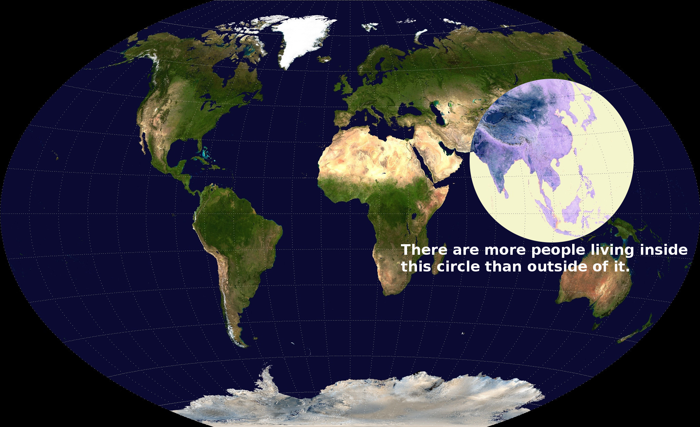
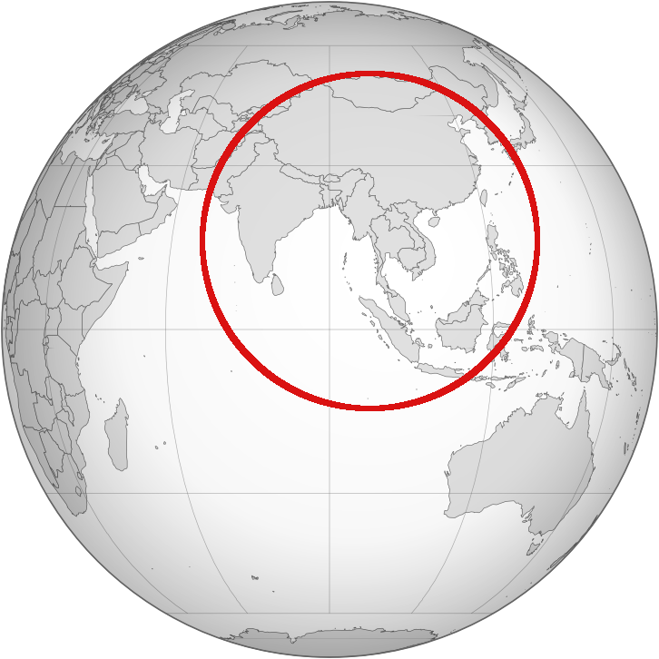

猜猜95%以上全球網際網路信息流動在哪？在[海底電纜](https://www.thepaper.cn/newsDetail_forward_23582699)！

聯合國[實現全人類的互連互通](https://news.un.org/zh/story/2020/09/1066822)“新路線圖”還在進行，[《中國網際網路發展報告2023》和《世界網際網路發展報告2023》藍皮書](http://www.cac.gov.cn/2023-11/08/c_1701102645017335.htm)也評估全世界的發展，包括21個欠發達國家。

澳恪森數智科技服務利用最新[SubmarineCable](https://www.submarinecablemap.com/)的數據，把500多條海底光纜網絡化可視化，發現網際網路的發展的確走向亞太及中東，除了中國外，新興的新加坡、印尼、阿聯酋、埃及等，不少在南方國家，雖然美國及英國的國際海底光纜數量還是排名靠前，網際網路已不在局限在北大西洋，而是在東南亞海域、印度洋、阿拉伯海等實現全人類的互連互通。

澳恪森數智科技服務數據科學家廖漢騰還指出一些有趣的地緣政治發展。

<!--more-->

### 海底光纜網絡化可視化成果

為慶祝世界網際網路的發展，澳恪森數智科技服務進行公益的可視化服務項目，將海底光纜網絡化可視化。

把500多條海底光纜網絡化可視化，並且使用海洋來做色彩分類，用節點大小表達該國家/地域的海底光纜數，得到下圖。注意此圖以海底光纜的登陸點國家/地域為數據分類，所以像關島和美國是分開的節點。
<figure>

  

此圖有🪄交互功能（試試拖拉、多手指平移、縮放頁面及🖱️鼠標懸停效果）
  

<iframe src="./Global_Submarine_Cable_Network-10-3.html" height="800px" width="100%" style="border:none;"></iframe>
<figcaption markdown="1" >
海底光纜網絡化可視化成果
</figcaption>
</figure>

可以發現網際網路的發展的確走向亞太及中東：

* 除了中國外，新興的新加坡、印尼、阿聯酋、埃及等，不少 算是發展中的“南方國家”
* 雖然美國及英國的國際海底光纜數量還是排名靠前，網際網路已不在局限在北大西洋
* 世界網際網路的密集化發展熱點，是在東南亞海域、印度洋、阿拉伯海等
### 網際網路不單只“消減”距離，而是有物質及地理條件的連結

“網際網路研究正迎來一股回歸物質及地理的轉向，”廖漢騰表示，“在英國牛津大學網際網路研究時，是網際網路與全球化可以“消減”距離信條的年代，現在由於世界網際網路與地緣政治的發展，網際網路的物質及地理特性愈來愈明顯，不可忽略。”

“首先是光纜的技術及商業革命，讓世界有更多的供應商如華為海洋（現名“華海通信”），然而同軸電纜時代的跨國產業合作聯盟仍是主要的合作形式。”

“但此合作形式，有時會因為地緣政治而有角力，使得合作互聯互通的網際網路，變成另一種國際關系及權力的場域。再者，海底光纜的地理特性，亦可是地緣政治海權的角力，若不只涉及開放的公海之外。”

### 不意外的解釋：瓦萊裡皮耶斯圓 （Valeriepieris circle）

“其實，有個網際網路民科變成科學的知識可以解釋此走向，和地緣政治或權力無關，就是和人口有關。”廖漢騰提出另一個角度。

瓦萊裡皮耶斯圓 （Valeriepieris circle）指的是在世界上最小範圍的圓圈，此圈內的人口大於圈外，這是一位美國教師以中國及印度人口大國開始說明世界人口分布的發現及設想。

2015年新加坡教授Danny Quah和實習生Ken Teoh驗證此想法，提出一個更准且小一點的圈：

“實現全人類的互連互通，不意外地就要往這圈走，以人為中心的網際網路自然而然如此。”廖漢騰表示。

“除非要來算物聯網。”

###  雙化協同的未來海底光纜

冷笑話之外，綠色化數字化雙化協同的未來，海底光纜的確還有技術路線圖的可能發展。

海洋航運的技術和管理，在聯合國貿易和發展會議（UNCTAD）主持下正往[公正、公平地過渡的脫碳](https://www.xindemarinenews.com/topic/yazaishuiguanli/50424.html)方向前進。

未來海底光纜、海上（風電/潮電）無人機、等等的技術發展如何實現全人類的“有意義且高質量”的互連互通，看來是必要的彙集發展路徑，希望能在此世界人口密集中心圈有決定未來20-30年雙碳未來的創新。
“海洋的人類活動也需要脫碳，以人為中心的網際網路、物聯網、及數據中心除了地緣政治、生態影響、及能源和碳排，指向的正是貿易和發展的雙化協同。”廖漢騰小結。
