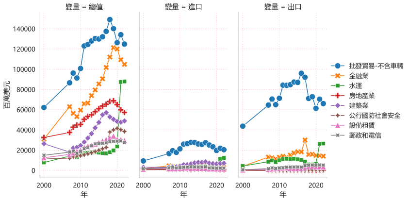

數碼化綠色化雙轉型的香港？

以數碼化綠色化雙轉型為主題，【[2023世界創新城市論壇](https://www.hkcd.com.hk/hkcdweb/content/2023/11/16/content_8610030.html)】討論包括香港等的創新發展，協同數碼化綠色化雙轉型。

澳恪森数智科技服务Oxford Roadmapping 在此展示中國香港自2000至2022年二十多年的產業結構變化，運用包括社交網絡分析的數據可視化，指出已下行近5年的主要核心產業如“批發貿易”、“金融業”、“房地產業”、及“建築業”，要如何和近年來成長的“水運”、“公行國防社會安全”等新興核心產業，協同數碼化綠色化雙轉型？

此數據分析及可視化是根據[亞洲開發銀行ADB](https://data.adb.org) 所提供的產業投入產出數據，含[中國香港35部门的🔁投入及產出](https://data.adb.org/dataset/hong-kong-china-input-output-economic-indicators)，有如“批發貿易↦水運”、“金融業↦房地產業”等具有方向性的金流數據。此數據亦含各部門的進口及出口數據，但可惜未含碳排量或強度等清單數據。未來創新、科研等需要結合產業金流及碳流數據來實撐數碼化綠色化雙轉型。

<!--more-->

### 數碼化綠色化雙轉型的香港？產業結構變化實證為何？

以數碼化綠色化雙轉型為主題，香港生產力促進局、英國標準協會、曼徹斯特大學等單位及代表參加了在深圳舉辦的【[2023世界創新城市論壇](https://www.hkcd.com.hk/hkcdweb/content/2023/11/16/content_8610030.html)】。

在内地稱“双化协同”的數碼化綠色化雙轉型正是本公司Oxford Roadmapping 澳恪森数智科技服务(广州)有限公司的主營領域。

在此展示中國香港自2000至2022年二十多年的產業結構變化，運用包括社交網絡分析的數據可視化，指出已下行近5年的主要核心產業如“批發貿易”、“金融業”、“房地產業”、及“建築業”。

中國香港要如何和近年來成長的“水運”、“公行國防社會安全”等新興核心產業，協同數碼化綠色化雙轉型？

### 趨勢圖分析——中國香港前8產業部門的總值、進出、與出口的多面分析

中國香港的35個產業部門當中，以2022年最新數據取前8，其20多年的趨勢圖分析如下圖所示：

近5年以來，位居前列的主要核心產業正下行的有：“批發貿易”、“金融業”、“房地產業”、及“建築業”。這些自2000年起至2018帶領香港產業走向成長的部門，極需尋找新增長點、新創新點、以及轉型。

近來總体走向還算是上行的是“水運”、“公行國防社會安全”等，其中“水運”是在2020年起開始大幅成長，其出口數據亦為如此。

### 網路圖分析--2022年中國香港產業部門之間關係 (此圖有交互功能) 

中國香港的35個產業部門的關係，以2022年最新數據取前5%的投入產出數據關係(已包括近8成的關係總值數據)進行網路圖分析如下圖:
<figure>
<iframe src="./NetVis-中國香港-2022-總值-5-zh-Hant.html" height="800px" width="100%" style="border:none;"></iframe><figcaption >

* 註1：節點大小表達總值大小，使用🖱️滑鼠懸停(hover)效果可見總值、進出、與出口的數據值，單位為百萬美元（按當前價格計算）   
* 註2：此圖有🪄交互功能（⎘拖拉、🖔多手指平移、🔍縮放頁面及🖱️滑鼠懸停效果）

 <cite>廖漢騰. (2023). 台灣主要產業結構. Oxford Roadmapping 澳恪森數智科技服务(廣州). </cite>
> 注：此圖將發表，在發表前請勿正式引用。

</figcaption>
</figure>

值得注意的是上行的是“水運”的關係網絡，不只和空運及陸運相關，更形構出如“水運↦空運↦批發貿易↦水運”、“水運↦金融業↦房地產業↦批發貿易”、“水運↦金融業↦郵政和電信↦批發貿易”等核心網絡關係。

下行的主要核心產業有：“批發貿易”、“金融業”、“房地產業”、及“建築業”，其間的主要關係依圖所示為“金融↦批發貿易↦建築業”、“金融業↦房地產業↦批發貿易↦建築業”。

小帖士：香港海運港口局出版的 [香港海運業概覽](https://www.hkmpb.gov.hk/publications/Maritime%20Industry%20in%20Hong%20Kong.pdf)

-----

### 網路圖分析--2000年中國香港產業部門之間關係 (此圖有交互功能) 

中國香港的35個產業部門的關係，以2000年最新數據取前5%的投入產出數據關係(已包括近8成的關係總值數據)進行網路圖分析如下圖:

<figure>
<iframe src="./NetVis-中國香港-2000-總值-5-zh-Hant.html" height="800px" width="100%" style="border:none;"></iframe><figcaption markdown="1" >

* 註1：節點大小表達總值大小，使用🖱️滑鼠懸停(hover)效果可見總值、進出、與出口的數據值，單位為百萬美元（按當前價格計算）   
* 註2：此圖有🪄交互功能（⎘拖拉、🖔多手指平移、🔍縮放頁面及🖱️滑鼠懸停效果）

 <cite>廖漢騰. (2023). 台灣主要產業結構. Oxford Roadmapping 澳恪森數智科技服务(廣州). </cite>
> 注：此圖將發表，在發表前請勿正式引用。

</figcaption>
</figure>

可見早在20多年前，中國香港的核心產業由“批發貿易”、“金融業”、“房地產業”三項產業部門為核心，支撐起建築業、運輸業及其它部門。
### 小结： 中國香港的未來展望及發問——根據研究及數碼化及綠色化的發問

#### 中國香港產業結構

根據[滕光進等人（2003）的分析](https://kns.cnki.net/kcms2/article/abstract?v=PT3z46FIkGl5vk6M3OTxqW-L0diMgTYJC8CbUCKW77FeppRcaHiPn3KEr1Kn8ifP1UFDtkNy9nGXeMk50vutCXvVXmw4MFpZpFnUZWMmHV8HidJXB_xXf_WTMZ0i2EFR&uniplatform=NZKPT&flag=copy)，亞洲金融危機之後，香港得益於與 內地以及全球的經濟互動，成為中國最重要的金融及商貿服務中心之一，而香港投資者也充分利用資本優勢進入信息及生物等高新技術領域，香港政府也改變原有“積極不干預” 並采取科創和高新環境的産業治理。

20年後的中國香港，在信息及生物等高新技術領域的可見成果似乎仍不如傳統核心“批發貿易”、“金融業”、“房地產業”。

#### 水運的新興與希望

20年後的中國香港，在“水運”部門看見一個新引擎，可以在數碼化和綠色化拼淨零轉型。展望世界航運今年2023年的主要發展如下：

* [國際海事組織力通過2023年船舶溫室氣體減排戰略](https://news.un.org/zh/story/2023/07/1119527)，要求：需透過提升新建船舶的能源效率設計來降低其碳強度；到2030年，國際航運單次運輸任務的二氧化碳排放量要比採用可實現溫室氣體零排放或接近零排放的技術、燃料和/或能源，到2030年至少佔國際航運所用能源的5%，力求達到10%。
* 全球 [碳稅逼近船運，擴大供應鏈脫碳需求](https://csr.cw.com.tw/article/41913)
* [美公布《2023年清潔航運法》協助航運業脫碳](https://tssp.neocities.org/news/shipping/202306/2023061603)

中國香港在[企業社會責任（CSR），環境、社會及管治（ESG），以及聯合國永續發展目標（SDGs）](https://cbs.bschool.cuhk.edu.hk/zh-hant/news/%E4%BC%81%E6%A5%AD%E5%8F%AF%E6%8C%81%E7%BA%8C%E7%99%BC%E5%B1%95%E6%8C%87%E6%95%B8%E5%85%AC%E5%B8%83/#:~:text=%E9%80%8F%E9%81%8E%E4%BC%81%E6%A5%AD%E5%8F%AF%E6%8C%81%E7%BA%8C%E7%99%BC%E5%B1%95,%E6%8E%A8%E5%B1%95%E5%8F%AF%E6%8C%81%E7%BA%8C%E7%99%BC%E5%B1%95%E5%B7%A5%E4%BD%9C%E3%80%82%E3%80%8D)方向，已有不少在商業可持續發展的積累。

### 香港數碼化綠色化雙轉型的問題

因此，本文參照鄭永年從[浙江樣本討論「八八戰略」](https://www.qiia.org/zh-hant/node/1023)，對中國香港從價值鏈、供應鏈和產業鏈而言，提出以下問題：

1.   在水運數碼化和綠色化拼淨零轉型的技術水平而言，如何評價其低中高等？
2.   在水運和其他核心産業如金融、批發貿易、等，其金流及物流的數碼化和綠色化拼淨零轉型的技術水平而言，如何評價其低中高等？
3. 在已知評價高低后，如何制定創新及産業戰略，促中國香港產業升級及高質量發展？(參考日本智庫[全球價值鏈微笑曲線可視化](https://www.ide.go.jp/English/ResearchColumns/Columns/2022/meng_bo.html)檢視中國-美國貿易衝突的研究。)

4. 在産業創新及戰略制定，如何識別出中國香港樣本、大灣區樣本中價值鏈、供應鏈和產業鏈的[鏈長和鏈主](http://amr.gd.gov.cn/zwdt/mtgz/content/post_4190657.html)？鏈長和鏈主的脫碳、升級及高質量發展如何定義？

5. 在産業創新及戰略制定，如何從中國香港樣本、大灣區樣本、來討論價值鏈、供應鏈和產業鏈升級及高質量發展？

####  展望未來：機構合作、議題設定

**澳恪森**表示，將於聯合國COP28 同步的IEEE技術可持續發展浄零政策研討会發布産業論文，並在亞太地區分析産業的碳足跡網絡，如[浙江精准脱碳](https://oxon8.netlify.app/post/2023-11-05-zhejiang-high-carbon-intensity-industry-mapping/)、
[广东精准脱碳](https://oxon8.netlify.app/post/2023-10-26-guandong-high-carbon-intensity-industry-mapping/)、等，持續産出[數據科学+設計科学](https://oxon8.netlify.app/post/2023-03-27-design-science-plus-information-science/)的知識和方法，特別在[碳中和管理服務數智平台](https://oxon8.netlify.app/post/2023-02-20-smart-digital-platforms-carbon-neutral-management-services/)、[智能港口全球價值鏈脫碳](https://oxon8.netlify.app/publication/liao-knowledge-2023/)、[ESG 咨詢﹑報告和傳播教育合作](https://oxon8.netlify.app/publication/liao-knowledge-2023/)進行科研創新。

在投入産出分析（Input-Output Analysis）整合 社交網絡圖可视化 （Social Network Mapping）及分析方面，有具大應用於 碳排管理（Carbon management）双化協同（Green Digital Transformation）的機會，歡迎來信 h.liao@ieee.org 詢問合作事宜。

-----

##### 數據來源：[亞洲開發銀行ADB](https://data.adb.org) 國家/地區投入產出表(35部门) 

* 亞洲開發銀行ADB, [Hong Kong, China: Input-Output Economic Indicators](https://data.adb.org/dataset/hong-kong-china-input-output-economic-indicators)

* 萬國碼Unicode,  [國家/地區名稱與編碼 ](https://cldr.unicode.org/translation/displaynames/countryregion-territory-names)

##### 本图文来源：Oxford Roadmapping 澳恪森数智科技服务(广州)有限公司

<cite>廖漢騰. (2023). 台灣主要產業結構. Oxford Roadmapping 澳恪森數智科技服务(廣州). </cite>

> 注：此圖將發表，在發表前請勿正式引用。
