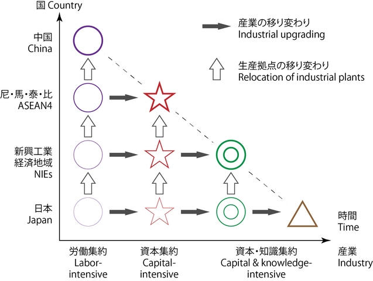

在台灣，[淨零、數位雙轉型已成為主流財經媒體眼中的企業必修課](https://www.wealth.com.tw/articles/7abc6db7-1428-4691-9d7b-29af5e78f47e) ，在其「2050淨零排放路徑」的12項關鍵戰略中，「ESG與數位轉型是一體兩面，相互為用，而且有加乘效應，透過雙轉型，也將會讓台灣成為一個更有韌性的社會。」

與香港的產業結構往其[數碼化綠色化雙轉型](https://oxon8.netlify.app/en/post/2023-11-18-hongkong-industry-mapping/)相比，台灣的主要產業結構樣態為何？

作為綠色化數字化轉型的科技服務公司，本圖文為澳恪森数智 (Oxford Roadmapping) 基於[亞洲開發銀行ADB](https://data.adb.org) 所提供的產業投入產出數據的產業結構趨勢與網路圖系列分析。

 台灣自2000至2022年二十多年的產業結構變化為何？這對其
「ESG與數位轉型」雙轉型成為韌性社會有何啟示？半導體是否獨大？這是對雙轉型有何優劣勢？
 
 <!--more-->

### 數碼化綠色化雙轉型的台灣？產業結構變化實證為何？

以「ESG與數位轉型」雙轉型為主題，台灣主流財經媒體舉辦的《[ESG（環境保護、社會責任、公司治理）](https://www.hkcd.com.hk/hkcdweb/content/2023/11/16/content_8610030.html)》論壇，標誌著台灣主流積優企業意識到ESG已取代財務性指標，成為企業價值衡量的普世標準。綠色金融產品也在平台化，銀行甚至協助客戶盤查、認證碳排量，提供能源管理服務、綠電交易信託、、法人綠色定存等產品。

在中國大陸稱“双化協同”的數字化綠色化雙轉型正是本公司Oxford Roadmapping 澳恪森數智科技服務(广州)有限公司的主營領域。

本圖文展示台灣自2000至2022年二十多年的產業結構變化，運用包括社交網絡分析的數據可視化，指出已下行近5年的主要核心產業以總值進出口三指標持續第一的“電子和光學設備”產業為主，然而其它核心產業的“基本金屬”、“批發貿易”、及“化學製品”等變化雖有消長但不大，其他產業相對較低的核心產業如“建築業”、“房地產業”、及“金融業”在投入產出網路中佔較核心地位。位處邊緣的農業、住宿和餐飲業、公行國防社會安全等民生產業可能面臨較高的雙轉型挑戰。

此數據分析及可視化是根據，含[台灣35部门的🔁投入及產出](https://data.adb.org/dataset/dataset/taipeichina-input-output-economic-indicators)，有如“基本金屬↦建築業↦房地產業”等具有方向性的金流數據。此數據亦含各部門的進口及出口數據，但可惜未含碳排量或強度等清單數據。未來創新、科研等需要結合產業金流及碳流數據來實撐數字化綠色化雙轉型。

### 趨勢圖分析——台灣前8產業部門的總值、進出、與出口的多面分析

台灣的35個產業部門當中，以2022年最新數據取前8，其20多年的趨勢圖分析如下圖所示：

近20年以來，台灣位居前列的核心產業多數時候往上行，如其持續總值進出口三項第一的“電子和光學設備”產業，僅有2007至2008年（環球金融危機）以及2018至2019年下行。

這反映的是台灣龍頭產業在全球市場的重要角色以及受到其影響的特性。
2021至2022年，排名第二及第四的“基本金屬”與“化學製品”的總值及出口呈下行，而批發貿易的總值和出口有回升。

### 網路圖分析--2022年台灣產業部門之間關係 (此圖有交互功能) 

台灣的35個產業部門的關係，以2022年最新數據取前5%的投入產出數據關係(已包括近8成的關係總值數據)進行網路圖分析如下圖:
<figure>
<iframe src="./NetVis-台灣-2022-總值-5-zh-Hant.html" height="800px" width="100%" style="border:none;"></iframe><figcaption >

1. 節點大小表達總值大小，使用🖱️滑鼠懸停(hover)效果可見總值、進出、與出口的數據值，單位為百萬美元（按當前價格計算）   

2. 此圖有🪄交互功能（⎘拖拉、🖔多手指平移、🔍縮放頁面及🖱️滑鼠懸停效果）
 <cite>廖漢騰. (2023). 台灣主要產業結構. Oxford Roadmapping 澳恪森數智科技服務(廣州). </cite>
> 注：此圖將發表，在發表前請勿正式引用。

</figcaption>
</figure>

值得注意的是上行的是台灣龍頭產業“電子和光學設備”的關係網絡，雖位處核心位置，但其其它產業間的金流關係（寬度表達金流量的大小）其實不若排名第二的“基本金屬”等之間的關係密切。

更能形構出台灣產業關係的是位處核心的如“基本金屬↦機械”、“基本金屬↦建築業↦房地產業↦批發貿易↦機械”、“金融業↦房地產業”等核心網絡關係。

小帖士：2023年核定[「臺灣AI行動計畫2.0」及「以大帶小製造業低碳化及智慧化升級轉型補助」](https://www.ey.gov.tw/Page/9277F759E41CCD91/58927b52-d2f4-4dd8-a34d-2de10622994d)來助力產業轉型升級的成本過高及回收期過長的門檻。

-----

### 網路圖分析--2000年台灣產業部門之間關係 (此圖有交互功能) 

台灣的35個產業部門的關係，以2000年最新數據取前5%的投入產出數據關係 (已包括近8成的關係總值數據) 進行網路圖分析如下圖:

<figure>
<iframe src="./NetVis-台灣-2000-總值-5-zh-Hant.html" height="800px" width="100%" style="border:none;"></iframe><figcaption markdown="1" >

1. 節點大小表達總值大小，使用🖱️滑鼠懸停(hover)效果可見總值、進出、與出口的數據值，單位為百萬美元（按當前價格計算）   

2. 此圖有🪄交互功能（⎘拖拉、🖔多手指平移、🔍縮放頁面及🖱️滑鼠懸停效果）

 <cite>廖漢騰. (2023). 台灣主要產業結構. Oxford Roadmapping 澳恪森數智科技服務(廣州). </cite>
> 注：此圖將發表，在發表前請勿正式引用。

</figcaption>
</figure>

可見早在20多年前，台灣的核心產業由“電子和光學設備”、“基本金屬”、“建築業”、“批發貿易”、“金融業”、“房地產業”六項產業部門為核心產業關係，支撐起化學、燃料等其它部門。

### 小結： 台灣的未來展望及發問——根據研究及數碼化及綠色化的發問

#### 台灣產業結構

根據日本經濟學家赤松要M. Ezak提出的雁行理論（日語：雁行形態論，英語：flying geese paradigm），二戰后東亞經濟發展是由日本帶動亞洲四小龍，自日本移轉技術或產業的產業結構相應升級，再其次是中國大陸與東協各國。台灣的產業結構受國際政經情勢變化影響較大，如1985年日本與美、德、法、英簽訂《廣場協議》（Plaza Accord）以及美日《半導體協議》，對日本和台灣高科技領域國際分工的消長有決定性影響。

這些政經理論及觀察的現實，主要表達在雁行理論產業基地轉移的模型：

「ESG與數位轉型」雙轉型下的台灣，產業基地的轉移則指出以下關鍵問題:
1. 國際市場如歐盟的碳關稅雖未列入半導體等産業，台灣支持半導體産業的基本金屬、化學、燃料則有明顯的碳排，要如何提早按實部局脫碳路線圖進行產業基地的全球佈局？
2. 台灣本地民生産業如建築業、批發貿易、金融業、房地產業等是否真能採用國際標準落實減排脫碳？要如何利用台灣各地區的地理及人文特性進行產業基地的新佈局？

3. 台灣產業結構改變時，如何[有效解決結構性失業的問題](https://ws.ndc.gov.tw/001/administrator/10/relfile/6140/12783/0018499.pdf)？智能化綠色化下的失業及就業問題，對雙轉型打造韌性社會將有什麼重大難點？台灣後疫情時代是否能有「[所得倍增計畫](https://ws.ndc.gov.tw/001/administrator/10/relfile/6140/12783/0018499.pdf)」？

#### 跨越「中等收入陷阱」的台灣是否能在更多領域跨越「中等技術陷阱」
台灣經濟發展歷程的主軸是在全球化的產業鏈下成長後的產業轉型，宏碁集團創辦人施振榮依據其商場實戰經驗總結的微笑曲線，更是走在「中等收入陷阱」、[「中等技術陷阱」](https://www.qiia.org/zh-hant/node/1155)等概念主流化前，成為台灣企業産業升級的核心操作概念？

台灣在半導體産業跨越「中等收入陷阱」及「中等技術陷阱」已有成果，但在其它如金融、資信通、航運、國防軍工等領域，則未能和同為亞洲四小龍的南韓、新加坡等相比。

#### 航運的希望--長榮大學、長榮航空及長榮海運

長榮大學與台灣數位企業總會將[建構「零碳轉型聯盟」平台](https://dweb.cjcu.edu.tw/rdcenter/spotlight/5293)來協助台灣企業來完成零碳化過程中所需要的量化指標、數據管理，最終達到「雙軸轉型（DigiZero）」，邁向淨零排放目標。

長榮航空及長榮海運也[投資打造綠色節能船隊](https://www.cw.com.tw/article/5127205)，更提出[數位轉型三大措施，提升營運效率、解決碳稅需求](https://esg.gvm.com.tw/article/33644)。

具體方案是提供客戶碳盤查方案，解決客戶在規劃「範疇三-供應鏈」碳稅作業時的計算需求，提供第三方認證的碳排證明，列出貨櫃運行期間的碳排放量。

#### 台灣需要更多的産業實證研究制定創新及産業戰略

施振榮總結的微笑曲線，近年來在日本智庫[全球價值鏈微笑曲線可視化](https://www.ide.go.jp/English/ResearchColumns/Columns/2022/meng_bo.html)的研究中，有了實證的支持及科學基礎，還用來檢視中國-美國貿易衝突以及在全球價值鏈位置分析。

台灣需要更多的産業實證研究制定創新及産業戰略，以制定創新及産業戰略，促台灣產業升級及高質量發展？

####  展望未來：機構合作、議題設定

**澳恪森**表示，將於聯合國COP28 同步的IEEE技術可持續發展浄零政策研討会發布産業論文，並在亞太地區分析産業的碳足跡網絡，如[浙江精准脱碳](https://oxon8.netlify.app/post/2023-11-05-zhejiang-high-carbon-intensity-industry-mapping/)、
[广东精准脱碳](https://oxon8.netlify.app/post/2023-10-26-guandong-high-carbon-intensity-industry-mapping/)、等，持續産出[數據科学+設計科学](https://oxon8.netlify.app/post/2023-03-27-design-science-plus-information-science/)的知識和方法，特別在[碳中和管理服務數智平台](https://oxon8.netlify.app/post/2023-02-20-smart-digital-platforms-carbon-neutral-management-services/)、[智能港口全球價值鏈脫碳](https://oxon8.netlify.app/publication/liao-knowledge-2023/)、[ESG 咨詢﹑報告和傳播教育合作](https://oxon8.netlify.app/publication/liao-knowledge-2023/)進行科研創新。

在投入産出分析（Input-Output Analysis）整合 社交網絡圖可视化 （Social Network Mapping）及分析方面，有具大應用於 碳排管理（Carbon management）双化協同（Green Digital Transformation）的機會，歡迎來信 h.liao@ieee.org 詢問合作事宜。
-----

##### 數據來源：[亞洲開發銀行ADB](https://data.adb.org) 國家/地區投入產出表(35部门) 

* 亞洲開發銀行ADB, [Taipei, China: Input-Output Economic Indicators](https://data.adb.org/dataset/dataset/taipeichina-input-output-economic-indicators)

* 萬國碼Unicode,  [國家/地區名稱與編碼 ](https://cldr.unicode.org/translation/displaynames/countryregion-territory-names)

##### 本圖文來源：Oxford Roadmapping 澳恪森數智科技服務(廣州)

<cite>廖漢騰. (2023). 台灣主要產業結構. Oxford Roadmapping 澳恪森數智科技服務(廣州). </cite>
> 注：此圖將發表，在發表前請勿正式引用。

