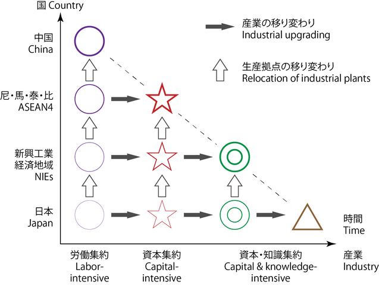

在台湾，[净零丶数位双转型已成为主流财经媒体眼中的企业必修课](https://www.wealth.com.tw/articles/7abc6db7-1428-4691-9d7b-29af5e78f47e) ，在其「2050净零排放路径」的12项关键战略中，「ESG与数位转型是一体两面，相互为用，而且有加乘效应，透过双转型，也将会让台湾成为一个更有韧性的社会。」

与香港的产业结构往其[数码化绿色化双转型](https://oxon8.netlify.app/en/post/2023-11-18-hongkong-industry-mapping/)相比，台湾的主要产业结构样态为何？

作为绿色化数字化转型的科技服务公司，本图文为澳恪森数智 (Oxford Roadmapping) 基於[亚洲开发银行ADB](https://data.adb.org) 所提供的产业投入产出数据的产业结构趋势与网路图系列分析。

 台湾自2000至2022年二十多年的产业结构变化为何？这对其
「ESG与数位转型」双转型成为韧性社会有何启示？半导体是否独大？这是对双转型有何优劣势？
 
 <!--more-->

### 数码化绿色化双转型的台湾？产业结构变化实证为何？

以「ESG与数位转型」双转型为主题，台湾主流财经媒体举办的《[ESG（环境保护丶社会责任丶公司治理）](https://www.hkcd.com.hk/hkcdweb/content/2023/11/16/content_8610030.html)》论坛，标志着台湾主流积优企业意识到ESG已取代财务性指标，成为企业价值衡量的普世标准。绿色金融产品也在平台化，银行甚至协助客户盘查丶认证碳排量，提供能源管理服务丶绿电交易信托丶丶法人绿色定存等产品。

在中国大陆称“双化协同”的数字化绿色化双转型正是本公司Oxford Roadmapping 澳恪森数智科技服务(广州)有限公司的主营领域。

本图文展示台湾自2000至2022年二十多年的产业结构变化，运用包括社交网络分析的数据可视化，指出已下行近5年的主要核心产业以总值进出口三指标持续第一的“电子和光学设备”产业为主，然而其它核心产业的“基本金属”丶“批发贸易”丶及“化学制品”等变化虽有消长但不大，其他产业相对较低的核心产业如“建筑业”丶“房地产业”丶及“金融业”在投入产出网路中占较核心地位。位处边缘的农业丶住宿和餐饮业丶公行国防社会安全等民生产业可能面临较高的双转型挑战。

此数据分析及可视化是根据，含[台湾35部门的🔁投入及产出](https://data.adb.org/dataset/dataset/taipeichina-input-output-economic-indicators)，有如“基本金属↦建筑业↦房地产业”等具有方向性的金流数据。此数据亦含各部门的进口及出口数据，但可惜未含碳排量或强度等清单数据。未来创新丶科研等需要结合产业金流及碳流数据来实撑数字化绿色化双转型。

### 趋势图分析——台湾前8产业部门的总值丶进出丶与出口的多面分析

台湾的35个产业部门当中，以2022年最新数据取前8，其20多年的趋势图分析如下图所示：

近20年以来，台湾位居前列的核心产业多数时候往上行，如其持续总值进出口三项第一的“电子和光学设备”产业，仅有2007至2008年（环球金融危机）以及2018至2019年下行。

这反映的是台湾龙头产业在全球市场的重要角色以及受到其影响的特性。
2021至2022年，排名第二及第四的“基本金属”与“化学制品”的总值及出口呈下行，而批发贸易的总值和出口有回升。

### 网路图分析--2022年台湾产业部门之间关系 (此图有交互功能) 

台湾的35个产业部门的关系，以2022年最新数据取前5%的投入产出数据关系(已包括近8成的关系总值数据)进行网路图分析如下图:
<figure>
<iframe src="./NetVis-台湾-2022-总值-5-zh-Hant.html" height="800px" width="100%" style="border:none;"></iframe><figcaption >

* 注1：节点大小表达总值大小，使用🖱️滑鼠悬停(hover)效果可见总值丶进出丶与出口的数据值，单位为百万美元（按当前价格计算）   

* 注2：此图有🪄交互功能（⎘拖拉丶🖔多手指平移丶🔍缩放页面及🖱️滑鼠悬停效果）
 <cite>廖汉腾. (2023). 台湾主要产业结构. Oxford Roadmapping 澳恪森数智科技服务(广州). </cite>
> 注：此图将发表，在发表前请勿正式引用。

</figcaption>
</figure>

值得注意的是上行的是台湾龙头产业“电子和光学设备”的关系网络，虽位处核心位置，但其其它产业间的金流关系（宽度表达金流量的大小）其实不若排名第二的“基本金属”等之间的关系密切。

更能形构出台湾产业关系的是位处核心的如“基本金属↦机械”丶“基本金属↦建筑业↦房地产业↦批发贸易↦机械”丶“金融业↦房地产业”等核心网络关系。

小帖士：2023年核定[「台湾AI行动计画2.0」及「以大带小制造业低碳化及智慧化升级转型补助」](https://www.ey.gov.tw/Page/9277F759E41CCD91/58927b52-d2f4-4dd8-a34d-2de10622994d)来助力产业转型升级的成本过高及回收期过长的门槛。

-----

### 网路图分析--2000年台湾产业部门之间关系 (此图有交互功能) 

台湾的35个产业部门的关系，以2000年最新数据取前5%的投入产出数据关系 (已包括近8成的关系总值数据) 进行网路图分析如下图:

<figure>
<iframe src="./NetVis-台湾-2000-总值-5-zh-Hant.html" height="800px" width="100%" style="border:none;"></iframe><figcaption markdown="1" >

* 注1：节点大小表达总值大小，使用🖱️滑鼠悬停(hover)效果可见总值丶进出丶与出口的数据值，单位为百万美元（按当前价格计算）   
* 注2：此图有🪄交互功能（⎘拖拉丶🖔多手指平移丶🔍缩放页面及🖱️滑鼠悬停效果）

 <cite>廖汉腾. (2023). 台湾主要产业结构. Oxford Roadmapping 澳恪森数智科技服务(广州). </cite>
> 注：此图将发表，在发表前请勿正式引用。

</figcaption>
</figure>

可见早在20多年前，台湾的核心产业由“电子和光学设备”丶“基本金属”丶“建筑业”丶“批发贸易”丶“金融业”丶“房地产业”六项产业部门为核心产业关系，支撑起化学丶燃料等其它部门。

### 小结： 台湾的未来展望及发问——根据研究及数码化及绿色化的发问

#### 台湾产业结构

根据日本经济学家赤松要M. Ezak提出的雁行理论（日语：雁行形态论，英语：flying geese paradigm），二战后东亚经济发展是由日本带动亚洲四小龙，自日本移转技术或产业的产业结构相应升级，再其次是中国大陆与东协各国。台湾的产业结构受国际政经情势变化影响较大，如1985年日本与美丶德丶法丶英签订《广场协议》（Plaza Accord）以及美日《半导体协议》，对日本和台湾高科技领域国际分工的消长有决定性影响。

这些政经理论及观察的现实，主要表达在雁行理论产业基地转移的模型：

「ESG与数位转型」双转型下的台湾，产业基地的转移则指出以下关键问题:
1. 国际市场如欧盟的碳关税虽未列入半导体等産业，台湾支持半导体産业的基本金属丶化学丶燃料则有明显的碳排，要如何提早按实部局脱碳路线图进行产业基地的全球布局？
2. 台湾本地民生産业如建筑业丶批发贸易丶金融业丶房地产业等是否真能采用国际标准落实减排脱碳？要如何利用台湾各地区的地理及人文特性进行产业基地的新布局？

3. 台湾产业结构改变时，如何[有效解决结构性失业的问题](https://ws.ndc.gov.tw/001/administrator/10/relfile/6140/12783/0018499.pdf)？智能化绿色化下的失业及就业问题，对双转型打造韧性社会将有什麽重大难点？台湾後疫情时代是否能有「[所得倍增计画](https://ws.ndc.gov.tw/001/administrator/10/relfile/6140/12783/0018499.pdf)」？

#### 跨越「中等收入陷阱」的台湾是否能在更多领域跨越「中等技术陷阱」
台湾经济发展历程的主轴是在全球化的产业链下成长後的产业转型，宏碁集团创办人施振荣依据其商场实战经验总结的微笑曲线，更是走在「中等收入陷阱」丶[「中等技术陷阱」](https://www.qiia.org/zh-hant/node/1155)等概念主流化前，成为台湾企业産业升级的核心操作概念？

台湾在半导体産业跨越「中等收入陷阱」及「中等技术陷阱」已有成果，但在其它如金融丶资信通丶航运丶国防军工等领域，则未能和同为亚洲四小龙的南韩丶新加坡等相比。

#### 航运的希望--长荣大学丶长荣航空及长荣海运

长荣大学与台湾数位企业总会将[建构「零碳转型联盟」平台](https://dweb.cjcu.edu.tw/rdcenter/spotlight/5293)来协助台湾企业来完成零碳化过程中所需要的量化指标丶数据管理，最终达到「双轴转型（DigiZero）」，迈向净零排放目标。

长荣航空及长荣海运也[投资打造绿色节能船队](https://www.cw.com.tw/article/5127205)，更提出[数位转型三大措施，提升营运效率丶解决碳税需求](https://esg.gvm.com.tw/article/33644)。

具体方案是提供客户碳盘查方案，解决客户在规划「范畴三-供应链」碳税作业时的计算需求，提供第三方认证的碳排证明，列出货柜运行期间的碳排放量。

#### 台湾需要更多的産业实证研究制定创新及産业战略

施振荣总结的微笑曲线，近年来在日本智库[全球价值链微笑曲线可视化](https://www.ide.go.jp/English/ResearchColumns/Columns/2022/meng_bo.html)的研究中，有了实证的支持及科学基础，还用来检视中国-美国贸易冲突以及在全球价值链位置分析。

台湾需要更多的産业实证研究制定创新及産业战略，以制定创新及産业战略，促台湾产业升级及高质量发展？

####  展望未来：机构合作丶议题设定

**澳恪森**表示，将於联合国COP28 同步的IEEE技术可持续发展浄零政策研讨会发布産业论文，并在亚太地区分析産业的碳足迹网络，如[浙江精准脱碳](https://oxon8.netlify.app/post/2023-11-05-zhejiang-high-carbon-intensity-industry-mapping/)丶
[广东精准脱碳](https://oxon8.netlify.app/post/2023-10-26-guandong-high-carbon-intensity-industry-mapping/)丶等，持续産出[数据科学+设计科学](https://oxon8.netlify.app/post/2023-03-27-design-science-plus-information-science/)的知识和方法，特别在[碳中和管理服务数智平台](https://oxon8.netlify.app/post/2023-02-20-smart-digital-platforms-carbon-neutral-management-services/)丶[智能港口全球价值链脱碳](https://oxon8.netlify.app/publication/liao-knowledge-2023/)丶[ESG 咨询、报告和传播教育合作](https://oxon8.netlify.app/publication/liao-knowledge-2023/)进行科研创新。

在投入産出分析（Input-Output Analysis）整合 社交网络图可视化 （Social Network Mapping）及分析方面，有具大应用於 碳排管理（Carbon management）双化协同（Green Digital Transformation）的机会，欢迎来信 h.liao@ieee.org 询问合作事宜。
-----

##### 数据来源：[亚洲开发银行ADB](https://data.adb.org) 国家/地区投入产出表(35部门) 

* 亚洲开发银行ADB, [Taipei, China: Input-Output Economic Indicators](https://data.adb.org/dataset/dataset/taipeichina-input-output-economic-indicators)

* 万国码Unicode,  [国家/地区名称与编码 ](https://cldr.unicode.org/translation/displaynames/countryregion-territory-names)

##### 本图文来源：Oxford Roadmapping 澳恪森数智科技服务(广州)

<cite>廖汉腾. (2023). 台湾主要产业结构. Oxford Roadmapping 澳恪森数智科技服务(广州). </cite>
> 注：此图将发表，在发表前请勿正式引用。

