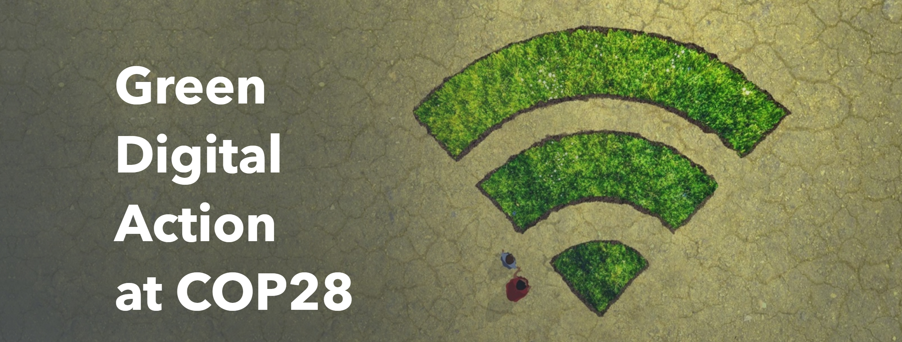

**联合国气候大会COP28**致力于解决气候问题。**国际电联ITU**负责ICT信息通讯技术，利用数字技术在COP28上号召**绿色数字行动** #GreenDigitalAction。

〝**双创+双化**是最新整合路径！〞**澳恪森**表示，〝国际电联ITU在**数字**创新创业 (双创) 发挥重要作用，倡导用数字创新解决数字鸿沟问题。在国际标准之上，国际电联[发展部门](https://www.itu.int/en/ITU-D/Pages/default.aspx)
，更以（数字）生态系统 （ecosystems）概念，
引领国际
绿色化数字化**转型** 
(双化)前沿发展。实际场景应用、标准、技术、治理通盘考量设计向前。〞

数据科学家廖汉腾博士表示，中国在绿色
〝中国在双化转型以及大学生**互联网创新创业** (双创)教育方面，〞澳恪森数据科学家廖汉腾博士表示，
〝应该借此世界机遇，从绿色化数字行动@COP28深入瞭解如何协调一致行动利用数字技术解决气候问题。#GreenDigitalAction 在中国即**双创加双化**。〞

<!--more-->

### 绿色化数字行动，为何是国际电联ITU？

国际电联ITU是联合国专门机构，负责信息通信技术（ICT）事务，旨在促进国际上通信网络的互联互通。

国际电联ITU不但是重要国际标准制定单位，更是在包括人工智能等应用及治理方面，最主要的数字发展单位及平台，其对数字发展的重要性相当于，WHO世卫组织之于公共卫生，FAO粮食及农业组织之于农业及粮食安全。



互联互通网络的旨趣，在国际发展的行动上，在过去几十年互联网的发展下，主要以[弥合数字鸿沟](https://news.un.org/zh/story/2023/06/1118622)为主，也是 5月17日“世界电信和信息社会日”主角机构。2015-2022年是由中国籍的赵厚麟任秘书长，把中小企业、科研部门、大专院校的参与纳入此国际平台，亦包括发展数字经济和消除数字鸿沟的行动，主要以４个I包括基础建设(Infrastructure)、投资(Investment)、创新(Innovation)、普惠(Inclusiveness)。2023年1月1日起，由[美国籍的多琳·伯格丹-马丁于就任国际电联秘书长](https://www.itu.int/zh/osg//default.aspx)
，强调数字化转型的必要性，发展创新伙伴关系以强化技术与可持续发展的统一。

国际电联ITU近年更推出绿色数字化双标准，ITU-T L.1470及ITU-T L.180制定，包括 “优化﹑替换﹑消费引导﹑信息管理﹑及协调对接"智能管理的减碳机制。本公司**澳恪森**不但以此标准审视中国互联网协会（ISC）碳中和管理及服务系统标准发表 [《碳中和管理服务数智平台》( Smart Digital Platforms for Carbon Neutral Management and Services) ](https://oxon8.netlify.app/post/2023-02-20-smart-digital-platforms-carbon-neutral-management-services/)
的论文，更以此开发工具箱及专利。

### 绿色化数字行动，国际电联ITU今年的内容是？

针对联合国气候大会COP28，国际电联ITU发起了[绿色化数字行动@COP28](https://www.itu.int/initiatives/green-digital-action-atcop28/)活动。

此活动目主要目标是聚焦于数字创新，面对并解决气候问题。

主要的努力方向有以下：

* 减少ICT行业排放
* 培育ICT循环产业
* 通过开放的环境数据和技术推进气候解决方案
* 为实施绿色标准造势
* 通过数字技术和技能发展，促进各行各业的绿色转型
利* 用数字系统确保根据联合国秘书长的“人人享有早期预警”倡议发出挽救生命的灾害警报



### 国际电联ITU在联合国气候大会COP28的活动亮点

〝2023年12月2日的主要活动是〞廖汉腾博士表示，〝**为净零未来的产业转型**是主要核心议程，点出数字科技促进产业转型及升级的要角。议程预告包括如何使用人工智能、数字孪生等，帮助难以减排的行业找到加速可持续发展的工法。〞

产业数字化和脱碳为讨论主题，并包括相关的监管及融资议题，来探索数字赋能行业转型潜力。

当天还有〝利用信息通信技术对气候的积极影响〞、〝众包人工智能解决方案〞议程。

### 其它活动与澳恪森的发展

国际电联ITU在联合国气候大会COP28的其它活動还包括以下：

* 减少ICT行业温室气体排放
* 创新、数字化赋能的绿色转型
* 围绕绿色标准造势
* WSC关于可持续数字技术国际标准的会议
* 负责任的数字支付以加速气候行动
* 负责任的数字支付，加速促进性别平等的气候行动
* 数字连接和技术，用于所有早期预警倡议
* 宜居星球上的数字化转型
* 科技向善：关于新兴技术在气候适应中的作用的圆桌讨论
* 技术盘点——人工智能在哪里，它如何使我们具有气候和灾害抵御能力？
* 数字脱碳：企业、科技领导者和政府之间的合作行动如何成为加快全球气候进展的关键
* 协调环境数据：制定全球环境数据战略
* 为电子产品创造循环经济
* 全球气候行动数据
* 气候博弈：游戏化、数字素养和行为改变
* 人工智能在气候中的应用：从创业公司的角度来看
* 国家数字战略和数字公共基础设施促进气候行动
* 净零数字化之旅：技术人员如何为绿色转型做出贡献

澳恪森表示，除了专注于产业关系的投入产出数据与碳排数据交叉的可视化，更对[《碳中和管理服务数智平台》( Smart Digital Platforms for Carbon Neutral Management and Services) ](https://oxon8.netlify.app/post/2023-02-20-smart-digital-platforms-carbon-neutral-management-services/)
的行业、团体标准、核心关键智彗财产权开发及协作累积用例、应用场景、工具箱以及产品原型。

澳恪森进一步表示，针对绿色化数字化转型 （双化协同）更会于今年底与利益相关方合作，结合国际电联、省级一流课程内容、以及技术路线图发布“绿色化数字化双化转型生态系统设计工具箱”。

〝欢迎有志对产业前瞻与传统的知识地图﹑协作地图有兴趣的行业协会、企业、大学科研人员来使用工具箱参与绿色化数字化创新。〞潘仲亷博士总结。〝我们将把科研成果，以[设计学+信息学的双创](https://oxon8.netlify.app/post/2023-03-27-design-science-plus-information-science/)
设计工作坊工具，和有志之士一起利用数字技术共创绿色可持续价值。〞

〝中国在**绿色化数字化双化转型**前沿以及**互联网创新创业**大学生教育方面，虽已有不少成果，但在协同合作、数字发展、以及ICT信息通讯技术的绿色化方面，存在不少重大短板，应该借此世界机遇，从绿色化数字行动@COP28深入瞭解如何协调一致行动利用数字技术解决气候问题。〞，澳恪森数据科学家廖汉腾博士表示

〝国际电联ITU在标准之外的[发展部门](https://www.itu.int/en/ITU-D/Pages/default.aspx)，更是倡导用数字创新来解决数字鸿沟的问题，更提出（数字）生态系统 （ecosystems）概念，将标准一方面往实际场景应用更紧密连结，一方面往技术治理更符合以人为中心的发展目标。这方面对用户体验、技术治理等多方面协作的生态系统观，是中国大学**互联网创新创业**比较少发展的，需要更好地结合双创教育与可持续发展教育 (ESD) ，这是个人6年以来在中国高校打造一流人工智能课程的经验与观察的结果。〞

---



