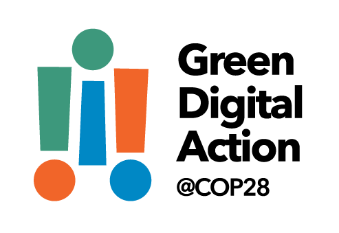
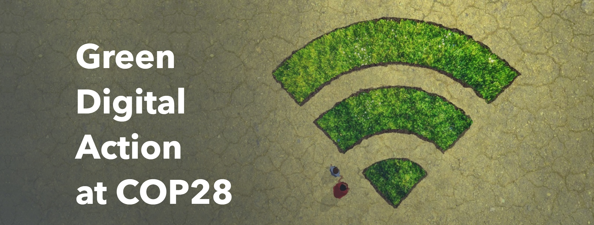

**聯合國氣候大會COP28**致力於解決氣候問題。**國際電聯ITU**負責ICT信息通訊技術，利用數字技術在COP28上號召**綠色數字行動** #GreenDigitalAction。

〝**雙創+雙化**是最新整合路徑！〞**澳恪森**表示，〝國際電聯ITU在**數字**創新創業 (雙創) 發揮重要作用，倡導用數字創新解決數字鴻溝問題。在國際標准之上，國際電聯[發展部門](https://www.itu.int/en/ITU-D/Pages/default.aspx)
，更以（數字）生態系統 （ecosystems）概念，
引領國際
綠色化數字化**轉型** 
(雙化)前沿發展。實際場景應用、標准、技術、治理通盤考量設計向前。〞

數據科學家廖漢騰博士表示，中國在綠色
〝中國在雙化轉型以及大學生**互聯網創新創業** (雙創)教育方面，〞澳恪森數據科學家廖漢騰博士表示，
〝應該借此世界機遇，從綠色化數字行動@COP28深入瞭解如何協調一致行動利用數字技術解決氣候問題。#GreenDigitalAction 在中國即**雙創加雙化**。〞

<!--more-->

### 綠色化數字行動，為何是國際電聯ITU？

國際電聯ITU是聯合國專門機構，負責信息通信技術（ICT）事務，旨在促進國際上通信網絡的互聯互通。

國際電聯ITU不但是重要國際標准制定單位，更是在包括人工智能等應用及治理方面，最主要的數字發展單位及平台，其對數字發展的重要性相當於，WHO世衛組織之於公共衛生，FAO糧食及農業組織之於農業及糧食安全。

互聯互通網絡的旨趣，在國際發展的行動上，在過去幾十年互聯網的發展下，主要以[彌合數字鴻溝](https://news.un.org/zh/story/2023/06/1118622)為主，也是 5月17日“世界電信和信息社會日”主角機構。2015-2022年是由中國籍的趙厚麟任秘書長，把中小企業、科研部門、大專院校的參與納入此國際平台，亦包括發展數字經濟和消除數字鴻溝的行動，主要以４個I包括基礎建設(Infrastructure)、投資(Investment)、創新(Innovation)、普惠(Inclusiveness)。2023年1月1日起，由[美國籍的多琳·伯格丹-馬丁於就任國際電聯秘書長](https://www.itu.int/zh/osg//default.aspx)
，強調數字化轉型的必要性，發展創新伙伴關系以強化技術與可持續發展的統一。

國際電聯ITU近年更推出綠色數字化雙標准，ITU-T L.1470及ITU-T L.180制定，包括 “優化﹑替換﹑消費引導﹑信息管理﹑及協調對接"智能管理的減碳機制。本公司**澳恪森**不但以此標准審視中國互聯網協會（ISC）碳中和管理及服務系統標准發表 [《碳中和管理服務數智平台》( Smart Digital Platforms for Carbon Neutral Management and Services) ](https://oxon8.netlify.app/post/2023-02-20-smart-digital-platforms-carbon-neutral-management-services/)
的論文，更以此開發工具箱及專利。

### 綠色化數字行動，國際電聯ITU今年的內容是？

針對聯合國氣候大會COP28，國際電聯ITU發起了[綠色化數字行動@COP28](https://www.itu.int/initiatives/green-digital-action-atcop28/)活動。

此活動目主要目標是聚焦於數字創新，面對並解決氣候問題。

主要的努力方向有以下：

* 減少ICT行業排放
* 培育ICT循環產業
* 通過開放的環境數據和技術推進氣候解決方案
* 為實施綠色標准造勢
* 通過數字技術和技能發展，促進各行各業的綠色轉型
利* 用數字系統確保根據聯合國秘書長的“人人享有早期預警”倡議發出挽救生命的災害警報

### 國際電聯ITU在聯合國氣候大會COP28的活動亮點

〝2023年12月2日的主要活動是〞廖漢騰博士表示，〝**為淨零未來的產業轉型**是主要核心議程，點出數字科技促進產業轉型及升級的要角。議程預告包括如何使用人工智能、數字孿生等，幫助難以減排的行業找到加速可持續發展的工法。〞

產業數字化和脫碳為討論主題，並包括相關的監管及融資議題，來探索數字賦能行業轉型潛力。

當天還有〝利用信息通信技術對氣候的積極影響〞、〝眾包人工智能解決方案〞議程。

### 其它活動與澳恪森的發展

國際電聯ITU在聯合國氣候大會COP28的其它活動還包括以下：

* 減少ICT行業溫室氣體排放
* 創新、數字化賦能的綠色轉型
* 圍繞綠色標准造勢
* WSC關於可持續數字技術國際標准的會議
* 負責任的數字支付以加速氣候行動
* 負責任的數字支付，加速促進性別平等的氣候行動
* 數字連接和技術，用於所有早期預警倡議
* 宜居星球上的數字化轉型
* 科技向善：關於新興技術在氣候適應中的作用的圓桌討論
* 技術盤點——人工智能在哪裡，它如何使我們具有氣候和災害抵御能力？
* 數字脫碳：企業、科技領導者和政府之間的合作行動如何成為加快全球氣候進展的關鍵
* 協調環境數據：制定全球環境數據戰略
* 為電子產品創造循環經濟
* 全球氣候行動數據
* 氣候博弈：游戲化、數字素養和行為改變
* 人工智能在氣候中的應用：從創業公司的角度來看
* 國家數字戰略和數字公共基礎設施促進氣候行動
* 淨零數字化之旅：技術人員如何為綠色轉型做出貢獻

澳恪森表示，除了專注於產業關系的投入產出數據與碳排數據交叉的可視化，更對[《碳中和管理服務數智平台》( Smart Digital Platforms for Carbon Neutral Management and Services) ](https://oxon8.netlify.app/post/2023-02-20-smart-digital-platforms-carbon-neutral-management-services/)
的行業、團體標准、核心關鍵智彗財產權開發及協作累積用例、應用場景、工具箱以及產品原型。

澳恪森進一步表示，針對綠色化數字化轉型 （雙化協同）更會於今年底與利益相關方合作，結合國際電聯、省級一流課程內容、以及技術路線圖發布“綠色化數字化雙化轉型生態系統設計工具箱”。

〝歡迎有志對產業前瞻與傳統的知識地圖﹑協作地圖有興趣的行業協會、企業、大學科研人員來使用工具箱參與綠色化數字化創新。〞潘仲亷博士總結。〝我們將把科研成果，以[設計學+信息學的雙創](https://oxon8.netlify.app/post/2023-03-27-design-science-plus-information-science/)
設計工作坊工具，和有志之士一起利用數字技術共創綠色可持續價值。〞

〝中國在**綠色化數字化雙化轉型**前沿以及**互聯網創新創業**大學生教育方面，雖已有不少成果，但在協同合作、數字發展、以及ICT信息通訊技術的綠色化方面，存在不少重大短板，應該借此世界機遇，從綠色化數字行動@COP28深入瞭解如何協調一致行動利用數字技術解決氣候問題。〞，澳恪森數據科學家廖漢騰博士表示

〝國際電聯ITU在標准之外的[發展部門](https://www.itu.int/en/ITU-D/Pages/default.aspx)，更是倡導用數字創新來解決數字鴻溝的問題，更提出（數字）生態系統 （ecosystems）概念，將標准一方面往實際場景應用更緊密連結，一方面往技術治理更符合以人為中心的發展目標。這方面對用戶體驗、技術治理等多方面協作的生態系統觀，是中國大學**互聯網創新創業**比較少發展的，需要更好地結合雙創教育與可持續發展教育 (ESD) ，這是個人6年以來在中國高校打造一流人工智能課程的經驗與觀察的結果。〞

### 關於澳恪森數智科技
澳恪森數智科技，簡稱Oxon8，全名為澳恪森數智科技服務（廣州）有限公司，創新數智平台與綠色金融科技的設計，助組織與個人的雙化協同發展及精准脫碳之旅。

澳恪森Oxon8為行業﹑智庫﹑政府等提供基於專利分析﹑科學計量﹑知識圖譜等等數據情報，合作開展集科技研發﹑科技服務﹑成果轉化﹑系統集成﹑人才培養﹑等科技創新公共及商業服務，運用前瞻情報連結在地及全球網絡。

### 澳恪森數智科技支持 綠色化數字行動@COP28

