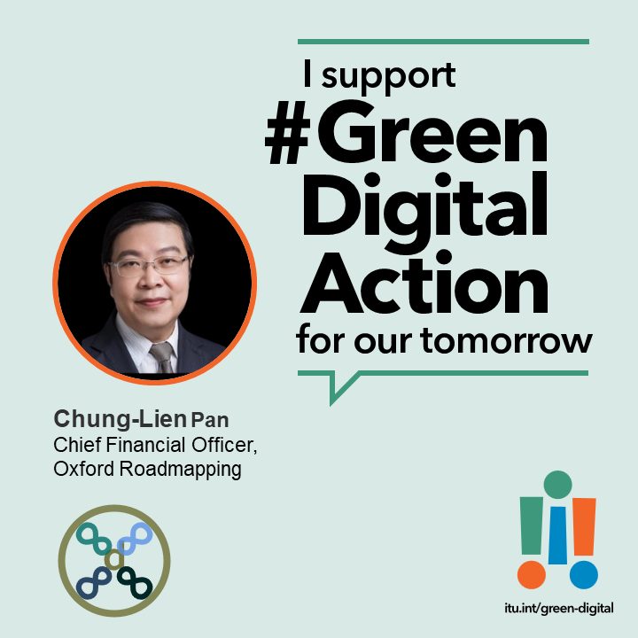

由澳恪森与国家工业设计研究院（生态设计）等单位合作的《面向数字农业基於碳排计量的供应链金融》技术文件 (编号：FG-AI4A-I-132)，已成功提交至 [第 8 届ITU-T **FG-AI4A** 智能农业焦点组2023年12月例会](https://www.itu.int/en/ITU-T/focusgroups/ai4a/Pages/default.aspx)，并由廖汉腾博士於**2023 年 12 月 1 日**会上报告发言。

在2023年参加了由联合国**国际电信联盟**及**粮农组织**组织的标准[研讨会系列第 21 集《数字农业：为粮食安全驱动数字转型》]()，澳恪森与国家工业设计研究院以[在地从化的农业情况实践碳普惠的机遇]()，以及大湾区
「绿色碳链通」的使用案例的调研，经技术路线图等设计工作坊创新活动後，展开了合作项目[**《数字农业绿色供应链金融科技（GSCFT）项目》**]()**

<!--more-->

## 背景

联合国[**国际电信联盟**](https://www.itu.int/zh/about/Pages/default.aspx) (ITU，简称 **国际电联**，负责**信息通信技术 ICT 事务**的专门机构) ，及[粮食及农业组织](https://www.fao.org/home/zh) (FAO，简称 **粮农组织**，负责**消除饥饿**的专门机构 ) ，亦已合作於[2023 年 2 月 17 日在线研讨会 ](https://itu.zoom.us/rec/play/zmdnzzW2a2y-1P9XM0GzQTShgHK4k4KtbS6kJX5pMeXGqLVkYMZGZ-opt6AsWii2CzsBM7-kMV7RdL2X.hRjzOJsdYSB2UFY1?startTime=1676638840000&_x_zm_rtaid=yoN60stZT-eP9f9NWA4MNg.1680104621320.50988e2cd7b334379f81d2ea2c62f7e1&_x_zm_rhtaid=287)。以《数字农业：为粮食安全驱动数字转型》为题，是国际电信联盟在线研讨会系列第 21 集。

＂绿色转型丶数字转型的双化融合，在农业领域就需要新产业新业态生态设计，这也是像[_国家工业设计研究院（生态设计领域）_](http://news.zjnu.edu.cn/2022/0324/c8449a390137/page.htm)等组织在人才培养丶标准服务等持续进行知识及技术转化的工作。＂

廖汉腾博士指出，＂现在正进行国际标准制定活动的[国际电信联盟 ITU-T 专门小组](https://www.itu.int/en/ITU-T/focusgroups/Pages/default.aspx "ITU-T Focus Groups")，[FG-AI4A](https://www.itu.int/en/ITU-T/focusgroups/ai4a/Pages/default.aspx#) ，致力於构建**数字农业的人工智能 (AI) 和物联网 (IoT)** 的 专门词汇表 _**WG-Gloss**_丶用例和解决方案 _**WG-AS**_丶数据采集和建模 _**WG-DAM**_丶标准活动的路线图 _**WG-Roadmap**_丶伦理法律和监管考虑 _**WG-ELR**_丶协作和外联 **_WG-CO_**丶等等工作。＂

## 澳恪森的参与及技术文件提交

经调研，「负碳/低碳」的计量审计，可进一步优化大湾区金融单位已实践的
「绿色碳链通」。澳恪森和国家工业设计研究院（生态设计）等单位合作的《面向数字农业基於碳排计量的供应链金融》文件主要创新思路如下：

1. 结合大我的[粮食安全](https://www.chinanews.com.cn/gn/2023/03-29/9980766.shtml)，从农民的小我的生产安全看融资需要
2. 提供绿色转型动机--链结融资需要与低碳负碳农业
3. 提供数字转型服务--低碳负碳农业计量及审计作为供应链金融上下游融资依据

### 数字农业生态设计能催生新产业新业态

＂基於从化 [**世界生态设计大会 WEDC**](https://www.wedo2018.com.cn/about/)及澳恪森於[**互联网生态与向善设计**](https://mp.weixin.qq.com/s/kjS1gD7T22AAO7KeNnndtg)的积累，＂廖汉腾博士点出在学习[国际电信联盟在线研讨会系列--数字农业](https://itu.zoom.us/rec/play/zmdnzzW2a2y-1P9XM0GzQTShgHK4k4KtbS6kJX5pMeXGqLVkYMZGZ-opt6AsWii2CzsBM7-kMV7RdL2X.hRjzOJsdYSB2UFY1?startTime=1676638840000&_x_zm_rtaid=yoN60stZT-eP9f9NWA4MNg.1680104621320.50988e2cd7b334379f81d2ea2c62f7e1&_x_zm_rhtaid=287)的切入角度，我们产出了主要利益相关者分析，以及其农粮产业链及金融链的关系，并立论了若能确把碳排计量数据链的可靠及可信度，则能左链农粮产业链上下游，右链供应链金融的中央与地方资源。

《面向数字农业基於碳排计量的供应链金融》文件主要创新思路就是用碳排计量数据链，打通农粮产业链与供应链金融，如此文件的核心示意图所示：

### CBAC 方法结合金融与农业

澳恪森商业模式专家潘仲亷博士学习了FAO粮农组织的＂CBAC＂方法，表示此方法不但纳入了粮食安全，更有碳中和农产品及产销过程的思维。

> FAO粮农组织： ＂CBAC＂方法 -- 碳中和农产品产生的潜在协同效应  碳中和农产品产生的潜在协同效应 

 ＂这和《习近平关於国家粮食安全论述摘编》中就有「要把**产业振兴**作为乡村振兴的重中之重，积极延伸和拓展**农业产业链**，培育发展农村**新产业新业态**，不断拓宽农民增收致富渠道。」的论述相符＂

### 技术路线图

＂放在技术路线图 Technology Roadmap 上，如何能催生新产业新业态？需要什麽样的数字农业生态设计 ( Eco-design of Digital Agriculture) ？＂廖汉腾博士分析，＂联合国粮农组织不只强调技术系统创新，更突**数字技术促粮农体系 agri-food systems 的政策顾问及投资的必要性** ，才能将数字农业的投资影响最大化。这也是联合国粮农组织和国际电联合力的出发点，并点名『数据是横跨联合国粮农组织有体系各介入切点的加速器』(data is cross-cutting accelerators across all FAO's programmatic interventions)。＂

＂这让我们更确认了，澳恪森的绿色信息流打通供应链各平台及节点的重要性，＂潘仲亷博士补充，＂联合国粮农组织指出人工智能用於监控森林丶农害丶人力投入丶肥料运用等，亦点出在经济丶社会丶及伦理的风控，必需要有符合国际人权原则的人工智能设计 ，这和我们即将发表的供应链安全韧性及劳动人权论文结论十分契合，也是乡村振兴在成功精准脱贫後，要精准脱碳的关键抓手。＂

＂实现 **“链式脱碳”丶“链式融资”丶“链式支持”** 是人民银行广州分行总结 “**绿色碳链通**”融资的创新意义，十分值得推向国际，＂潘仲亷博士说明参与**国际电联**的制定标准纳入在地实践的中国现代化意义，＂人民银行及中国金融学会绿色金融专业委员会等的组织，亦对[通过“绿色碳链通”模式进行融资并取得良好经济丶社会丶环境效益的供应链核心企业丶上下游企业进行精准支持采正面期待](http://www.greenfinance.org.cn/displaynews.php?cid=86&id=3537)。＂

＂这是绿色数据及信息流促进社会丶环境丶治理 (ESG) 效益的**精准支持**及数据驱动**精准脱碳**丶**精准减排**的最新理论及实践路径，＂廖汉腾博士总结，＂在**扩大企业碳账户的行业覆盖面**的工作建议之下，农业有不少[生物能源与碳捕获和储存 (BECCS )](https://www.eco.gov.cn/news_info/51244.html)在零碳或负碳的机运，打通绿色品牌丶技术丶地理标志丶等估值的 **高质量发展**，[设计如『双碳荔枝』丶『碳中和玫瑰』品牌之绿色金融科技路线图]()。

在推动此议题领域的全球机器学习丶数据分析集成平台，**先正达** (Syngenta) 全球数字农业 数据资产管理经理 [R. Andres Ferreyra](https://www.itu.int/en/ITU-T/webinars/DT4CC/20230217/Pages/bios.aspx#Ferreyra)则从国际数据标准的实践需求，提供了智能农业的定义丶标准重要性说明丶以及目前国际标准化组织 ISO 在此领域的 SAG 组织的主要工作产出，就是要产出标准化路线图 (Standardization Roadmap)。

R. Andres Ferreyrag 点出，由於学校不教丶潜在用户也不知道，这些潜在农业技术的提供商则不断要重新发明轮子，使标准评估难且贵，需要突破标准的推广丶教学丶及采用。全球合作需要协作路线图，要纳入大学参与，并强调标准之间的可互操性，R. Andres Ferreyrag 建议。

＂**智能农业应放在数据驱动的粮农体系**，是 R. Andres Ferreyrag 的重要结论，＂廖汉腾博士总结，＂粮农体系的**精准减排**工作，也因此需要把智能农业的数据标准可互操性放在第一位，这和中国国家要推动国家及国际的双碳计量标准相符，值得发展成[世界生态设计大会 WEDC](https://www.wedo2018.com.cn/about/)及[互联网生态与向善设计](https://mp.weixin.qq.com/s/kjS1gD7T22AAO7KeNnndtg)的主要推广及教学领域。

### 技术路线图反过来定义数字农业

此次 [第 8 届ITU-T **FG-AI4A** 智能农业焦点组2023年12月例会](https://www.itu.int/en/ITU-T/focusgroups/ai4a/Pages/default.aspx)，召开後，已有由德国单位Fraunhofer HHI主导的科技标准化路线图成果 “Standardization Roadmap on AI and IoT for Agriculture:  Trends and Gaps in Standardization” （文件编号：FG-AI4A-I-133）。

廖汉腾博士表示，会上专家对於明年交付标准文件成果十分有信心，也对标准化路线图成果的方法提出对国际电联另一关於元宇宙的焦点组的最新成果的参考建议。经研究，此文件和澳恪森熟用的文献计量软件（Bibliometrix）及方法一致。

会上专家表示，这意着其实还没有权威定於一尊的”数字农业“一词，可以用技术路线图成果反过来定义。其它相关专业和技术用语已在上述文件编号：FG-AI4A-I-133已有基本定义和应用描述。

-----

### 合作机运：澳恪森数智征求加入 ITU FG-AI4A 的合作伙伴

聚焦<a href="#脚注">数智平台 ¹</a> 与   <a href="#脚注">绿色金融科技 ²</a>  <a href="#脚注">设计创新 ³</a>的 **澳恪森数智科技服务** ，认同此次联合国信息通信技术及农粮组织的权威前沿讨论结论之一：易用易交换的数据标准及数据分析标准是发展的必要。

在地相关的行业协会如[广州市绿色金融协会，也已为金融机构围绕 “双碳” 目标开展投融资业务提供可操作丶可计量丶可验证的依据进行探讨](http://www.gzgfa.org.cn/Dongtai-30/632.html)，都对国家及[地方的绿色低碳循环发展经济体系](http://www.gd.gov.cn/zwgk/wjk/qbwj/yf/content/post_3721142.html) 做出贡献。

澳恪森数智科技服务征求加入 ITU FG-AI4A 的合作伙伴，参与以下活动，使致力於构建**数字农业的人工智能 (AI) 和物联网 (IoT)** 的[FG-AI4A](https://www.itu.int/en/ITU-T/focusgroups/ai4a/Pages/default.aspx#) 国际标准的讨论流程，能有效采集并试验在地的数字农业及绿色金融科技：

- 专门词汇表 _**WG-Gloss**_丶
- 用例和解决方案 _**WG-AS**_丶
- 标准活动的路线图 _**WG-Roadmap**_

＂供应链金融低碳体系建设方面，农业及农粮体系在国家[粮食安全战略高度](https://www.chinanews.com.cn/gn/2023/03-29/9980766.shtml)下可不能少。＂澳恪森创办人与商业模式运营官潘仲亷博士总结。＂支持智能农业及乡村振兴的绿色供应链金融，对从化的农业丶旅游业丶酒店业丶美妆业等等，都是关键需要高质量发展的商业模式创新，这也是我们最近发表的《[在 ESG 咨询、报告和传播教育方面进行合作](https://oxfordroadmap.github.io/oxon8/post/2023-02-22-esg-education-partner-maps/)》丶《[碳中和管理服务数智平台](https://oxfordroadmap.github.io/oxon8/post/2023-02-20-smart-digital-platforms-carbon-neutral-management-services/)》两篇论文及系列设计画布的发展相符。＂ ( 参见[《 设计科学+信息科学：不论任何学科都能用上的知识及方法》](https://oxfordroadmap.github.io/oxon8/post/2023-03-27-design-science-plus-information-science/) )

＂供应链金融低碳体系建设方面，农粮体系和金融体系的数据交换及交流标准则是重中之重。＂澳恪森创办人与数据科学家廖汉腾腾博士总结。＂支持智能农业及乡村振兴的绿色技术及标准需要多方合作，望有志之士一同为此领域创建公共产品及平台，推动数智农业的产业 5.0 数据空间技术路线图 ，催生新产业新业态，发展数字农业生态设计 ( Eco-design of Digital Agriculture) 。＂

### 脚注

¹ 数智平台 指利用人工智能、区块链、云计算、数据科学等 ABCD 数字科技实现[数字化转型](http://www.sasac.gov.cn/n4470048/n13461446/n15927611/n16058233/c16135120/content.html)[平台商业模式](https://www2.deloitte.com/cn/zh/pages/soe/articles/soe-digital-transformation-2.html)，如阿里云[数据智能平台](https://datapaas.aliyun.com)丶京东云[数智平台“优加”](http://www.21jingji.com/article/20230323/herald/fe6ebc956c6d6e11f7887c21cbe0a86e.html) ，有广义的 SaaS/PaaS/IaaS/DaaS，也有狭义的 Data as a Service (DaaS) 

² [绿色金融科技](https://link.springer.com/chapter/10.1007/978-3-319-76014-8_11) 指 [可持续金融](https://www.unep.org/regions/asia-and-pacific/regional-initiatives/supporting-resource-efficiency/green-financing) (特别包括[联合国可持续发展目标下](https://www.un.org/en/digital-financing-taskforce) ) 及 [金融科技](https://www.sciencedirect.com/topics/economics-econometrics-and-finance/fintech) (或 数字金融) 两者交叉的新兴领域及实践。 

³ [设计创新](https://www.sciencedirect.com/topics/social-sciences/design-innovation)  为 设计学 及 创新学 交叉的领域，在联合国系统下如[使用创新标准结合数字化转型达成可持续发展](https://www.unido.org/news/unido-promotes-innovation-standards-and-digital-transformation-achieve-sdgs)、[使用数字化转型促进社会包容型发展](https://www.un.org/development/desa/dspd/2021/02/digital-technologies-for-social-inclusion/)、[使用数字创新生态系统促进数字化转型](https://www.itu.int/itu-d/sites/innovation/)、等等。

---

### 关於澳恪森数智科技

澳恪森数智科技，简称Oxon8，全名为澳恪森数智科技服务（广州）有限公司，创新数智平台与绿色金融科技的设计，助组织与个人的双化协同发展及精准脱碳之旅。

澳恪森Oxon8为行业、智库、政府等提供基于专利分析、科学计量、知识图谱等等数据情报，合作开展集科技研发、科技服务、成果转化、系统集成、人才培养、等科技创新公共及商业服务，运用前瞻情报连结在地及全球网络。

### 澳恪森数智科技支持 绿色化数字行动@COP28

