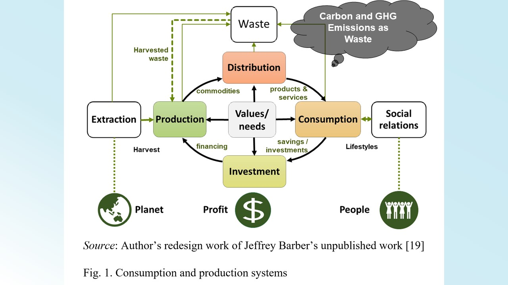

澳恪森于[IEEE 绿色技术丶可持续发展和净零政策与实践研讨会 （IEEE GTSNZ） 2023](https://gtsnz.org/)成功报告2篇具产业论文：

* 碳管理与服务平台
* 碳中和丶国际标准组织ISO和国际电联ITU标准

此IEEE GTSNZ 绿色会议与 [COP 28《联合国气候变化框架公约》第28次缔约方大会](https://www.cop28.com/) 同地同步展开。

澳恪森同时发布[「精准脱碳」交互可视化产品](./project/prj-VisCEADs)成果，以实际产品原型开发，展示**平台**加**标准**的碳排管理，有具大的商业模式及技术路线的发展潜能，是双化协同（绿色化数字化）数智平台核心。

<!--more-->

## 论文内容

澳恪森发布的"碳中和丶ISO 和国际电联标准"论文，展示碳中和**标准工作**的科学知识图谱。

另一篇"碳管理与服务平台"则融合国际标准及中国智库文件，展示碳排如何成为核心排污数据融入中国绿色化数字化转型模型。

两篇论文具产业实践意义，展示数字科技如何能具体解决气候问题带来的生产、消费、及投资的挑战。

### 标准化：碳中和、ISO 和国际电联标准

点出碳中和**标准工作**的科学知识图谱及空缺，题名为“碳中和、ISO 和国际电联标准”( Carbon Neutrality, ISO and ITU Standards: A Bibliometric Analysis ) 系统分析碳中和ISO 和国际电联标准的科技文献，产出科学图谱并提出科技路线图发展可参考的知识概念和结构，对发展碳中和标准、技术、政策、商业模式等具有参考价值。

> 碳中和**标准工作**的科学知识图谱

此论文探讨了有关碳中和主要国际标准的最新研究。这些国际标准可以通过提供强大的框架、方法和认证来测量、减少和抵消温室气体排放 （GHGs），从而协助指引项目、组织和国家实现净零未来。通过基于从Web of Science（WoS）数据库中收集的105种英语出版物进行文献计量分析。 研究结果显示了研究的空间和时间分布，最有生产力的国家、组织隶属、来源、作者、文件、和作者关键字。对作者关键词和引文的进一步分析揭示了知识概念和结构。 科学图谱结果揭示了几个值得注意的发展。未来的工作应寻求绿色和数字创新，以改善运营管理、环境管理和能源管理，以实现净零未来。调查结果为各组织和机构采用国际标准并进行科学及管理创新奠定了基础。

### 双化：分析碳管理与服务平台商业模式及技术路线图机运

展示碳排如何成为核心排污数据融入中国绿色化数字化转型模型，题名为“碳管理与服务平台”( Carbon Management and Service Platforms: A Green Digital Transformation Analysis ) 结合国际和中国最新标准文件，提出数字平台促进产业转型的核心价值，对明确及识别平台价值及商业模式具有启示。

> 中国信息通信研究院发布的**绿色化数字化**模型

在促进碳中和决策生态方面，此论文探讨数字平台的作用。碳中和，即平衡温室气体排放（GHG）与碳封存的发展进程，已成为全球应对气候变化的焦点。为快速减排，云计算等数字平台已展开基于科学数据提供信息化、智能化服务。本文对中国信息通信研究院发布的《数字化绿色化协同发展》白皮书和国际电信联盟（ITU）发布的两份绿色数字化转型标准文件进行分析比较。通过消费和生产系统思维分析这些进展，研究结果揭示数字平台在协调和中介温室气体减排活动的核心价值，指出数字平台在绿色数字转型的作用以迈向净零未来。

> 碳排作为排污要如何纳入资源采取、生产、分销、消费、及投资的环节，核心在价值主张设计，确保满足人们、地球及获利的3P需求：**可持续生产与消费**模型

### 「精准脱碳」交互可视化产品发布

澳恪森同时[「精准脱碳」交互可视化产品](./project/prj-VisCEADs)成果，以实际产品原型开发，展示**平台**加**标准**的碳排管理，有具大的商业模式及技术路线的发展潜能，是双化协同（绿色化数字化）数智平台核心。

## 关于 IEEE-GTSNZ 
旨在报告绿色技术丶可持续性和净零排放领域的最新进展丶实践丶挑战和机遇，全名为 **“IEEE 绿色技术、可持续发展和净零政策与实践研讨会”** 的[IEEE-GTSNZ  ](https://gtsnz.org/)旨在促进政府，行业，学术界和社区之间的协作努力和知识共享。研讨会提供了对最佳实践和经验的见解，以应对挑战和集体努力，以实现可持续的净零未来。  

IEEE GTSNZ 由 [IEEE TEMS技术和工程管理协会](https://www.ieee-tems.org)指导办理，于2023年12 月7-8日在阿联酋杜拜COP28会议期间同步举办。

## 展望未来：商业模式、标准化、技术路线图、等

**澳恪森**表示，[「精准脱碳」交互可视化产品]()项目的商业模式、标准化、技术路线图、等还有不少工作可以推进，同时还有其它可视化产品正规划开发中。

在探讨[联合国气候变化框架公约](https://unfccc.int/sites/default/files/convchin.pdf)
下的中国“[双化协同（Green Digital Transformation）](https://m.gmw.cn/2023-02/26/content_1303295710.htm)
”应用，特别是 “碳排管理（Carbon management）”平台解决方案开发，符合如[工业领域碳达峰实施方案](https://www.gov.cn/gongbao/content/2022/content_5717004.htm)及[碳排放管理体系实施](http://bzh.scjgj.beijing.gov.cn/bzh/apifile/file/2021/20210325/f4451779-29b3-491d-ac72-cfe29b5f53b2.PDF)的发展。欢迎来信 h.liao@ieee.org 问询各式合作机会。

---



