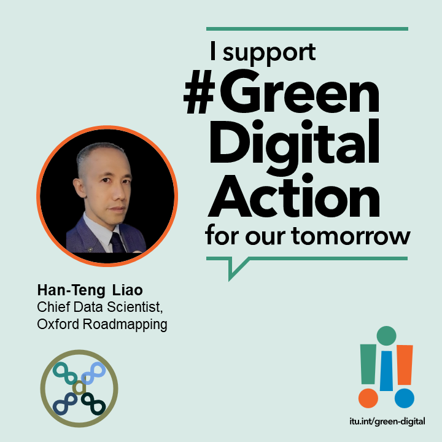

Announced in December 2023 at the COP28, the [outcomes of the Green Digital Action by the International Telecommunication Union (ITU) ](https://www.itu.int/initiatives/green-digital-action-atcop28/about/outcomes/) includes the following:

1. Green standards：
	* One joint statement on the importance of **sustainability being built into technical standards’ development** by design to achieve net-zero, announced by [World Standards Cooperation](https://www.worldstandardscooperation.org/), led by international standard organizations such as IEC, ISO and ITU.
	* One [Action Plan](http://www.itu.int/initiatives/green-digital-action-atcop28/wp-content/uploads/sites/4/2023/12/Call-to-Action-Pillar4-Green-standards.pdf) and launch of a peer-learning working group that foster collaboration on **environmental sustainability standards.** implementation。
2. The UN **Early Warnings for All (EW4all) ** initiative to be implemented by the ICT sector before 2027 that ensure protection for everyone, using cell broadcasts and location-based SMS (Satellite service providers are encouraged to join). 
3. A peer learning working group on **ICT Sector GHG emissions** is launched to to implement GHG emissions reductions by following ICT 1.5°C trajectories.
4. A **circular economy** project on [“E-Waste Management Regulations”](https://www.itu.int/hub/2023/12/how-to-reduce-e-waste-and-build-circular-economies/) is  launched by Saudi Arabia, to help  the regulations in Zambia, Rwanda, and Paraguay.

Over 40 tech companies and organizations came together to push for Green Digital Action at COP28, and the Green Standard  [Action Plan](http://www.itu.int/initiatives/green-digital-action-atcop28/wp-content/uploads/sites/4/2023/12/Call-to-Action-Pillar4-Green-standards.pdf)  is co-led by the ITU and Huawei. 

Marking the roadmap and gaps of standardization, the [Call to Action](https://www.itu.int/initiatives/green-digital-action-atcop28/wp-content/uploads/sites/4/2023/12/Call-to-Action-Pillar4-Green-standards.pdf) document is among the most important technological documents announced by the ITU at COP 28.

<!--more-->

> Requires translation

### 国际电联ITU绿色化数字行动@COP28 

[世界标准合作组织（World Standards Cooperation）](https://www.worldstandardscooperation.org/)，的[COP28联合声明](https://www.worldstandardscooperation.org/wp-content/uploads/2023/11/WSC_Statement_Standards-Digital_8_Nov_2023.pdf)强调可持续发展。

如上图所示，世界标准合作组织的SPCG标准化计划协调小组的合作领域从无障碍到人工智能，从电子健康到智能制造，从物网到3D打印，一共28项合作领域，确保IEC/ISO/ITU能协同合作分工，并通过设计纳入**技术标准制定**，以及帮助世界实现净零排放和实现资源节约型循环低碳经济的标准。



> 华为与会代表说明为何参加国际标准

> 国际电联与华为推动环保可持续标准践行

### 澳恪森GDAStandard项目助力绿色化数字行动扩大参与

澳恪森数智科技以其标准化工作及科技路线图工作的经验，将持续以[【GDAStandard】项目]()
结合国际电联ITU的数字生态创新工具箱与自身积累的双化设计教案，推出绿色数字行动工具箱。

廖汉腾表示，「此工具箱将以双创的切入点，来实践双化的设计，来降低学习门槛。」

「此双创到双化，再从双化创新到双化行动的国际标准化工作，正是我们试过可行的实践路线。」

与国家工业设计研究院（生态设计）合作，澳恪森GDAStandard项目将于2023年年底，至2024年年初，推出绿色数字行动工具箱，可用来引导双创学生走向双化创新，更可在各学术科研及产业研发活动中，做为「数字生态体系」(digital ecosystems) 设计创新的教材及教案，从而解决自身问题后，提练引领产业及学科的标准化能力。

图：[国际电联](https://www.itu.int/Pages/VariationRoot.aspx "ITU")>[ITU-D](https://www.itu.int/en/ITU-D/Pages/default.aspx "The site of the Telecommunication Development Sector of the International Telecommunication Union")数字创新生态系统资源

### 标准化地图与空缺

[呼吁采取行动文件](https://www.itu.int/initiatives/green-digital-action-atcop28/wp-content/uploads/sites/4/2023/12/Call-to-Action-Pillar4-Green-standards.pdf)中标注出各相关标准的范围（城市、公司组织、网络、设备、服务等）。

澳恪森数智科技表示，此份文件展示最新的绿色数字标准路线发展，是可以用来展开创新创业、科研、产品开发、以及标准化等活动，是国际电联2023年12月于COP28发布的最重要的技术文件。



> 欧洲光纤到户委员会（FTTH Fiber to the Home Council Europe）说明ICT行业的绿色责任

### 关于澳恪森数智科技
澳恪森数智科技，简称Oxon8，全名为澳恪森数智科技服务（广州）有限公司，创新数智平台与绿色金融科技的设计，助组织与个人的双化协同发展及精准脱碳之旅。

澳恪森Oxon8为行业﹑智库﹑政府等提供基于专利分析﹑科学计量﹑知识图谱等等数据情报，合作开展集科技研发﹑科技服务﹑成果转化﹑系统集成﹑人才培养﹑等科技创新公共及商业服务，运用前瞻情报连结在地及全球网络。

### 澳恪森数智科技支持 绿色化数字行动@COP28

### 关于标准化计划协调小组 （SPCG）

**[标准化计划协调小组 （SPCG）](https://www.worldstandardscooperation.org/what-we-do/spcg/)** 是由推进基于自愿共识的国际标准体系的[「世界标准合作组织」（World Standards Cooperation）](https://www.worldstandardscooperation.org/)下的委员会，协调及审查IEC、ISO和ITU-T技术标准化活动。目前已定立下列高新技术合作领域：无障碍、人工智能、增强现实、大数据、生物识别技术、区块链、循环经济、气候变化、云计算、网络安全、数据管理、数字货币、赈灾、边缘计算、电子医疗、能源效率、电子垃圾、智能交通系统、物联网、机器学习、印刷电子产品、量子计算、机器人技术、智慧城市、智能电网、智能制造、虚拟现实、可穿戴设备、3D打印。



### 关于世界标准合作组织

[**世界标准合作组织（World Standards Cooperation）**](https://www.worldstandardscooperation.org/)是由IEC（国际电工委员会）、ISO（国际标准化组织）和 ITU（国际电信联盟）之间的高级别合作。在此世界标准合作旗帜下，三个组织加强并推进基于自愿与共识的国际标准体系。

