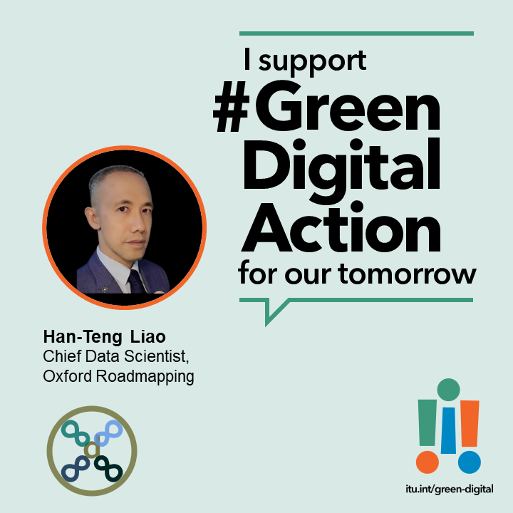
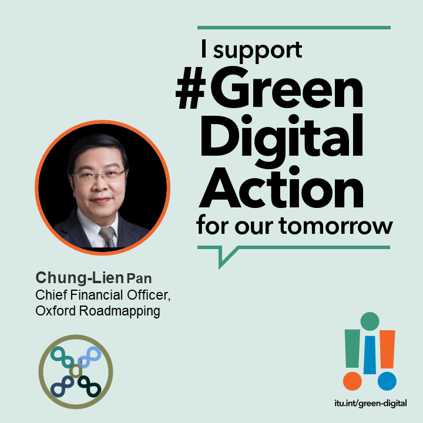

2023年12月於[聯合國氣候大會COP28](https://www.mee.gov.cn/xxgk/hjyw/202311/t20231101_1044710.shtml)上，[國際電聯ITU發佈綠色數字行動成果 ](https://www.itu.int/initiatives/green-digital-action-atcop28/about/outcomes/)有下：

1. **綠色標準**：由[世界標準合作組織](https://www.worldstandardscooperation.org/) 領頭聯合聲明通過設計將可持續性納入**技術標準制定**，助世界實現淨零。由國際電聯等展開[行動計畫](http://www.itu.int/initiatives/green-digital-action-atcop28/wp-content/uploads/sites/4/2023/12/Call-to-Action-Pillar4-Green-standards.pdf)，啟動同行學習組，實施**環境可持續性標準**合作。
2. **人人享用早期預警**倡議：實現社區廣播和位置短信，2027年前保護所有人。鼓勵衛星服務商加入。
3. **ICT行業溫室氣體排放**啟動同行學習工作組，按 1.5°C的軌跡實施溫室氣體減排。
4. 啟動 **[“電子廢物管理條例”](https://www.itu.int/hub/2023/12/how-to-reduce-e-waste-and-build-circular-economies/)** 的迴圈經濟聯合項目，由沙烏地阿拉伯王國與國際電聯合作推進發起，幫助尚比亞、盧旺達和巴拉圭制定法規。

標注出標準化地圖與空缺的[呼籲採取行動文件](https://www.itu.int/initiatives/green-digital-action-atcop28/wp-content/uploads/sites/4/2023/12/Call-to-Action-Pillar4-Green-standards.pdf)是國際電聯發佈的最重要的技術檔。澳恪森數智科技將持續以[【GDAStandard】專案]()
推出綠色數位行動工具箱。

<!--more-->

IEC/ISO/ITU

有40多家科技公司參與，其中綠色標準行動計畫由國際電聯及華為領頭。

綠色標準：
	* 1項聯合聲明，通過設計納入**技術標準制定**，助世界實現淨零，由[世界標準合作組織](https://www.worldstandardscooperation.org/) 會IEC/ISO/ITU領頭。
	* 1項[行動計畫](http://www.itu.int/initiatives/green-digital-action-atcop28/wp-content/uploads/sites/4/2023/12/Call-to-Action-Pillar4-Green-standards.pdf)，啟動同行學習組，實施**環境可持續性標準**方面的合作。

### 國際電聯ITU綠色化數字行動@COP28 

[世界標準合作組織（World Standards Cooperation）](https://www.worldstandardscooperation.org/)，的[COP28聯合聲明](https://www.worldstandardscooperation.org/wp-content/uploads/2023/11/WSC_Statement_Standards-Digital_8_Nov_2023.pdf)強調可持續發展。

如上圖所示，世界標準合作組織的SPCG標準化計畫協調小組的合作領域從無障礙到人工智慧，從電子健康到智慧製造，從物網到3D列印，一共28項合作領域，確保IEC/ISO/ITU能協同合作分工，並通過設計納入**技術標準制定**，以及幫助世界實現淨零排放和實現資源節約型迴圈低碳經濟的標準。



> 華為與會代表說明為何參加國際標準

### 澳恪森GDAStandard專案助力綠色化數字行動擴大參與

澳恪森數智科技以其標準化工作及科技路線圖工作的經驗，將持續以[【GDAStandard】專案]()
結合國際電聯ITU的數位生態創新工具箱與自身積累的雙化設計教案，推出綠色數位行動工具箱。

廖漢騰表示，「此工具箱將以雙創的切入點，來實踐雙化的設計，來降低學習門檻。」

「此雙創到雙化，再從雙化創新到雙化行動的國際標準化工作，正是我們試過可行的實踐路線。」

與國家工業設計研究院（生態設計）合作，澳恪森GDAStandard項目將於2023年年底，至2024年年初，推出綠色數位行動工具箱，可用來引導雙創學生走向雙化創新，更可在各學術科研及產業研發活動中，做為「數位生態體系」(digital ecosystems) 設計創新的教材及教案，從而解決自身問題後，提練引領產業及學科的標準化能力。

圖：[國際電聯](https://www.itu.int/Pages/VariationRoot.aspx "ITU")>[ITU-D](https://www.itu.int/en/ITU-D/Pages/default.aspx "The site of the Telecommunication Development Sector of the International Telecommunication Union")數位創新生態系統資源

### 標準化地圖與空缺

[呼籲採取行動文件](https://www.itu.int/initiatives/green-digital-action-atcop28/wp-content/uploads/sites/4/2023/12/Call-to-Action-Pillar4-Green-standards.pdf)中標注出各相關標準的範圍（城市、公司組織、網路、設備、服務等）。

澳恪森數智科技表示，此份檔展示最新的綠色數字標準路線發展，是可以用來展開創新創業、科研、產品開發、以及標準化等活動，是國際電聯2023年12月於COP28發佈的最重要的技術文件。



> 歐洲光纖到戶委員會（FTTH Fiber to the Home Council Europe）說明ICT行業的綠色責任

### 關於澳恪森數智科技
澳恪森數智科技，簡稱Oxon8，全名為澳恪森數智科技服務（廣州）有限公司，創新數智平臺與綠色金融科技的設計，助組織與個人的雙化協同發展及精准脫碳之旅。

澳恪森Oxon8為行業﹑智庫﹑政府等提供基於專利分析﹑科學計量﹑知識圖譜等等資料情報，合作開展集科技研發﹑科技服務﹑成果轉化﹑系統集成﹑人才培養﹑等科技創新公共及商業服務，運用前瞻情報連結在地及全球網路。

### 澳恪森數智科技支援 綠色化數字行動@COP28

### 關於標準化計畫協調小組 （SPCG）

**[標準化計畫協調小組 （SPCG）](https://www.worldstandardscooperation.org/what-we-do/spcg/)** 是由推進基於自願共識的國際標準體系的[「世界標準合作組織」（World Standards Cooperation）](https://www.worldstandardscooperation.org/)下的委員會，協調及審查IEC、ISO和ITU-T技術標準化活動。目前已定立下列高新技術合作領域：無障礙、人工智慧、增強現實、大資料、生物識別技術、區塊鏈、迴圈經濟、氣候變化、雲計算、網路安全、資料管理、數位貨幣、賑災、邊緣計算、電子醫療、能源效率、電子垃圾、智慧交通系統、物聯網、機器學習、印刷電子產品、量子計算、機器人技術、智慧城市、智慧電網、智慧製造、虛擬實境、可穿戴設備、3D列印。



### 關於世界標準合作組織

[**世界標準合作組織（World Standards Cooperation）**](https://www.worldstandardscooperation.org/)是由IEC（國際電子電機委員會）、ISO（國際標準組織）和 ITU（國際電信聯盟）之間的高級別合作。在此世界標準合作旗幟下，三個組織加強並推進基於自願與共識的國際標準體系。


