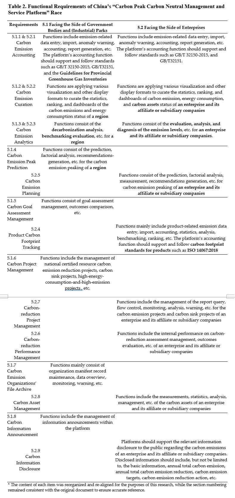

Congratulations to Oxford Roadmapping for publishing a research report on **[Smart Digital Platforms for Carbon Neutral Management and Services](https://www.frontiersin.org/articles/10.3389/fevo.2023.1134381/abstract)**.  

Business Models Based on ITU Standards for Green Digital Transformation

This brief research report focuses on the effects of artificial intelligence (AI) on the environment, by analyzing the latest documents by major standard organizations such as the International Telecommunication Union (ITU) and Internet Society of China (ISC). 

Smart Digital Platforms for Carbon Neutral Management and Services

By outlining the latest developments onto a platform canvas for carbon neutrality management and services, the report outlines the potential of “AI _of_ the environment” (i.e., the material compositions and environmental impact of AI itself) and “AI _for_ the environment” (i.e., the purposeful use of smart applications to benefit the environment). 

<!--more-->

This paper on Carbon-Neutrality Smart Digital Platforms will be published soon by Frontiers in Ecology and Evolution (Front. Ecol. Evol.) ,  in the section of "Environmental Informatics and Remote Sensing." doi: [10.3389/fevo.2023.1134381](https://www.frontiersin.org/articles/10.3389/fevo.2023.1134381/abstract)
This study succinctly visualizes key elements of digital platforms of/for GHG emission reduction and their enabling mechanisms, serving as an AI technology roadmap for future research and innovation in the field.

### Main Findings

####  Internet Society of China (ISC) documents
The latest requirements documents by Internet Society of China (ISC) were analyzed in the context of the ITU green digital transformation standards.  

#### Digital Platform Business Model

Such an analysis, was then used as basis for designing a buisness model using platform canvas, as shown below:

###  Smart optimization, substitution, induced consumption, information management, and facilitation services 

AI, according to the ITU-T L.1470 and L.1480 standards, can provide smart services for "optimization, substitution, induced consumption, information management, and facilitation."   These services must be enabled by smart digital platforms for carbon neutral management and services.

### Abstract

This brief research report focuses on the effects of artificial intelligence (AI) on the environment, by analyzing the latest documents by major standard organizations such as the International Telecommunication Union (ITU) and Internet Society of China (ISC). By outlining the latest developments onto a platform canvas for carbon neutrality management and services, the report outlines the potential of “AI of the environment” (i.e., the material compositions and environmental impact of AI itself) and “AI for the environment” (i.e., the purposeful use of smart applications to benefit the environment). The role of AI is contextualized in the digital platform design for providing services on carbon emission data, which serves as material foundation for smart services facing both producers and consumers of such information. Contributing to the design of business models that enable open innovations, it discusses emission impact reduction mechanisms that can optimize, substitute, induce, manage and facilitate processes and services, indicating the potential of AI-enabled smart services such as forecasting, planning and recommendation systems. Despite the limited disciplinary considerations and detailed discussions on specific AI technologies, the report provides a simple, practical, and flexible technology roadmap that can be used as a guide for researchers and practitioners to refine their operations and designs and to follow best practices. The report succinctly visualizes key elements of digital platforms of/for GHG emission reduction and their enabling mechanisms, serving as an AI technology roadmap for future research and innovation in the field.

