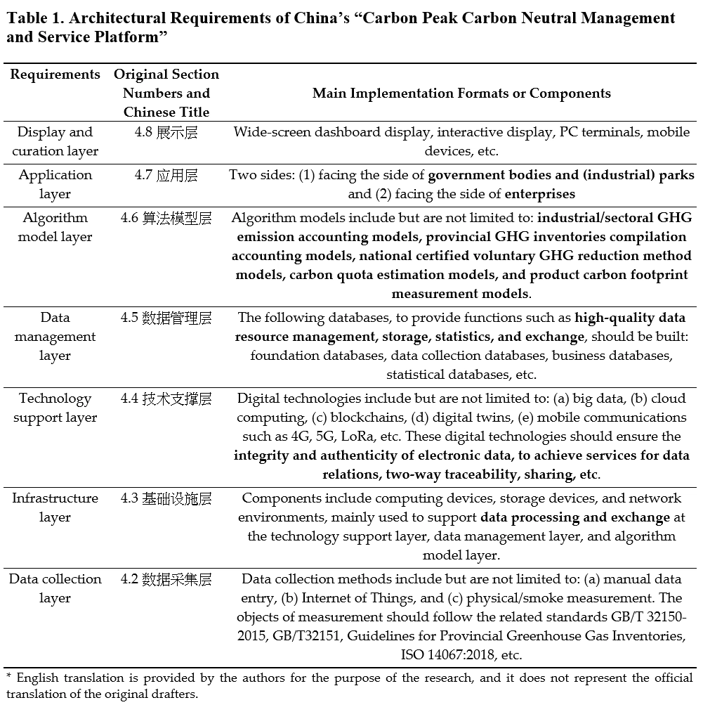
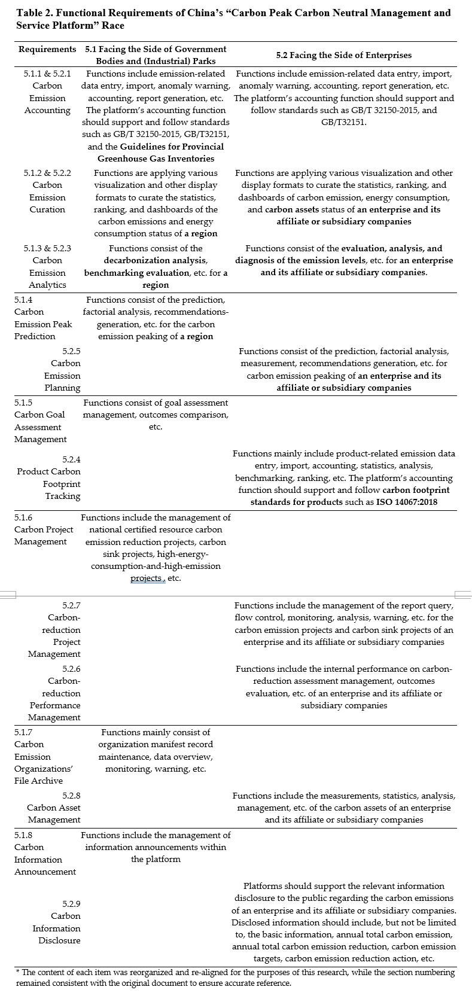

澳恪森数智科技服务 ( Oxford Roadmapping) 参与的论文 [**《碳中和管理服务数智平台》( Smart Digital Platforms for Carbon Neutral Management and Services)** ](https://www.frontiersin.org/articles/10.3389/fevo.2023.1134381/abstract) 获录稿发表。 
此研究以国际电信联盟（ITU）和中国互联网协会（ISC）等主要标准组织的最新文件，重点关注人工智能（AI）对环境的影响。

该报告研究概述了“源于环境的人工智能”（“AI _of_ the environment”即人工智能本身的物质组成和环境影响）和“为环境服务的人工智能”（AI _for_ the environment”即有目的地使用智能应用造福环境）的潜力，总结碳中和管理服务平台的最新发展，

<!--more-->

### 获录稿发表的碳中和管理服务数智平台

此碳中和管理服务数智平台研究 将由《生态与进化前沿》（Front. Ecol. Evol.）在“环境信息学和遥感”栏目发表。 doi: [10.3389/fevo.2023.1134381](https://www.frontiersin.org/articles/10.3389/fevo.2023.1134381/abstract)
《生态与进化前沿》 是科学引文索引SCI-E收录期刊，根据Journal Citation Reports（JCR）分区，2021年影响因子为4.496，Q2 2区，期刊跨学科评价指标Journal Citation Indicator（JCI）分区亦为Q2 2区。
该报告简明扼要地对温室气体减排数字平台的关键要素及其机制进行可视化，产出的人工智能技术路线图，作为该领域未来研究和创新的基础。

### 主要发现
作为双碳平台丶生态经济学﹑数字治理首项跨领域重点成果，揭示了ICT信息与通信技术不只要本身需净零，亦要协助其它行业提供可靠可信的双碳数据交换及管理平台服务促进科学﹑精准净零。
####  中国互联网协会文件
基于国际电信联盟（ITU）的绿色数字化标准文件，此研究分析了中国互联网协会的最新文件：

### 数智平台的商业模式设计

然后基于分析结果，此研究使用平台画布设计出碳中和管理服务数智平台商业模式，如下所示：

以数字经济下最重要理论之一，平台治理，运用平台经济的商业模式画布，对最新的国际及国内行业标准文献，进行了交叉分析并形成系统整合设计，以解决双碳背景下地方政府及行业能双碳系统创新的迫切数据分析、智能预测及管理需求。

### "优化﹑替换﹑消费引导﹑信息管理﹑及协调对接"等等智能管理及服务

其中人工智能可以按绿色数字化转型的国际电联 (ITU) 双标准ITU-T L.1470及ITU-T L.180制定的 "优化﹑替换﹑消费引导﹑信息管理﹑及协调对接"等等智能管理及服务来有效设计及实施。此研究为建立更清晰和可行的碳达峰碳中和管理与服务平台的学科及应用发展做出贡献。

### 英文摘要  Abstract

This brief research report focuses on the effects of artificial intelligence (AI) on the environment, by analyzing the latest documents by major standard organizations such as the International Telecommunication Union (ITU) and Internet Society of China (ISC). By outlining the latest developments onto a platform canvas for carbon neutrality management and services, the report outlines the potential of “AI of the environment” (i.e., the material compositions and environmental impact of AI itself) and “AI for the environment” (i.e., the purposeful use of smart applications to benefit the environment). The role of AI is contextualized in the digital platform design for providing services on carbon emission data, which serves as material foundation for smart services facing both producers and consumers of such information. Contributing to the design of business models that enable open innovations, it discusses emission impact reduction mechanisms that can optimize, substitute, induce, manage and facilitate processes and services, indicating the potential of AI-enabled smart services such as forecasting, planning and recommendation systems. Despite the limited disciplinary considerations and detailed discussions on specific AI technologies, the report provides a simple, practical, and flexible technology roadmap that can be used as a guide for researchers and practitioners to refine their operations and designs and to follow best practices. The report succinctly visualizes key elements of digital platforms of/for GHG emission reduction and their enabling mechanisms, serving as an AI technology roadmap for future research and innovation in the field.

### 相关消息介绍

* 互联网节能产业联盟，(2021-09-29 15:53)，[《碳达峰碳中和管理与服务平台架构1.0》编制启动会召开](https://mp.weixin.qq.com/s?src=11&timestamp=1679462497&ver=4421&signature=aLlW5pQNyLxZlqnt08F6GRoV7OI73ZqiJzqFu0k*uxpZZlUqeX1sEMhgDUsIp4DzDGEP3WZzR6aM-TtP48yEi9h*ll8TJqQ8WOzdCtxCAT0h4xAoLHkC4DO9K5xboUad&new=1)
*  GDT高校影响力研究中心，(2023-02-23)，[碳中和智能数字平台——我校教师在SCI收录期刊发表科研论文](https://mp.weixin.qq.com/s?src=11&timestamp=1679462520&ver=4421&signature=P6rCLfVU9rhMdHQD1h1KOGG0InuWpYosPHY56bMxyZqK2OYpbmGanlnCbbBxlUbaaivh47rzV54P250KFIbyCsBDe-vINg2kg0HMqjU2f9qNyEmkhSaZw7xbXabX-vtn&new=1)
*  知研1v1,  （2023-02-24）.　《三个月内三篇SCI(一区及二区）收录期刊发表，成绩斐然》 [03. ESG数据驱动治理及教育](https://mp.weixin.qq.com/s?src=11&timestamp=1679377034&ver=4419&signature=58rspt51riDaR40jvggKb7MvePyHPP3j0uR0cLd2acMEJsEzW2094fT63kp-SKdgx*ORo6w1YEtlkh3eg48VOxVKMBasEFW1A-Xd4OC31j3t2JoChGuMHv-2IOxJnnDQ&new=1)

