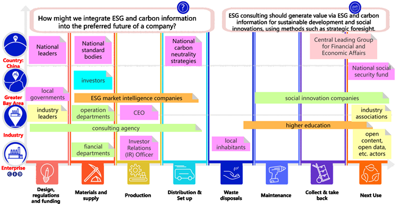
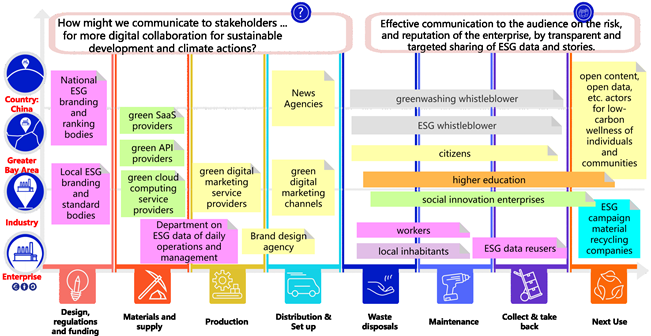

A research report on [Collaborating on ESG consulting, reporting, and engaging education](https://www.frontiersin.org/articles/10.3389/fenvs.2023.1119011/abstract) contributed by ***Oxford Roadmapping*** is accpted for publication.

Using the design innovation "How Might We" method, the report produces a series of Partner Maps for ESG consulting, reporting and communicating. The research and design method followed the design science methods by executing design workshops that integrated design thinking, literature analysis and expert interviews from various disciplines. 
<!--more-->

### Scientific Journal Publication

This report is accepted by ***Frontiers in Environmental Science*** on 2023/02/22, under the Research Topic of  "Consumers' Preferences Toward the Transition to Circular Economy-- Stimulating Drivers and Tackling" Barriers."
Focusing on the Guangdong–Hong Kong–Macao Greater Bay Area (Greater Bay Area) and the  crucial role of China in green finance, ESG efforts, carbon neutral policies, and climate change actions, this study presented findings of three  main ESG activities—consulting, reporting, and communicating.   It integrated design thinking of “how might we” design questions, literature analysis, and expert interviews across disciplines.   

### Meeting the ESG Talent Demands 

According to [a World Economic Forum event](https://www.weforum.org/agenda/2022/06/esg-talent-is-critical-for-advancing-sustainability-strategies/), ESG talent is critical.   Based on the stakeholder analysis,  three partner/capability maps were generated to map stakeholders and explore the capabilities needed.  Using a circular economy-based partner map design canvas, three partner maps were developed for capability building design for ESG education: 

#### ESG Consulting Partner Map

#### ESG Reporting Partner Map

#### ESG Communicating Partner Map

### Smart System of ESG and Carbon Information
A conceptual framework—a Smart System of ESG and Carbon Information—is proposed to summarize planning, operating, and communicating with ESG and carbon information, along with high-level organizational actions and talent capabilities. It identifies the building blocks of an ESG operating system within an enterprise to engage various stakeholders for value-creation collaboration.

### Abstract

Given the rising demand for environmental, social, and governance (ESG) talents, the study aims to provide a multi-disciplinary outlook of specific capability requirements of ESG talents focusing on the use of ESG and carbon information, thereby filling the literature gap in ESG education. Following the design science conventions and running design workshops that integrate design thinking of “how might we” design questions, literature analysis, and expert interviews across disciplines, the study presents findings regarding three main consulting, reporting, and communicating activities. Based on the iterations of design workshops that adopt a circular economy-based partner map design canvas for stakeholder analysis, with procedures including expert interviews and literature reviews, three Partner/Capability Maps were generated to map out the stakeholders and explore the capabilities needed. Digital and data skills using ESG and carbon information emerged as the core capability to complete all three tasks. A conceptual framework, Smart System on ESG and Carbon Information, is proposed to summarize the planning, operating, and engaging with ESG and carbon information, along with high-level organizational actions and talent capabilities. It identifies building blocks that amount to an ESG operating system within an enterprise, with the purpose to engage various stakeholders for value-creation collaboration. Despite the limitations in the lack of comprehensive review and limited geographic and disciplinary representation, the study provides a roadmap for enterprises and universities to explore and define talent requirements and create specific education and training programs.

