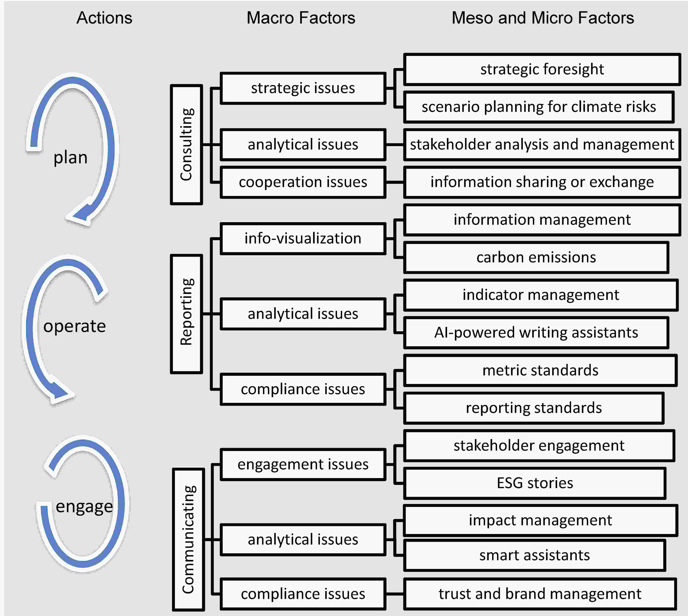

澳恪森数智科技服务 ( Oxford Roadmapping) 参与的论文 **[《在 ESG 咨询﹑报告和参与教育方面进行合作》( Collaborating on ESG consulting, reporting, and engaging education) ](https://www.frontiersin.org/articles/10.3389/fenvs.2023.1119011/abstract)**获录稿发表。 
本研究以创新设计思维方法“我们如何可能”(How might we)，遵循设计科学惯例举办设计工作坊，整合了设计思维、文献分析和跨学科专家访谈，在 ESG 咨询﹑报告和参与方面产出教育合作路线图。

<!--more-->

### 获录稿发表的合作伙伴地图

2023/02/22 获国际期刊 《Frontiers in Environmental Science》正式录稿于《人工智能背景下碳中和的路径丶方法与理论》(消费者对向循环经济转型的偏好 - 刺激驱动力和克服障碍) 研究课题下。面对粤港澳大湾区在国家及国企双碳目标，以及绿色金融所需的ESG人才需求，文章整合了相关文献及专家访谈数据，基于创新的利益相关人分析，提出了用数据贯通ESG 咨询丶报告和参与教育的合作伙伴地图，对培养政府及企业部门所需的ESG顾问丶投资丶分析丶管理丶传播丶公关丶等等人才勾勒出主要利害关系人丶主要文献丶及人才需求的驱动及障碍。此文展示了我校攻坚棘手问题的跨领域丶应用创新丶及创新教育能力。

发表于环境经济学及管理栏目，符合国家ESG及双碳人才建设需求，论文以国际前沿发展结合粤港澳大湾区具体的人才需求及供给，运用循环经济商业模式画布的设计科学方法，进行了交叉分析并形成系统需求文件，明确ESG数据价值链上的利益相关人，以全覆盖解决ESG及双碳系统创新的迫切人才培养及需求。

### 英文 Abstract

Given the rising demand for environmental, social, and governance (ESG) talents, the study aims to provide a multi-disciplinary outlook of specific capability requirements of ESG talents focusing on the use of ESG and carbon information, thereby filling the literature gap in ESG education. Following the design science conventions and running design workshops that integrate design thinking of “how might we” design questions, literature analysis, and expert interviews across disciplines, the study presents findings regarding three main consulting, reporting, and communicating activities. Based on the iterations of design workshops that adopt a circular economy-based partner map design canvas for stakeholder analysis, with procedures including expert interviews and literature reviews, three Partner/Capability Maps were generated to map out the stakeholders and explore the capabilities needed. Digital and data skills using ESG and carbon information emerged as the core capability to complete all three tasks. A conceptual framework, Smart System on ESG and Carbon Information, is proposed to summarize the planning, operating, and engaging with ESG and carbon information, along with high-level organizational actions and talent capabilities. It identifies building blocks that amount to an ESG operating system within an enterprise, with the purpose to engage various stakeholders for value-creation collaboration. Despite the limitations in the lack of comprehensive review and limited geographic and disciplinary representation, the study provides a roadmap for enterprises and universities to explore and define talent requirements and create specific education and training programs.

### 相关消息介绍

*  知研1v1,  （2023-02-24）.　《三个月内三篇SCI(一区及二区）收录期刊发表，成绩斐然》 [03. ESG数据驱动治理及教育](https://mp.weixin.qq.com/s?src=11&timestamp=1679377034&ver=4419&signature=58rspt51riDaR40jvggKb7MvePyHPP3j0uR0cLd2acMEJsEzW2094fT63kp-SKdgx*ORo6w1YEtlkh3eg48VOxVKMBasEFW1A-Xd4OC31j3t2JoChGuMHv-2IOxJnnDQ&new=1)，知研导师三个月内三篇SCI(一区及二区）收录期刊发表，成绩斐然

