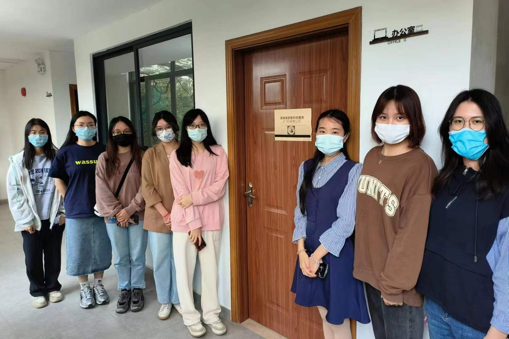

**澳恪森**创办人接待一批学生，说明如何开发绿色化数字化创新工具箱推迸***绿色金融科技的数智科技服务***，以从化温泉镇的**湾区设计开放大学/湾区设计协同研究院**为基地，来自湾区﹑服务湾区，推出协同创新设计服务及产品。

<!--more-->
**澳恪森**创办人廖汉腾﹑潘仲亷博士，于3月17日星期五接待一批财务﹑会计﹑及审计专业的大学生，说明位于从化温泉镇的**湾区设计开放大学/湾区设计协同研究院**的创新创业环境，并介绍澳恪森在***绿色金融科技的数智科技服务***协同创新路线，如何开发绿色化数字化创新工具箱，推出服务及产品。

### 来自湾区﹑服务湾区

“大湾区有整套现代金融﹑物流﹑旅游﹑酒店﹑农业等行业，需要数字化﹑绿色化的双化协同发展，”牛津大学博士廖汉腾解释协同创新的必要，“要如何数字化的同时，也能绿色化如达成双碳目标，成为需要协同设计﹑协同创新的重大议题。”

“大学生不管是就业或是创业，都应考虑如何助力数字化+绿色化的双化协同能力，”台湾科技大学博士潘仲亷点出绿色金融科技的发展方向，“像财务﹑会计﹑审计等专业，现急需对绿色化及数字化有融合能力的人才，来确保绿色金融的确有科学﹑量化﹑可审计的成果。”

廖汉腾﹑潘仲亷博士创办澳恪森，主要是要在绿色金融科技的数智科技服务协同创新。两位都表示，位于温泉镇的湾区设计开放大学，又名/湾区设计协同研究院，有对接长三角及珠三角大湾区的工业设计 (生态设计) 的国家级机构及网络，很感谢有这机会在来自湾区的环境下，提供能服务湾区网络的服务及产品。

### 科技创新服务及产品：双碳荔枝？

“数字化﹑绿色化的双化协同发展，需要具全球及地方视野的科技路线图，”澳恪森创始人之一廖汉腾点出市场需求，“想想从化若要发展「双碳荔枝」，各行各业能做什麽？”

“荔枝不只是水果，更是有从田野到餐桌的各种农产品，从荔枝乾到荔枝酒，需要不只是智能的现代营销及物流，更需有促进绿色发展及乡村振兴的增长，”澳恪森创始人之一潘仲亷点出绿色供应链金融的机会，“要如何能给有减排或创新的荔枝绿色供应链农户及商家相对映的绿色信用﹑投融资？要如何推动绿色产业营销的同时避免漂绿？要如何打造可信可用的荔枝E碳足迹护照？要如何建立「双碳荔枝」的行业最佳实践﹑标准﹑及标章？”

“荔枝不只是水果，更是生态系的一环，在从化还有荔枝木﹑荔枝菌等等传统及现代结合的实践，是实现 [生物减排固碳](http://lyj.gd.gov.cn/news/special/forum/content/post_3629236.html) 发展「双碳乡村振兴」的高潜力案例。”澳恪森廖汉腾点出[生物能源与碳捕获和储存 (BECCS )](https://www.eco.gov.cn/news_info/51244.html)用于「双碳乡村振兴」的可能性。“荔枝木的使用多元，包括烧鸡烧鸭等，都可以协同创新改良改进现有实践来创造负碳排放。此外，菌类的减排潜力已有量化科学研究，因此在荔枝菌的生产与消费应该建构以联合国SBTi（科学碳目标倡议）标准的计量体系，来合理估算审计荔枝生态循环的绿金潜力。”

### 大学生能做什麽？使用工具箱参与绿色化数字化创新

面对大学生，潘仲亷博士以澳恪森2023年具体项目为例，说明各专业的大学生都能使用工具箱参与绿色化数字化创新：

* 🌱 绿色化数字化双化转型技术路线工具箱 🌐
* 🎁 绿色化数字化双化转型商业模式工具箱 🈺
* 👉基于专利分析﹑科学计量﹑的中文及英文科技和课题预查新﹑前瞻与传统产业知识地图产品及服务 👌

潘仲亷博士以此说明，聚焦于辅导大学生科学论文思考﹑写作的**知研1对1**，已和澳恪森合作，扩大大学生参与如双化转型技术路线﹑双化转型商业模式的工作坊，并以专利及文献分析来协同跨领域﹑异业合作创新。

“这也是我认同并选择在湾区设计开放大学/湾区设计协同研究院成立公司及办公的主要原因。”澳恪森廖汉腾点「开放协同」及「开放创新」的重要性。“从大学出社会工作到现在，我一直在开源软件﹑开放数据﹑开放内容﹑开放知识﹑开放创新﹑数字协作等领域工作，现在这些关于数据及数字的开放知识，也正如同绿色软件基金会的发展，走向绿色化﹑走向科技向善。”

### 大学生开放﹑好奇的初心，是工业5.0的核心

“大学生保有开放的心﹑好奇的心，按步就班使用工具箱和不同领域的专家学习，就有创新的机会。”澳恪森廖汉腾点出，“恪这字，不只是传统谨慎的用心，更是如陈寅恪先生『独立之精神，自由之思想』 名言，体現的以人为中心的协同创新设计观，工业5.0的核心。”

“欢迎有志对产业前瞻与传统的知识地图﹑协作地图有兴趣的大学生来使用工具箱参与绿色化数字化创新。”潘仲亷博士总结。

-----

## 延伸阅读

### 生物质能碳捕集与封存 BECCS

#### 国內
*  中国华能 (2022-03-28)，[碳中和目标下电力行业如何加快发展BECCS技术](https://m.thepaper.cn/newsDetail_forward_17338633) 。『实现碳中和需要负碳技术』 
	* [农业农村部办公厅关于做好2022年农作物秸秆综合利用工作的通知](http://www.gov.cn/zhengce/zhengceku/2022-04/26/content_5687228.htm) 中国政府网 (www.gov.cn) 农办科〔2022〕12号 
		* 推进秸秆变能源降碳，助力“双碳”工作。积极有序发展秸秆为原料的成型燃料﹑打捆直燃﹑沼气工程﹑热解气化等生物质能利用，提升农村清洁用能比例。在乡村社区﹑园区以及公共机构等推广打捆直燃集中式供热﹑成型燃料+生物质锅炉供热﹑成型燃料+清洁炉具分散式供暖等模式。
	* 中国科协科普部 (2022), [生物质能源化利用 助力“双碳”目标实现](http://www.news.cn/science/2022-11/10/c_1310675250.htm) -新华网 (news.cn)
 
#### 国际
* [Venton](https://www.pnas.org/doi/10.1073/pnas.1617583113#con), Danielle (2016), Can bioenergy with carbon capture and storage make an impact?  _PNAS_ **113(47)**, 13260–13262. [https://doi.org/10.1073/pnas.1617583113](https://doi.org/10.1073/pnas.1617583113)
	* 『BECCS的技术挑战是真实的，...更大的挑战是金融和政治。我们尚未制定政策，认识到气候挑战的紧迫性』
* Council of the EU (2022), [Council adopts conclusions on carbon farming - Consilium](https://www.consilium.europa.eu/en/press/press-releases/2022/04/07/council-adopts-conclusions-on-carbon-farming/) 
	* 结论具体说明了理事会对碳去除认证框架的期望，今年年底将提出立法提案，以确保根据科学证明的测量要求，增加**碳去除**和储存的做法具有经济价值。
	* 欧盟的碳捕集﹑利用和封存 [Carbon Capture, Utilisation and Storage in the European Union (europa.eu)](https://setis.ec.europa.eu/carbon-capture-utilisation-and-storage-european-union_en)
	* 欧盟碳去除认证框架 [Carbon Removal Certification (europa.eu)](https://climate.ec.europa.eu/eu-action/sustainable-carbon-cycles/carbon-removal-certification_en)
* IEA (2022), Bioenergy with Carbon Capture and Storage, IEA, Paris https://www.iea.org/reports/bioenergy-with-carbon-capture-and-storage, License: CC BY 4.0
	* 『BECCS路线已有商业化路线，但最关键的路线仍处于示范或试点阶段』
	* 
*  Ai, Z., Hanasaki, N., Heck, V. _et al._ (2021), Global bioenergy with carbon capture and storage potential is largely constrained by sustainable irrigation. _Nat Sustain_ **4**, 884–891 . https://doi.org/10.1038/s41893-021-00740-4
	* 『BECCS在许多严格的气候情景中至关重要...  我们的研究结果强调了水资源/灌溉限制在全球BECCS潜力
中的重要性。』
* [EMILY DREYFUSS](https://www.wired.com/author/emily-dreyfuss) (2019), [The Plan to Grab the World's Carbon With Supercharged Plants](https://www.wired.com/story/the-plan-to-grab-the-worlds-carbon-with-supercharged-plants/)  WIRED

### 荔枝产业园﹑从化产业

* 广州日报 (2021-08-23),  [一棵荔枝树 三种致富“经”](http://food.cnr.cn/focus/20210823/t20210823_525575542.shtml) 央广网 (cnr.cn) 
	* 广州市从化区荔枝产业园...将助推从化区建设全省乃至全国乡村振兴示范区。
		* ...李仲辉介绍道，在荔枝树上种铁皮石斛既不影响荔枝生长，又能多一项收益。
		* ... 李仲辉介绍，培植荔枝菌，需要设备﹑技术和人工，每亩地投入4万到8万元左右，收成之时收益可以达到每亩地20万元左右。
		* ... “以前是靠人，现在靠技术。”李仲辉介绍道，荔博园里安装了摄像头，气象﹑温度﹑水土等资料都通过技术收集起来，温度不够？水分不够？远程就能遥控打开水闸，工作人员只要坐在办公室就能照顾荔枝。
		* ...“通过电商零售我们的利润能高出30%。”
		* ...率先实施的农户以荔枝果树土地经营权入股，探索出的“土地流转得租金﹑入园就业得薪金﹑家庭经营得现金﹑股份分红得股金”的“一地生四金”模式就让农民获得多重收入。
	* 陈厚彬观察发现，... “比如很少产业园会在生产环节寻求科技支持，省内很多荔枝园依然是低产的，品质提升也是不够的，精深加工不足，没有真正从研发﹑生产到加工环节投入科技力量，提升产品的附加值。”
* [456亿！涉及高速改扩建﹑产业园！从化2022年重点建设项目出炉！_腾讯新闻 (qq.com)](https://new.qq.com/rain/a/20220323A09G1Z00)
	* 明珠片区选址**明珠工业园核心区低丘缓坡片区东侧**，...，**打造生物医药﹑医疗美容融合发展的“南方美谷”**；
	* 民乐片区紧邻京珠高速民乐出入口...，**重点打造新能源汽车零部件生产基地**；
	* 太平片区...，作为中新知识城产业延伸...区域，...，打造**成为集科技创新﹑国际合作﹑生态宜居为特色的产城融合发展示范区**。

-----

### 湾区设计开放大学/湾区设计协同研究院
湾区设计开放大学/湾区设计协同研究院 ...

### 关于知研1对1
知研1对1是广州市级众创空间，广州南方学院商学院南方创新谷的双创项目，旨在“大众创业丶万众创新”丶“专创融合立体化人才培养”丶“新文科教育实践基地”等背景下，提供各项科技商业模式创新丶市场查新丶科研论文丶科学计量等丶1v1辅导丶创新创业工作坊的公共及商业服务。

### 关于澳恪森数智科技
澳恪森数智科技，简称Oxon8，全名为澳恪森数智科技服务（广州）有限公司，创新数智平台与绿色金融科技的设计，助组织与个人的双化协同发展及精准脱碳之旅。

澳恪森Oxon8为行业﹑智库﹑政府等提供基于专利分析﹑科学计量﹑知识图谱等等数据情报，合作开展集科技研发﹑科技服务﹑成果转化﹑系统集成﹑人才培养﹑等科技创新公共及商业服务，运用前瞻情报连结在地及全球网络。

