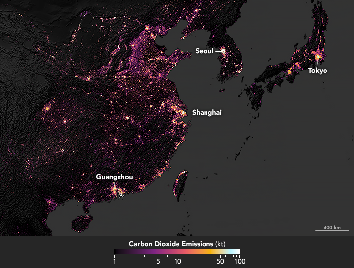

全球足迹网络之产业分析简介

“全球足迹网络”的核心是于1990年代早期成立的科学研究公司“生态足迹”，由Mathis Wackernagel 及 William Rees 创立，基于Wackernagel于UBC的博士研究。其2003年的“国家足迹与生态承截力核算”资源核算工具取得不少包括联合国单位的认可与引用，包括15个国家政府将其计量方式应用在各自的政策方案里。该组织亦在瑞士日内瓦与意大利成立了社会组织。该单位亦参与了[中国生态足迹 
报告2010](https://www.footprintnetwork.org/content/images/uploads/LPR_China_2010_Chinese.pdf) 的工作，研究中国大陆31省份对土地和水资源需求的变化，为经济发展和生态足迹脱钓指明机遇

该公司于2017年发起“生态足迹探索器”的[开放数据平台](https://data.footprintnetwork.org/#/) ，释出200多个国家地区的相关足迹与生态承截力数据，并和欧盟高校合作产出[EUSTEPs线上学习平台](https://www.eusteps.eu/)

### 产业分析

“生态足迹”公司的科学研究及服务之一是[产业分析](https://www.footprintnetwork.org/our-work/sector-analysis/) ，可以在地方、区域或国家层面评估行业的生态足迹。

该公司的产业分析取径分成两种：“自上而下”或“自下而上”，详细成果发表于[同行评审文献](https://www.footprintnetwork.org/resources/journal-articles/)。
“自上而下”的取径是从最高别的数据，如“国家足迹与生物承截力核算”开始，针对特产业的相关统计及消费数据进行缩进。
与之相反的是“自下而上”方法，运用产业收集的任何资金流动、物质流动、及能源流动的数据。

目前，“全球足迹网络”正针对地中海地区的旅游业迸行产业层次的评估，[发展可持续旅游产品，强调像MEET Network 的生态旅游套餐](https://www.footprintnetwork.org/our-work/sustainable-tourism/)，不但可以探索自然与人文，还能在比游客待在家里时产出更低的每日生态足迹。

> 挪威NTNU研究世界13,000城市发现，富裕大城市的碳排高。[City Carbon Footprints] (http://citycarbonfootprints.info/)，图片来源[NASA Earth Observatory](https://earthobservatory.nasa.gov/images/144807/sizing-up-the-carbon-footprint-of-cities)

### 对澳恪森产业分析产品化的启发

在完成[广东](https://oxon8.netlify.app/post/2023-10-26-guandong-high-carbon-intensity-industry-mapping/) 与[浙江](https://oxon8.netlify.app/post/2023-11-05-zhejiang-high-carbon-intensity-industry-mapping/)的产业结构的高产值与高碳排的网络可视化分析后， *澳恪森*已开始着手探讨[中国碳核算数据库（CEADs）](https://www.ceads.net.cn/)如何能和“国家足迹与生物承截力核算”结合。

“自上而下”的取径可以针对一个或多个高产值或高碳排的产业进行全国省际及地域（湾区）的比较研究，取得基线和标杆指标，并开发科学地计量方法及标准，作为中国碳排技术、标准、最佳实践的数据驱动策策的核心模块之一。

“自下而上”的取径，可运用产业收集的大数据，特别是地方海关、税务、供应链金融、物流、产业供应链平台的数据，取得可建模的投入产出的预测、优化、及仿真方法。

同“生态足迹”公司一致，*澳恪森*期待能以坚实的科学研究基础，和地方决策者、学者、产业专家合作，分析关键行业部门包括碳排的生态足迹的务实基线、标杆、预测、优化、及仿真，以最省心直面核心的精准脱碳方法，识别出最关键的产业关系及主体。

## 展望未来：机构合作、议题设定

**澳恪森**表示，在探讨[中国碳核算数据库（CEADs）](https://www.ceads.net.cn/)如何 能和“国家足迹与生物承截力核算”结合，应用于 碳排管理（Carbon management）及双化协同（Green Digital Transformation）的解决方案，欢迎来信 h.liao@ieee.org 问询各式合作机会。

